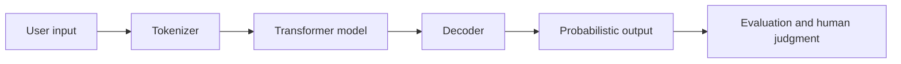

# Course 00: AI Foundations

Chinese: [README.zh.md](README.zh.md) | Prerequisites: basic programming curiosity | Gate: 80%

## Outcomes

Explain AI, ML, deep learning, transformers, training, inference, tokens, embeddings, and evaluation; run a semantic similarity example; identify where model output can fail.

## 5W + How

- **What:** AI systems map inputs to predictions or generated outputs. LLMs are probabilistic sequence models; they do not store a guaranteed database of truth.
- **Why:** precise mental models prevent magical thinking and make later architecture choices testable.
- **Who:** learners, software engineers, product managers, data scientists, risk owners, and executives need different depths of the same model.
- **When:** start here before prompts, RAG, agents, or platform decisions. Do not begin with framework APIs while core terms remain unclear.
- **Where:** models sit inside a larger product containing data, instructions, tools, policy, evaluation, and human accountability.
- **How:** learn the vocabulary, trace a transformer inference path, run simple vector math, measure results, and explain limitations.

## System View



## Code: Semantic Similarity

```python
from math import sqrt

def cosine(a: list[float], b: list[float]) -> float:
    dot = sum(x * y for x, y in zip(a, b))
    norm_a = sqrt(sum(x * x for x in a))
    norm_b = sqrt(sum(y * y for y in b))
    if not norm_a or not norm_b:
        raise ValueError("vectors must be non-zero")
    return dot / (norm_a * norm_b)

assert cosine([1, 0], [1, 0]) == 1.0
assert cosine([1, 0], [0, 1]) == 0.0
```

The vectors are supplied for teaching; a real embedding model produces them. Add tests for different lengths and decide whether to reject or normalize that input.

## Modules

1. AI, ML, deep learning, and generative AI
2. Data, labels, training, validation, and inference
3. Tokens, embeddings, attention, and transformers
4. Foundation models, fine-tuning, and in-context learning
5. Quality, hallucination, bias, latency, and cost
6. Responsible use and lifecycle evaluation

## Failure Analysis

Confusing fluency with truth, using one anecdote as evaluation, leaking test data into training, ignoring distribution shift, and treating benchmark scores as product outcomes. Mitigate with explicit tasks, representative datasets, baselines, and human-impact review.

## Lab And Interview Gate

Build a tiny intent matcher from supplied vectors, test five edge cases, and explain why similarity is not semantic truth. Beginner question: “What is an embedding?” Engineer follow-up: “How would you evaluate retrieval quality?” CTO follow-up: “Which business decision should never depend on this score alone, and why?”

Pass by earning 80/100: concepts 25, code/tests 25, failure reasoning 20, diagram explanation 15, interview defense 15.

## Sources

[Attention Is All You Need](https://arxiv.org/abs/1706.03762) · [NIST AI RMF](https://www.nist.gov/itl/ai-risk-management-framework)

