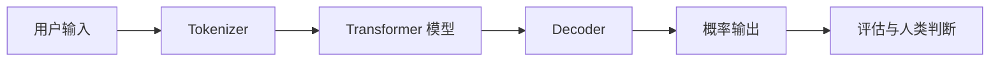

# 课程 00：AI 基础

English: [README.md](README.md) | 前置要求：具备基本编程兴趣 | 通过线：80%

## 学习成果

解释 AI、机器学习、深度学习、Transformer、训练、推理、Token、Embedding 与评估；运行语义相似度示例；识别模型输出的失败位置。

## 5W + How

- **What：** AI 系统把输入映射为预测或生成结果。LLM 是概率序列模型，不是保证真实的数据库。
- **Why：** 准确的心智模型可以避免“AI 魔法论”，并让后续架构选择可验证。
- **Who：** 学习者、软件工程师、产品经理、数据科学家、风险 Owner 与高管需要同一模型的不同解释深度。
- **When：** 在 Prompt、RAG、Agent 或平台决策前学习。核心术语不清楚时，不应先从框架 API 开始。
- **Where：** 模型位于包含数据、指令、工具、策略、评估与人类责任的完整产品中。
- **How：** 学习术语，追踪 Transformer 推理路径，运行向量计算，度量结果，并解释边界。

## 系统视图



## 代码：语义相似度

```python
from math import sqrt

def cosine(a: list[float], b: list[float]) -> float:
    dot = sum(x * y for x, y in zip(a, b))
    norm_a = sqrt(sum(x * x for x in a))
    norm_b = sqrt(sum(y * y for y in b))
    if not norm_a or not norm_b:
        raise ValueError("vectors must be non-zero")
    return dot / (norm_a * norm_b)

assert cosine([1, 0], [1, 0]) == 1.0
assert cosine([1, 0], [0, 1]) == 0.0
```

这里的向量用于教学；真实系统由 Embedding 模型生成。请补充不同长度向量的测试，并决定拒绝还是规范化该输入。

## 模块

1. AI、机器学习、深度学习与生成式 AI
2. 数据、标签、训练、验证与推理
3. Token、Embedding、Attention 与 Transformer
4. 基础模型、Fine-tuning 与上下文学习
5. 质量、幻觉、偏差、延迟与成本
6. 负责任使用与全生命周期评估

## 故障分析

典型错误包括把流畅当作真实、用单个案例代替评估、测试数据泄漏、忽略分布漂移，以及把 Benchmark 当成产品结果。缓解措施是定义明确任务、代表性数据集、Baseline 与人类影响评审。

## 实验与面试门槛

用给定向量构建一个小型意图匹配器，测试五个边界情况，并解释为什么相似度不等于语义真相。初学者题：“什么是 Embedding？”工程师追问：“如何评估检索质量？”CTO 追问：“哪些业务决策绝不能只依赖该分数，为什么？”

总分 100，达到 80 分通过：概念 25、代码与测试 25、故障推理 20、图表讲解 15、面试答辩 15。

## 参考资料

[Attention Is All You Need](https://arxiv.org/abs/1706.03762) · [NIST AI RMF](https://www.nist.gov/itl/ai-risk-management-framework)

