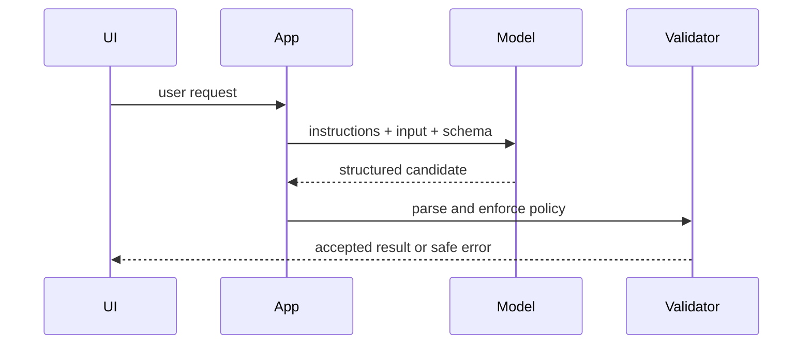

# Course 01: LLM Application Engineering

Chinese: [README.zh.md](README.zh.md) | Prerequisite: Course 00 | Gate: typed, tested application

## Outcomes And 5W + How

- **What:** an LLM application is conventional software around a probabilistic model boundary.
- **Why:** schemas, validation, retries, and evaluations turn model capability into dependable product behavior.
- **Who:** application engineers own integration; product owns the outcome; security and risk approve authority and data use; users remain informed.
- **When:** use an LLM when language or multimodal judgment adds value. Use deterministic code for exact rules and calculations.
- **Where:** place model calls behind a service boundary, not directly inside every UI component or business transaction.
- **How:** specify the task, select a model by evals, constrain output, validate, retry narrowly, observe, and fall back safely.



## Code: Typed Boundary

```python
from dataclasses import dataclass

@dataclass(frozen=True)
class Triage:
    category: str
    confidence: float

def parse_triage(payload: dict) -> Triage:
    allowed = {"billing", "technical", "account"}
    category = payload.get("category")
    confidence = float(payload.get("confidence", -1))
    if category not in allowed or not 0 <= confidence <= 1:
        raise ValueError("invalid model output")
    return Triage(category, confidence)

assert parse_triage({"category": "billing", "confidence": 0.9}).category == "billing"
```

Replace the fake payload with a current provider SDK only after the schema and tests work. Never place secrets in source code.

## Modules

Prompt and context design; model selection by evaluation; structured output; streaming and state; rate limits, timeouts, retries, and idempotency; caching; privacy; provider abstraction without lowest-common-denominator design.

## Failure Analysis

Unbounded free text, prompt-only security, infinite retries, silent model upgrades, PII in logs, and treating confidence prose as calibrated probability. Mitigate with schemas, allowlists, versioning, redaction, budgets, eval gates, and explicit user-visible failure states.

## Lab And Interview Gate

Build a multilingual support triage API with three categories, schema validation, timeout, bounded retry, redacted logs, and ten evaluation cases. Explain the request sequence and defend whether the model belongs in the critical transaction path.

Interview ladder: write a parser; debug a malformed response; design for 1,000 requests/second; present build-versus-buy and unit economics to a CTO. Pass at 80/100 using the program rubric.

## Sources

[OpenAI function calling](https://developers.openai.com/api/docs/guides/function-calling) · [OpenAI tools](https://developers.openai.com/api/docs/guides/tools) · [Anthropic tool use](https://platform.claude.com/docs/en/agents-and-tools/tool-use/how-tool-use-works)

