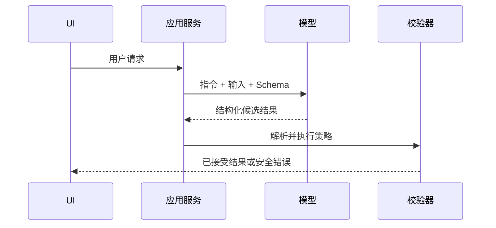

# 课程 01：LLM 应用工程

English: [README.md](README.md) | 前置课程：课程 00 | 门槛：有类型约束且有测试的应用

## 学习成果与 5W + How

- **What：** LLM 应用是围绕概率模型边界构建的常规软件系统。
- **Why：** Schema、校验、重试和评估把模型能力转化为可靠产品行为。
- **Who：** 应用工程师负责集成，产品负责结果，安全与风险团队审批权限和数据使用，用户应保持知情。
- **When：** 当语言或多模态判断创造价值时使用 LLM；精确规则与计算应使用确定性代码。
- **Where：** 将模型调用放在服务边界之后，而不是散落在每个 UI 组件或业务事务中。
- **How：** 明确任务，以评估选模型，约束输出，校验，有限重试，可观测，并安全降级。



## 代码：类型边界

```python
from dataclasses import dataclass

@dataclass(frozen=True)
class Triage:
    category: str
    confidence: float

def parse_triage(payload: dict) -> Triage:
    allowed = {"billing", "technical", "account"}
    category = payload.get("category")
    confidence = float(payload.get("confidence", -1))
    if category not in allowed or not 0 <= confidence <= 1:
        raise ValueError("invalid model output")
    return Triage(category, confidence)

assert parse_triage({"category": "billing", "confidence": 0.9}).category == "billing"
```

先让 Schema 与测试成立，再用当前厂商 SDK 替换模拟输入。任何密钥都不得写入源代码。

## 模块

Prompt 与上下文设计；基于评估的模型选择；结构化输出；流式响应与状态；限流、超时、重试和幂等；缓存；隐私；避免“最低公分母式”的厂商抽象。

## 故障分析

常见问题包括无约束文本输出、仅依赖 Prompt 安全、无限重试、静默模型升级、日志泄露 PII，以及把置信度文字当成校准概率。应采用 Schema、Allowlist、版本控制、脱敏、预算、评估门禁与明确的用户可见失败状态。

## 实验与面试门槛

构建支持多语言的客服分类 API：三个分类、Schema 校验、超时、有限重试、脱敏日志和十个评估案例。讲解请求时序，并答辩模型是否应位于关键交易路径。

面试阶梯：编写解析器；调试畸形响应；设计每秒 1,000 请求的系统；向 CTO 说明 Build vs Buy 与单位经济性。按项目量表达到 80/100。

## 参考资料

[OpenAI Function Calling](https://developers.openai.com/api/docs/guides/function-calling) · [OpenAI Tools](https://developers.openai.com/api/docs/guides/tools) · [Anthropic Tool Use](https://platform.claude.com/docs/en/agents-and-tools/tool-use/how-tool-use-works)

