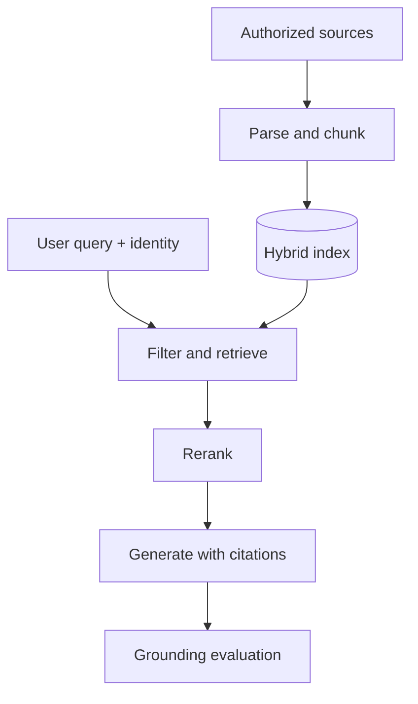

# Course 02: RAG And Knowledge Systems

Chinese: [README.zh.md](README.zh.md) | Prerequisite: Course 01 | Gate: grounded-answer evaluation

## 5W + How

- **What:** retrieval-augmented generation finds authorized evidence and supplies it to a model before generation.
- **Why:** it improves grounding and freshness without pretending retrieval guarantees truth.
- **Who:** content owners govern sources; platform teams run ingestion; security enforces identity; application teams own answer quality.
- **When:** use RAG for changing or private knowledge. Prefer long context for small stable corpora, search for discovery, databases for exact records, and fine-tuning for behavior rather than fresh facts.
- **Where:** ingestion is an offline data path; retrieval is an online request path; authorization must constrain both.
- **How:** ingest, parse, chunk, enrich, index, retrieve, rerank, assemble context, generate with citations, and evaluate each stage.



## Code: Retrieval Metric

```python
def recall_at_k(relevant: set[str], ranked: list[str], k: int) -> float:
    if not relevant:
        return 1.0
    return len(relevant.intersection(ranked[:k])) / len(relevant)

assert recall_at_k({"a", "c"}, ["a", "b", "c"], 2) == 0.5
assert recall_at_k({"a", "c"}, ["a", "b", "c"], 3) == 1.0
```

## Modules

Document parsing and provenance; chunking; embeddings; lexical, vector, and hybrid search; metadata and ACL filters; reranking; context assembly; citations; freshness and deletion; retrieval and answer evaluation.

## Failure Analysis

Measure retrieval separately from generation. Watch for poisoned documents, cross-tenant leakage, stale indexes, lost provenance, “citation-shaped” unsupported claims, bad OCR, and high-recall context that overwhelms the model. Enforce document-level ACLs before ranking and test deletion end to end.

## Lab And Interview Gate

Build a 50-document knowledge assistant with source IDs, hybrid retrieval, ACL filtering, citations, and a 30-question golden set. Report recall@k, answer groundedness, abstention quality, latency, and cost. Defend RAG versus long context and fine-tuning at engineer, architect, and CTO depth. Pass at 80/100.

## Sources

[Retrieval-Augmented Generation](https://arxiv.org/abs/2005.11401) · [NIST AI RMF](https://www.nist.gov/itl/ai-risk-management-framework)

