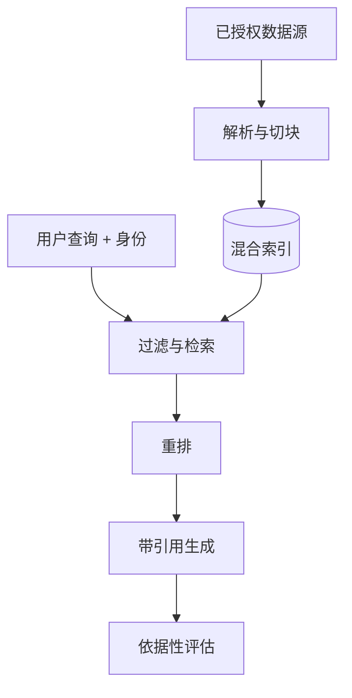

# 课程 02：RAG 与知识系统

English: [README.md](README.md) | 前置课程：课程 01 | 门槛：有依据回答评估

## 5W + How

- **What：** 检索增强生成先找到有权限访问的证据，再把证据提供给模型生成答案。
- **Why：** 它改善依据性与新鲜度，但检索本身并不保证真实。
- **Who：** 内容 Owner 治理来源，平台团队运行摄取，安全团队执行身份权限，应用团队负责答案质量。
- **When：** 变化或私有知识适合 RAG；小型稳定语料可用长上下文，发现任务可用搜索，精确记录用数据库，行为调整用 Fine-tuning。
- **Where：** 摄取属于离线数据路径，检索属于在线请求路径，两者都必须受授权约束。
- **How：** 摄取、解析、切块、增强、索引、检索、重排、组装上下文、带引用生成，并逐阶段评估。



## 代码：检索指标

```python
def recall_at_k(relevant: set[str], ranked: list[str], k: int) -> float:
    if not relevant:
        return 1.0
    return len(relevant.intersection(ranked[:k])) / len(relevant)

assert recall_at_k({"a", "c"}, ["a", "b", "c"], 2) == 0.5
assert recall_at_k({"a", "c"}, ["a", "b", "c"], 3) == 1.0
```

## 模块

文档解析与 Provenance；切块；Embedding；关键词、向量与混合搜索；元数据与 ACL 过滤；重排；上下文组装；引用；新鲜度与删除；检索和答案评估。

## 故障分析

必须分开度量检索和生成。重点防范文档投毒、跨租户泄露、索引过期、来源丢失、看似有引用但无证据的陈述、OCR 错误，以及高召回上下文淹没模型。排序前执行文档级 ACL，并端到端测试删除。

## 实验与面试门槛

构建一个 50 文档知识助手，包含来源 ID、混合检索、ACL 过滤、引用和 30 题 Golden Set。报告 recall@k、答案依据性、拒答质量、延迟与成本。分别以工程师、架构师和 CTO 深度答辩 RAG、长上下文与 Fine-tuning 的选择。达到 80/100。

## 参考资料

[Retrieval-Augmented Generation](https://arxiv.org/abs/2005.11401) · [NIST AI RMF](https://www.nist.gov/itl/ai-risk-management-framework)

