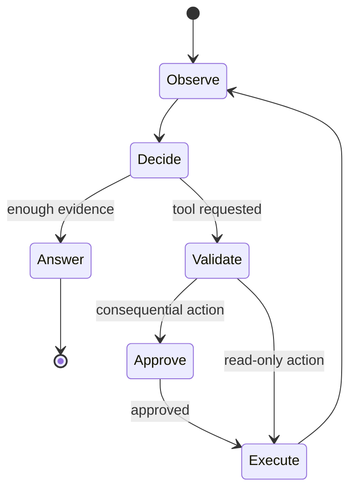

# Course 03: Tool Use And AI Agents

Chinese: [README.zh.md](README.zh.md) | Prerequisite: Course 01 | Gate: safe workflow/agent comparison

> Lab and interview gates here mean **AI-role hiring defense** (ReAct, tool loops, injection, exec risk)—not LeetCode pattern drills. Those belong in [Learn AI](https://learn.xingai.app).

## 5W + How

- **What:** a workflow follows coded paths; an agent lets a model choose steps and tools within bounded authority.
- **Why:** tool use connects language reasoning to real data and actions, while explicit loops make control and failure visible.
- **Who:** product defines the outcome, engineers define tools, security limits authority, humans approve consequential actions, and operations own incidents.
- **When:** use workflows for known paths and agents for valuable tasks requiring adaptive decisions. Do not use an agent when a rule, query, or form is sufficient.
- **Where:** the agent runtime belongs between the user/application and least-privilege tools, behind policy and audit controls.
- **How:** observe, select an allowed tool, validate arguments, authorize, execute, record the result, reassess, and stop under explicit limits.



## Code: Bounded Tool Loop

```python
TOOLS = {"lookup_order": lambda order_id: {"id": order_id, "status": "shipped"}}

def run_tool(name: str, arguments: dict) -> dict:
    if name not in TOOLS:
        raise PermissionError("tool not allowed")
    if set(arguments) != {"order_id"}:
        raise ValueError("invalid arguments")
    return TOOLS[name](**arguments)

assert run_tool("lookup_order", {"order_id": "o-7"})["status"] == "shipped"
```

## Modules

ReAct; workflow versus agent selection; schema-first tools; client-driven loops; stop conditions; planning; human approval; memory boundaries; prompt injection; authority, audit, and compensating actions.

## Failure Analysis

Tool descriptions are untrusted inputs to planning, model intent is not authorization, and successful execution is not correct outcome. Guard against excessive agency, recursive loops, argument smuggling, indirect prompt injection, stale observations, duplicate writes, and hidden side effects with allowlists, typed validation, policy checks, idempotency, budgets, and audit.

## Lab And Interview Gate

Implement one support process twice: a deterministic workflow and a bounded agent. Both must use read-only lookup and a separately approved refund proposal. Compare completion rate, unsafe-action rate, latency, cost, and debuggability. Interview defense spans ReAct explanation, tool-loop coding, prompt-injection incident response, and executive risk acceptance. Pass at 80/100.

## Sources

[ReAct](https://arxiv.org/abs/2210.03629) · [Building Effective AI Agents](https://www.anthropic.com/engineering/building-effective-agents) · [OpenAI function calling](https://developers.openai.com/api/docs/guides/function-calling)

