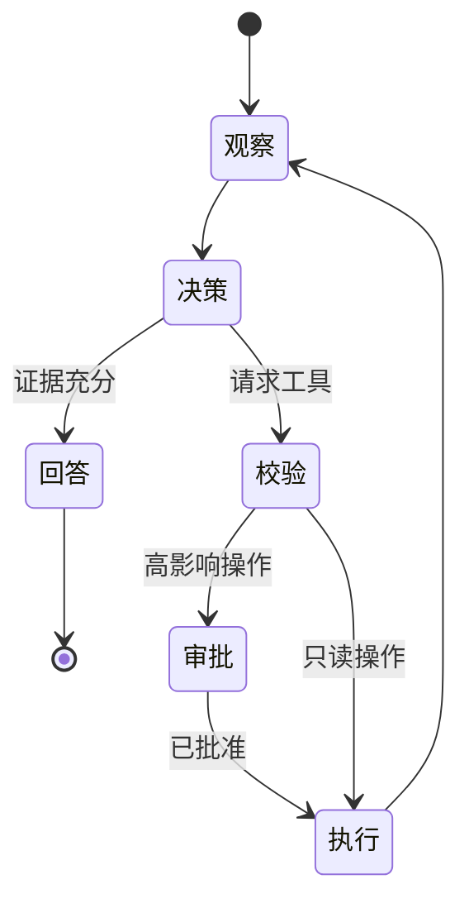

# 课程 03：工具调用与 AI Agent

English: [README.md](README.md) | 前置课程：课程 01 | 门槛：安全比较工作流与 Agent

> 本课的实验与面试门槛是 **AI 岗位面试答辩**（ReAct、工具 Loop、注入、执行风险）——不是刷题式 DSA Pattern。后者属于 [Learn AI](https://learn.xingai.app)。

## 5W + How

- **What：** 工作流遵循编码路径；Agent 在受限权限内由模型选择步骤与工具。
- **Why：** 工具调用把语言推理连接到真实数据与操作，显式 Loop 让控制与失败可见。
- **Who：** 产品定义结果，工程师定义工具，安全团队限制权限，人类审批高影响操作，运维负责事故。
- **When：** 已知路径使用工作流，需要适应性决策且价值足够时使用 Agent。规则、查询或表单能解决时不要使用 Agent。
- **Where：** Agent Runtime 位于用户/应用与最小权限工具之间，并置于策略和审计控制之后。
- **How：** 观察，选择允许工具，校验参数，授权，执行，记录结果，重新判断，并在明确限制下停止。



## 代码：受限工具循环

```python
TOOLS = {"lookup_order": lambda order_id: {"id": order_id, "status": "shipped"}}

def run_tool(name: str, arguments: dict) -> dict:
    if name not in TOOLS:
        raise PermissionError("tool not allowed")
    if set(arguments) != {"order_id"}:
        raise ValueError("invalid arguments")
    return TOOLS[name](**arguments)

assert run_tool("lookup_order", {"order_id": "o-7"})["status"] == "shipped"
```

## 模块

ReAct；工作流与 Agent 选择；Schema-first 工具；客户端驱动 Loop；停止条件；规划；人工审批；记忆边界；Prompt Injection；权限、审计与补偿操作。

## 故障分析

工具描述对规划而言是不可信输入，模型意图不等于授权，执行成功也不等于业务结果正确。通过 Allowlist、类型校验、策略检查、幂等、预算与审计，防止过度权限、递归循环、参数走私、间接 Prompt Injection、过期观察、重复写入与隐藏副作用。

## 实验与面试门槛

把同一个客服流程分别实现为确定性工作流和受限 Agent。两者都使用只读查询，并把退款限制为单独审批的提案。比较完成率、不安全操作率、延迟、成本与可调试性。面试答辩覆盖 ReAct、工具循环编码、Prompt Injection 事故响应与高管风险接受。达到 80/100。

## 参考资料

[ReAct](https://arxiv.org/abs/2210.03629) · [Building Effective AI Agents](https://www.anthropic.com/engineering/building-effective-agents) · [OpenAI Function Calling](https://developers.openai.com/api/docs/guides/function-calling)

