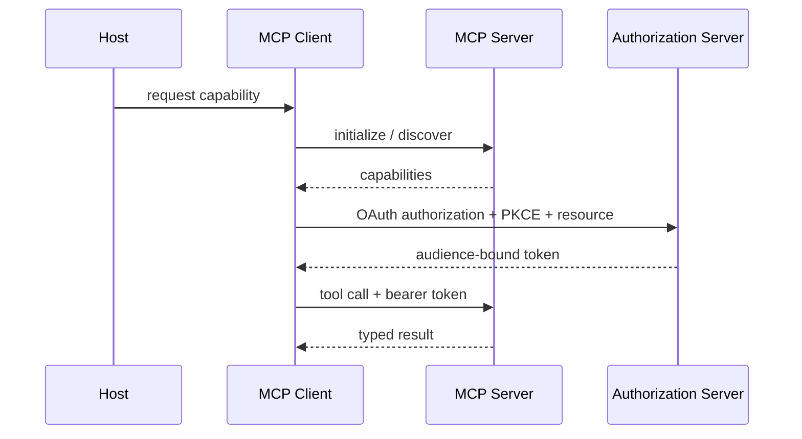

# Course 04: MCP And Interoperability

Chinese: [README.zh.md](README.zh.md) | Prerequisite: Course 03 | Gate: secured MCP client/server lab

## 5W + How

- **What:** Model Context Protocol standardizes how hosts connect models to servers exposing tools, resources, and prompts. A2A addresses agent-to-agent collaboration; it is a different boundary.
- **Why:** protocol contracts reduce custom integration while preserving explicit capability and trust boundaries.
- **Who:** host and client developers, MCP server owners, authorization servers, resource owners, security reviewers, and users granting consent.
- **When:** use MCP when multiple compatible hosts need governed access to capabilities. A direct internal API can be simpler for one tightly controlled integration.
- **Where:** MCP sits at the model-application integration edge; it does not replace domain APIs, orchestration, policy engines, or business decision ownership.
- **How:** initialize capabilities, discover tools/resources, validate requests, authenticate, authorize for the target resource, execute least privilege, and audit.



## Code: Tool Definition

```python
TOOL = {
    "name": "get_policy",
    "description": "Read one policy by ID; no search or write side effects.",
    "inputSchema": {
        "type": "object",
        "properties": {"policy_id": {"type": "string", "pattern": "^p-[0-9]+$"}},
        "required": ["policy_id"],
        "additionalProperties": False,
    },
}
assert TOOL["inputSchema"]["additionalProperties"] is False
```

## Modules

Architecture and lifecycle; transports and JSON-RPC concepts; tools, resources, and prompts; capability negotiation; errors; OAuth 2.1, PKCE, protected resource metadata, resource indicators, audience validation, scopes and step-up authorization; local versus remote trust; A2A comparison.

## Failure Analysis

Never pass through upstream tokens, accept a token intended for another resource, infer authorization from tool visibility, or combine read and write authority casually. Test confused-deputy paths, SSRF, tool-description poisoning, scope escalation, token leakage, replay, consent mismatch, and server replacement.

## Lab And Interview Gate

Extend the existing [OAuth + PKCE MCP lab](../../guides/2026-07-12-mcp-oauth-pkce-lab.md) with protected-resource discovery, a read tool, a separately scoped proposal tool, audit events, and negative authorization tests. Explain MCP versus API gateway, workflow engine, and A2A. Pass at 80/100.

## Sources

[MCP specification](https://modelcontextprotocol.io/specification) · [MCP authorization](https://modelcontextprotocol.io/specification/2025-11-25/basic/authorization) · [A2A specification](https://a2a-protocol.org/latest/specification/)

