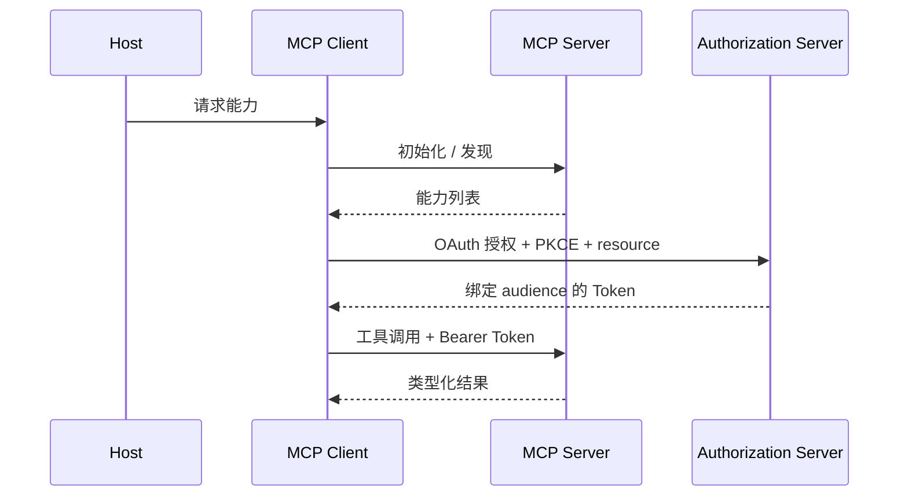

# 课程 04：MCP 与互操作性

English: [README.md](README.md) | 前置课程：课程 03 | 门槛：受保护的 MCP 客户端/服务端实验

## 5W + How

- **What：** Model Context Protocol 标准化 Host 如何把模型连接到提供工具、资源和 Prompt 的 Server。A2A 解决 Agent-to-Agent 协作，属于不同边界。
- **Why：** 协议契约减少定制集成，同时保留明确的能力与信任边界。
- **Who：** Host 和 Client 开发者、MCP Server Owner、Authorization Server、资源 Owner、安全评审者及授权用户。
- **When：** 多个兼容 Host 需要受治理访问能力时使用 MCP；单个严格受控集成可能直接内部 API 更简单。
- **Where：** MCP 位于模型应用的集成边缘；它不替代领域 API、编排、策略引擎或业务决策 Owner。
- **How：** 初始化能力，发现工具/资源，校验请求，认证，为目标资源授权，以最小权限执行并审计。



## 代码：工具定义

```python
TOOL = {
    "name": "get_policy",
    "description": "Read one policy by ID; no search or write side effects.",
    "inputSchema": {
        "type": "object",
        "properties": {"policy_id": {"type": "string", "pattern": "^p-[0-9]+$"}},
        "required": ["policy_id"],
        "additionalProperties": False,
    },
}
assert TOOL["inputSchema"]["additionalProperties"] is False
```

## 模块

架构与生命周期；Transport 与 JSON-RPC 概念；工具、资源和 Prompt；能力协商；错误；OAuth 2.1、PKCE、Protected Resource Metadata、Resource Indicator、Audience 校验、Scope 与 Step-up Authorization；本地与远程信任；A2A 对比。

## 故障分析

不得透传上游 Token、接受发给其他资源的 Token、从工具可见性推断授权，或随意合并读写权限。测试 Confused Deputy、SSRF、工具描述投毒、Scope 提权、Token 泄露、重放、Consent 不一致与 Server 替换。

## 实验与面试门槛

扩展现有 [OAuth + PKCE MCP 实验](../../guides/2026-07-12-mcp-oauth-pkce-lab.zh.md)：加入 Protected Resource Discovery、只读工具、独立 Scope 的提案工具、审计事件及负向授权测试。解释 MCP 与 API Gateway、Workflow Engine、A2A 的区别。达到 80/100。

## 参考资料

[MCP 规范](https://modelcontextprotocol.io/specification) · [MCP Authorization](https://modelcontextprotocol.io/specification/2025-11-25/basic/authorization) · [A2A 规范](https://a2a-protocol.org/latest/specification/)

