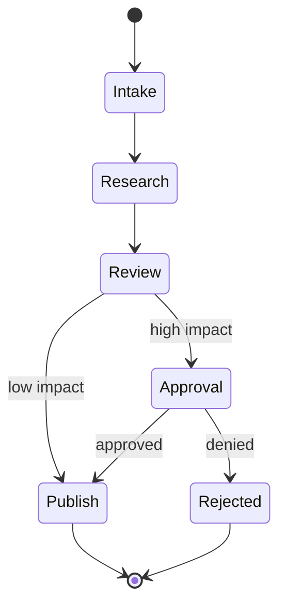

# Course 05: Agent Runtime And Multi-Agent Systems

Chinese: [README.zh.md](README.zh.md) | Prerequisite: Course 04 | Gate: recoverable stateful workflow

## 5W + How

- **What:** an agent runtime manages state, transitions, tools, checkpoints, retries, approvals, and traces; multi-agent design divides responsibility across bounded participants.
- **Why:** durable execution makes long-running work recoverable. Multiple agents help only when specialization or organizational boundaries outweigh coordination cost.
- **Who:** domain agents propose, orchestrators route, policy services authorize, humans approve, and operators recover incidents.
- **When:** use explicit state for long-running, interruptible work. Add agents only for real specialization, trust separation, or parallelism.
- **Where:** orchestration belongs in a runtime/control plane, not hidden in an MCP server or UI conversation.
- **How:** model states and invariants, persist checkpoints, use idempotency keys, route bounded tasks, validate handoffs, compensate side effects, and trace decisions.



## Code: Explicit Transition

```python
ALLOWED = {"intake": {"research"}, "research": {"review"},
           "review": {"approval", "publish"}, "approval": {"publish", "rejected"}}

def transition(state: str, target: str) -> str:
    if target not in ALLOWED.get(state, set()):
        raise ValueError(f"illegal transition: {state} -> {target}")
    return target

assert transition("research", "review") == "review"
```

## Modules

State machines and graph workflows; durable execution; checkpointing; short- and long-term memory; event delivery; retries and compensation; delegation and handoffs; concurrency; A2A; LangGraph and AutoGen as references; traces and replay.

## Failure Analysis

More agents increase nondeterminism, latency, cost, attack surface, and attribution ambiguity. Prevent cyclic delegation, duplicate side effects, memory poisoning, partial completion, stale checkpoints, and unclear ownership through invariants, budgets, leases, idempotency, typed handoffs, and one accountable outcome owner.

## Lab And Interview Gate

Build a recoverable research-review workflow that pauses for approval, survives process restart, rejects illegal transitions, and replays an audit trace. Then justify whether the reviewer should be a second agent or deterministic evaluator. Pass at 80/100.

## Sources

[LangGraph overview](https://docs.langchain.com/oss/python/langgraph/overview) · [LangGraph workflows and agents](https://docs.langchain.com/oss/python/langgraph/workflows-agents) · [AutoGen](https://microsoft.github.io/autogen/stable/) · [A2A](https://a2a-protocol.org/latest/specification/)

