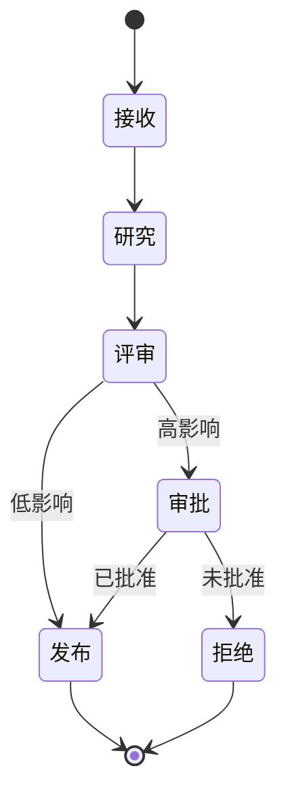

# 课程 05：Agent Runtime 与多 Agent 系统

English: [README.md](README.md) | 前置课程：课程 04 | 门槛：可恢复的有状态工作流

## 5W + How

- **What：** Agent Runtime 管理状态、转换、工具、Checkpoint、重试、审批与 Trace；多 Agent 设计把职责分配给边界明确的参与者。
- **Why：** Durable Execution 让长任务可以恢复；只有专业化或组织边界的价值高于协调成本时，多 Agent 才有帮助。
- **Who：** 领域 Agent 提案，Orchestrator 路由，策略服务授权，人类审批，运维恢复事故。
- **When：** 长时间、可中断任务使用显式状态；只有真实专业化、信任隔离或并行需求才增加 Agent。
- **Where：** 编排属于 Runtime/Control Plane，不应隐藏在 MCP Server 或 UI 对话中。
- **How：** 建模状态与不变量，持久化 Checkpoint，使用幂等键，路由受限任务，校验 Handoff，补偿副作用，并追踪决策。



## 代码：显式状态转换

```python
ALLOWED = {"intake": {"research"}, "research": {"review"},
           "review": {"approval", "publish"}, "approval": {"publish", "rejected"}}

def transition(state: str, target: str) -> str:
    if target not in ALLOWED.get(state, set()):
        raise ValueError(f"illegal transition: {state} -> {target}")
    return target

assert transition("research", "review") == "review"
```

## 模块

状态机与图工作流；Durable Execution；Checkpoint；短期和长期记忆；事件投递；重试与补偿；委派与 Handoff；并发；A2A；LangGraph 和 AutoGen 参考；Trace 与 Replay。

## 故障分析

更多 Agent 会增加不确定性、延迟、成本、攻击面和责任归属模糊。通过不变量、预算、Lease、幂等、类型化 Handoff 与单一结果 Owner，防止循环委派、重复副作用、记忆投毒、部分完成、过期 Checkpoint 和职责不清。

## 实验与面试门槛

构建可恢复的研究-评审工作流：支持暂停审批、进程重启后恢复、拒绝非法转换，并可重放审计 Trace。随后答辩评审者应是第二个 Agent 还是确定性 Evaluator。达到 80/100。

## 参考资料

[LangGraph Overview](https://docs.langchain.com/oss/python/langgraph/overview) · [LangGraph Workflows and Agents](https://docs.langchain.com/oss/python/langgraph/workflows-agents) · [AutoGen](https://microsoft.github.io/autogen/stable/) · [A2A](https://a2a-protocol.org/latest/specification/)

