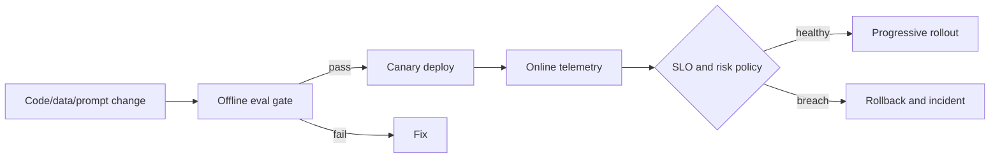

# Course 06: Production AI Engineering

Chinese: [README.zh.md](README.zh.md) | Prerequisite: Course 05 | Gate: production-readiness review

## 5W + How

- **What:** production AI engineering applies evaluation, security, reliability, observability, deployment, and cost controls to probabilistic systems.
- **Why:** a demo proves possibility; production evidence proves acceptable behavior under realistic load and failure.
- **Who:** product, ML/application/platform engineers, SRE, security, privacy, legal, risk, support, and incident commanders share explicit responsibilities.
- **When:** define production criteria before development and enforce them at release and continuously after deployment.
- **Where:** controls span data, model, prompt, retrieval, tools, runtime, infrastructure, UI, and human operations.
- **How:** establish SLOs and risk tolerances, build golden and adversarial sets, trace requests, gate releases, canary, monitor drift, and rehearse rollback.



## Code: Release Gate

```python
def release_allowed(metrics: dict[str, float]) -> bool:
    return (
        metrics["task_success"] >= 0.90
        and metrics["unsafe_action_rate"] == 0
        and metrics["p95_latency_ms"] <= 2500
        and metrics["cost_per_task"] <= 0.08
    )

assert release_allowed({"task_success": .92, "unsafe_action_rate": 0,
                        "p95_latency_ms": 1800, "cost_per_task": .05})
```

## Modules

Evaluation design; human and model judges; calibration; red teaming; prompt injection and data exfiltration; tracing and redaction; SLOs; capacity, rate limits and backpressure; fallback; model/prompt/data versioning; canaries; incident response; FinOps and unit economics.

## Failure Analysis

Averages hide severe tails. Judge models can share the same blind spots as the system. Logs can become a privacy incident. Fallbacks can silently change behavior. Evaluate slices, inspect disagreements, separate security tests, redact by default, bound queues and retries, and make degraded states explicit.

## Lab And Interview Gate

Create an evaluation harness and release gate for the Course 03 agent. Add 50 normal cases, 20 adversarial cases, trace fields, SLOs, cost budget, canary policy, rollback runbook, and one simulated incident. Defend residual risk to engineering and executive panels. Pass at 80/100.

## Sources

[NIST AI RMF](https://www.nist.gov/itl/ai-risk-management-framework) · [NIST Generative AI Profile](https://nvlpubs.nist.gov/nistpubs/ai/NIST.AI.600-1.pdf) · [OWASP GenAI Security Project](https://genai.owasp.org/)

