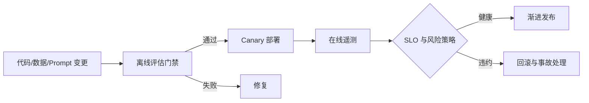

# 课程 06：生产级 AI 工程

English: [README.md](README.md) | 前置课程：课程 05 | 门槛：生产就绪评审

## 5W + How

- **What：** 生产级 AI 工程把评估、安全、可靠性、可观测性、部署与成本控制应用于概率系统。
- **Why：** Demo 证明“可能做到”，生产证据证明在真实负载和故障下行为仍可接受。
- **Who：** 产品、ML/应用/平台工程师、SRE、安全、隐私、法务、风险、客服及 Incident Commander 需要明确分工。
- **When：** 开发前定义生产标准，在发布时执行，并在部署后持续验证。
- **Where：** 控制覆盖数据、模型、Prompt、检索、工具、Runtime、基础设施、UI 与人工运营。
- **How：** 定义 SLO 和风险容忍度，建立 Golden/Adversarial Set，追踪请求，设置发布门禁，Canary，监控漂移，并演练回滚。



## 代码：发布门禁

```python
def release_allowed(metrics: dict[str, float]) -> bool:
    return (
        metrics["task_success"] >= 0.90
        and metrics["unsafe_action_rate"] == 0
        and metrics["p95_latency_ms"] <= 2500
        and metrics["cost_per_task"] <= 0.08
    )

assert release_allowed({"task_success": .92, "unsafe_action_rate": 0,
                        "p95_latency_ms": 1800, "cost_per_task": .05})
```

## 模块

评估设计；人工与模型 Judge；校准；红队；Prompt Injection 与数据外泄；Trace 与脱敏；SLO；容量、限流和 Backpressure；Fallback；模型/Prompt/数据版本；Canary；事故响应；FinOps 与单位经济性。

## 故障分析

平均值会隐藏严重长尾；Judge 模型可能与被测系统共享盲点；日志可能成为隐私事故；Fallback 可能静默改变行为。应按 Slice 评估，检查分歧，单独执行安全测试，默认脱敏，限制队列和重试，并明确展示降级状态。

## 实验与面试门槛

为课程 03 Agent 创建评估 Harness 和发布门禁：50 个正常案例、20 个对抗案例、Trace 字段、SLO、成本预算、Canary 策略、回滚 Runbook 和一次模拟事故。分别向工程与高管面试组答辩剩余风险。达到 80/100。

## 参考资料

[NIST AI RMF](https://www.nist.gov/itl/ai-risk-management-framework) · [NIST 生成式 AI Profile](https://nvlpubs.nist.gov/nistpubs/ai/NIST.AI.600-1.pdf) · [OWASP GenAI Security Project](https://genai.owasp.org/)

