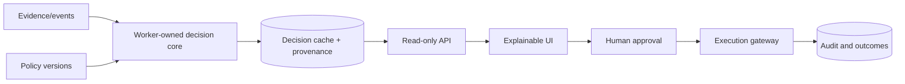

# Course 07: Enterprise AI Decision Systems

Chinese: [README.zh.md](README.zh.md) | Prerequisite: Course 06 | Gate: architecture review board defense

## 5W + How

- **What:** an AI decision system combines evidence, models, deterministic rules, policy, authority, human judgment, and audit into an accountable outcome.
- **Why:** enterprises need repeatable decisions, not persuasive chat. Separation of computation, transport, approval, and execution makes outcomes governable.
- **Who:** domain owners are accountable; model teams provide signals; policy/risk defines constraints; platform runs infrastructure; humans approve exceptions; auditors verify evidence.
- **When:** use this pattern for high-impact, repeated decisions across systems. A simple assistant is enough when no consequential decision or action occurs.
- **Where:** decision computation belongs in a worker/core domain boundary; APIs transport precomputed decisions; UIs explain them; execution remains separately authorized.
- **How:** map the decision, define evidence and policy, compute versioned recommendations, persist provenance, expose read-only views, obtain approval, execute through gates, and monitor outcomes.



## Code: Immutable Decision Envelope

```python
from dataclasses import dataclass

@dataclass(frozen=True)
class Decision:
    decision_id: str
    recommendation: str
    policy_version: str
    evidence_ids: tuple[str, ...]
    requires_approval: bool

def api_view(cached: Decision) -> dict:
    return cached.__dict__  # transport only; no request-time recomputation
```

## Modules

Decision decomposition; evidence and provenance; deterministic policy versus model signal; event buses; worker/core ownership; cached decision envelopes; confidence and uncertainty; human-in-the-loop; execution gates; audit; outcomes and feedback; model risk and change control.

## Failure Analysis

Do not reconstruct recommendations in the API or UI, let explanations outrun evidence, merge approval with execution, or optimize proxy metrics without outcome review. Threats include stale decisions, policy drift, automation bias, selective explanations, event duplication, and unverifiable overrides.

## Lab And Interview Gate

Design one governed decision system for claims, finance, healthcare, or operations. Submit context, container and sequence diagrams; decision schema; policy table; stale/degraded semantics; approval matrix; audit events; SLOs; and threat model. Defend it before a simulated architecture review board. Pass at 80/100.

## XingAI References

[Enterprise AI decision systems](../../articles/2026-06-07-enterprise-ai-decision-systems.md) · [Agent governance](../../articles/2026-07-05-agent-governance-reference-architecture.md) · [Decision cache boundary](../../../xingai-invest-ai/docs/adr/012-decision-cache-boundary.md)

