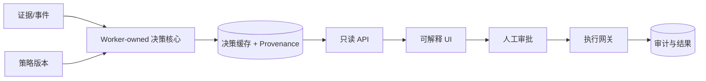

# 课程 07：企业 AI 决策系统

English: [README.md](README.md) | 前置课程：课程 06 | 门槛：架构评审委员会答辩

## 5W + How

- **What：** AI 决策系统把证据、模型、确定性规则、策略、权限、人类判断与审计组合成可问责结果。
- **Why：** 企业需要可重复决策，而不是有说服力的聊天。分离计算、传输、审批和执行，才能治理结果。
- **Who：** 领域 Owner 对结果负责；模型团队提供信号；策略/风险团队定义约束；平台团队运行基础设施；人类审批例外；审计验证证据。
- **When：** 跨系统、高影响、重复决策适合该模式；没有高影响决策或操作时，简单助手足够。
- **Where：** 决策计算属于 Worker/Core 领域边界；API 传输预计算决策；UI 负责解释；执行需要独立授权。
- **How：** 映射决策，定义证据与策略，计算版本化建议，持久化 Provenance，暴露只读视图，获得审批，经 Gate 执行，并监控结果。



## 代码：不可变决策信封

```python
from dataclasses import dataclass

@dataclass(frozen=True)
class Decision:
    decision_id: str
    recommendation: str
    policy_version: str
    evidence_ids: tuple[str, ...]
    requires_approval: bool

def api_view(cached: Decision) -> dict:
    return cached.__dict__  # 仅传输，不在请求时重新计算
```

## 模块

决策分解；证据与 Provenance；确定性策略与模型信号；事件总线；Worker/Core 所有权；缓存决策信封；置信与不确定性；人机闭环；执行 Gate；审计；结果反馈；模型风险与变更控制。

## 故障分析

不得在 API 或 UI 重建建议、让解释超出证据、合并审批与执行，或只优化代理指标而不审查真实结果。重点防范决策过期、策略漂移、自动化偏见、选择性解释、事件重复和无法验证的 Override。

## 实验与面试门槛

为理赔、金融、医疗或运营设计一个受治理的决策系统。提交 Context、Container 和 Sequence 图；决策 Schema；策略表；Stale/Degraded 语义；审批矩阵；审计事件；SLO 与威胁模型。参加模拟架构评审委员会答辩。达到 80/100。

## XingAI 参考资料

[企业 AI 决策系统](../../articles/2026-06-07-enterprise-ai-decision-systems.zh.md) · [Agent 治理](../../articles/2026-07-05-agent-governance-reference-architecture.zh.md) · [Decision Cache Boundary](../../../xingai-invest-ai/docs/adr/012-decision-cache-boundary.md)

