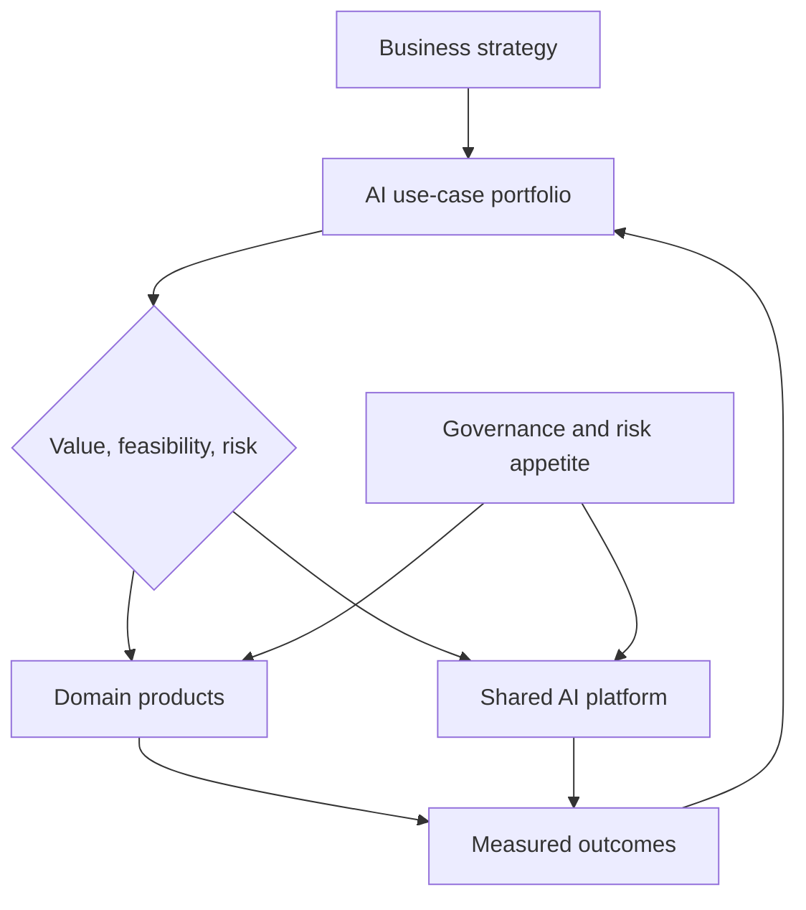

# Course 08: AI Leadership And CTO Strategy

Chinese: [README.zh.md](README.zh.md) | Prerequisite: Course 07 | Gate: board-level strategy defense

## 5W + How

- **What:** AI strategy is a portfolio of business decisions, capabilities, controls, talent, data, platforms, and measurable adoption, not a vendor list.
- **Why:** leadership must convert uncertain technical capability into durable advantage without accepting unbounded cost or risk.
- **Who:** the board sets risk appetite; CEO owns enterprise outcomes; CTO owns technical strategy; CISO/privacy/legal/risk set controls; product and domain leaders own adoption and value.
- **When:** invest when a valuable decision can improve, evidence and ownership exist, and the organization can operate the system. Pause when the use case lacks a measurable outcome or accountable owner.
- **Where:** shared platform capabilities belong centrally; domain decisions remain close to accountable business teams; governance spans both.
- **How:** map the portfolio, score opportunities, choose build/buy/partner, establish architecture principles and control tiers, fund evaluation and change management, stage adoption, and review outcomes quarterly.



## Code: Transparent Portfolio Scoring

```python
def opportunity_score(value: float, feasibility: float, readiness: float, risk: float) -> float:
    for n in (value, feasibility, readiness, risk):
        if not 0 <= n <= 5:
            raise ValueError("inputs must be 0..5")
    return round(0.4 * value + 0.25 * feasibility + 0.2 * readiness - 0.15 * risk, 2)

assert opportunity_score(5, 4, 3, 2) == 3.3
```

The score supports discussion; it does not replace accountable investment judgment. Sensitivity-test weights and record dissent.

## Modules

Strategy and portfolio; capability maturity; operating model and team topology; platform versus domain ownership; build/buy/partner; vendor and model portability; data strategy; economics; security and regulatory governance; adoption; talent; board communication; scenario planning and exit criteria.

## Failure Analysis

Avoid strategy by demo count, centralized bottlenecks, shadow AI, vendor lock-in without exit plans, ROI without baselines, governance detached from delivery, and workforce plans based only on automation. Track adoption, quality-adjusted outcomes, incidents, cost-to-serve, cycle time, and option value.

## Capstone And Interview Gate

Prepare a three-year strategy with current-state map, ten-use-case portfolio, investment thesis, reference platform, risk tiers, operating model, talent plan, vendor scorecard, economics, quarterly milestones, kill criteria, and board memo. Handle challenge questions on a major incident, 40% budget reduction, regulatory change, and failed adoption. Pass at 80/100.

## Sources

[NIST AI RMF](https://www.nist.gov/itl/ai-risk-management-framework) · [XingAI runtime architecture](../../articles/2026-07-03-beyond-prompt-engineering-loop-engineering.md) · [Executable knowledge](../../articles/2026-07-04-executable-knowledge-quality-velocity.md)

