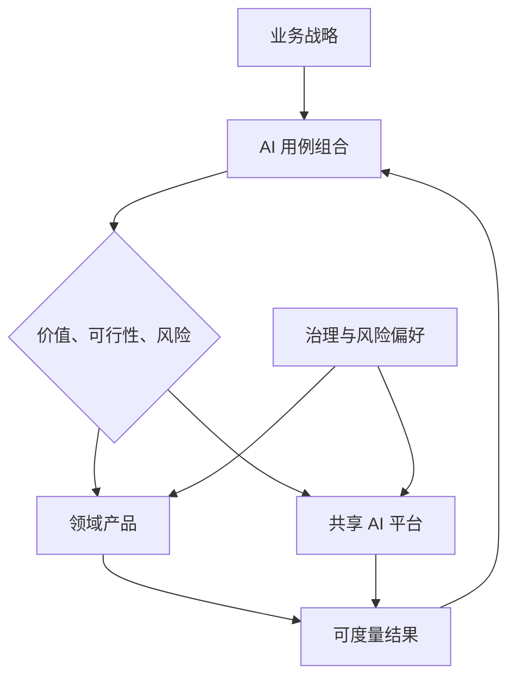

# 课程 08：AI 领导力与 CTO 战略

English: [README.md](README.md) | 前置课程：课程 07 | 门槛：董事会级战略答辩

## 5W + How

- **What：** AI 战略是业务决策、能力、控制、人才、数据、平台和可度量采用率的组合，而不是厂商清单。
- **Why：** 领导者需要把不确定的技术能力转化为持久优势，同时避免无边界成本和风险。
- **Who：** 董事会设定风险偏好，CEO 负责企业结果，CTO 负责技术战略，CISO/隐私/法务/风险团队定义控制，产品与领域负责人负责采用和价值。
- **When：** 当重要决策可改善、证据与 Owner 明确、组织能够运营系统时投资。没有可测结果或责任 Owner 时应暂停。
- **Where：** 共享平台能力集中建设；领域决策留在承担责任的业务团队；治理横跨两者。
- **How：** 映射产品组合，评分机会，选择 Build/Buy/Partner，建立架构原则与控制等级，为评估和变革管理提供预算，分阶段采用并按季度复盘结果。



## 代码：透明的组合评分

```python
def opportunity_score(value: float, feasibility: float, readiness: float, risk: float) -> float:
    for n in (value, feasibility, readiness, risk):
        if not 0 <= n <= 5:
            raise ValueError("inputs must be 0..5")
    return round(0.4 * value + 0.25 * feasibility + 0.2 * readiness - 0.15 * risk, 2)

assert opportunity_score(5, 4, 3, 2) == 3.3
```

评分用于支持讨论，不替代有责任主体的投资判断。需要对权重做敏感性分析并记录不同意见。

## 模块

战略与产品组合；能力成熟度；运营模型与团队拓扑；平台与领域所有权；Build/Buy/Partner；厂商与模型可迁移性；数据战略；经济性；安全与监管治理；采用；人才；董事会沟通；情景规划与退出标准。

## 故障分析

避免以 Demo 数量代替战略、中央团队成为瓶颈、Shadow AI、无退出方案的 Vendor Lock-in、无 Baseline 的 ROI、治理脱离交付，以及只从自动化角度规划人才。跟踪采用率、质量调整后结果、事故、Cost-to-serve、周期时间与 Option Value。

## 结业项目与面试门槛

提交三年战略：现状图、十个用例组合、投资论证、参考平台、风险等级、运营模型、人才计划、厂商 Scorecard、经济模型、季度里程碑、终止标准和董事会 Memo。回答重大事故、预算削减 40%、监管变化和采用失败等挑战。达到 80/100。

## 参考资料

[NIST AI RMF](https://www.nist.gov/itl/ai-risk-management-framework) · [XingAI Runtime 架构](../../articles/2026-07-03-beyond-prompt-engineering-loop-engineering.zh.md) · [Executable Knowledge](../../articles/2026-07-04-executable-knowledge-quality-velocity.zh.md)

