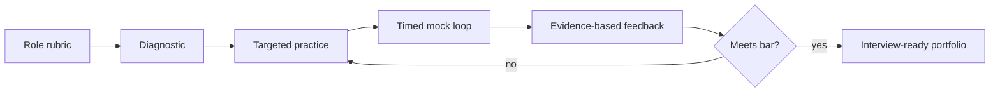

# Course 09: AI Interview Mastery

Chinese: [README.zh.md](README.zh.md) | Prerequisite: target-role courses | Gate: two calibrated mock loops

> This course trains **AI engineer / architect / CTO hiring loops** (coding-for-AI-systems, ML depth, system design, governance). It is not [Learn AI](https://learn.xingai.app)’s coding-pattern practice product.

## 5W + How

- **What:** an AI interview samples coding, ML/LLM understanding, experimentation, debugging, system design, product judgment, security, leadership, and communication.
- **Why:** strong candidates make reasoning and evidence visible under constraints instead of reciting terminology.
- **Who:** candidates, interviewers, hiring managers, cross-functional partners, and executive panels evaluate different signals.
- **When:** begin practice during Course 00; intensify after target-role competencies are demonstrated. Do not use memorized answers to hide missing implementation skill.
- **Where:** prepare across phone screen, coding, take-home, ML depth, AI system design, behavioral, architecture review, and executive presentation.
- **How:** clarify, state assumptions, choose a baseline, reason aloud, write/test, quantify tradeoffs, address risk, summarize, and incorporate feedback.



## Code: Precision And Recall

```python
def precision_recall(tp: int, fp: int, fn: int) -> tuple[float, float]:
    precision = tp / (tp + fp) if tp + fp else 0.0
    recall = tp / (tp + fn) if tp + fn else 0.0
    return precision, recall

assert precision_recall(8, 2, 4) == (0.8, 2 / 3)
```

Explain which metric matters for fraud, medical screening, and low-cost recommendation, then challenge the framing with consequence-weighted outcomes.

## Interview Tracks

Beginner: Python, data, model vocabulary, metrics, one project. Engineer: APIs, RAG, tools, evaluation, debugging. Senior/staff: distributed runtime, reliability, security, tradeoffs, influence. Architect: boundaries, governance, migration, review boards. CTO: portfolio, economics, operating model, risk appetite, board communication, crisis leadership.

## Failure Analysis

Common failures are solving before clarifying, choosing an advanced design without baseline, ignoring data and evaluation, hand-waving security, hiding uncertainty, failing to test code, and giving leadership stories without measurable outcomes or personal contribution.

## Final Gate

Complete two full mock loops separated by remediation. Each includes coding, AI depth, system design, incident/debugging, behavioral, and role-specific leadership. No dimension may score below 3/5; overall score must be at least 80/100. Use the shared [interview bank](../../interview-bank/README.md) and preserve recordings, diagrams, code, feedback, and improved answers as evidence.

