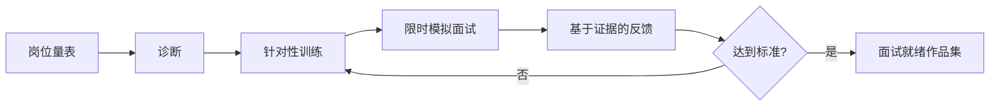

# 课程 09：AI 面试精通

English: [README.md](README.md) | 前置课程：目标岗位相关课程 | 门槛：两轮校准后的模拟面试

> 本课训练的是 **AI 工程师 / 架构师 / CTO 岗位面试循环**（面向 AI 系统的编码、ML 深度、系统设计、治理）。不是 [Learn AI](https://learn.xingai.app) 的 Coding Pattern 刷题产品。

## 5W + How

- **What：** AI 面试通常抽样考察编码、ML/LLM 理解、实验、调试、系统设计、产品判断、安全、领导力与沟通。
- **Why：** 强候选人在约束下展示推理和证据，而不是背诵术语。
- **Who：** 候选人、面试官、招聘经理、跨职能伙伴和高管面试组关注不同信号。
- **When：** 从课程 00 就开始练习；证明目标岗位能力后强化。不要用背诵答案掩盖实现能力缺口。
- **Where：** 覆盖电话筛选、编码、Take-home、ML 深度、AI 系统设计、行为面试、架构评审和高管演讲。
- **How：** 澄清问题，陈述假设，选择 Baseline，口述推理，编码与测试，量化权衡，处理风险，总结并吸收反馈。



## 代码：Precision 与 Recall

```python
def precision_recall(tp: int, fp: int, fn: int) -> tuple[float, float]:
    precision = tp / (tp + fp) if tp + fp else 0.0
    recall = tp / (tp + fn) if tp + fn else 0.0
    return precision, recall

assert precision_recall(8, 2, 4) == (0.8, 2 / 3)
```

解释欺诈、医疗筛查与低成本推荐分别关注哪个指标，再用后果加权结果挑战这个问题设定。

## 面试路径

初学者：Python、数据、模型术语、指标、一个项目。工程师：API、RAG、工具、评估、调试。Senior/Staff：分布式 Runtime、可靠性、安全、权衡、影响力。架构师：边界、治理、迁移、评审委员会。CTO：产品组合、经济性、运营模型、风险偏好、董事会沟通和危机领导。

## 故障分析

常见失败包括未澄清就解题、没有 Baseline 却选择高级设计、忽略数据与评估、模糊处理安全、隐藏不确定性、代码不测试，以及领导力故事缺少可测结果或个人贡献。

## 最终门槛

完成两轮完整模拟面试，中间进行针对性补强。每轮包含编码、AI 深度、系统设计、事故/调试、行为题和岗位领导力。任何维度不得低于 3/5，总分至少 80/100。使用共享[面试题库](../../interview-bank/README.zh.md)，保存录屏、图表、代码、反馈与改进答案作为证据。

