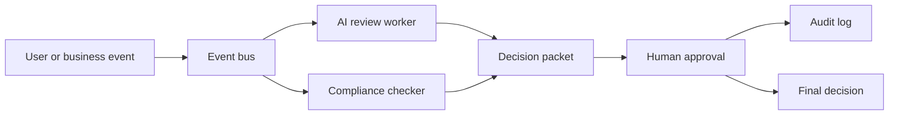

# POC: Event Bus AI Review

> **Status: Architecture Design Only — not yet runnable.**
> This folder contains the architecture design, flow diagram, and enterprise mapping.
> No implementation exists yet. See [Contributing](../../docs/CONTRIBUTING.md) to build it.

## What This Proves

This POC validates how an event bus can decouple AI analysis, compliance review, human approval, and audit logging in an enterprise AI decision workflow.

## Enterprise Pattern

- Event-driven AI workflow
- Agent orchestration
- Human-in-the-loop approval
- Audit-ready decision trail

## Not Production Yet

This POC does not include full auth, tenant isolation, production secrets management, long-term audit retention, or compliance certification.

## Architecture

## Flow

1. A user or business system emits an event.
2. The event bus routes it to independent subscribers.
3. The AI review worker creates a recommendation.
4. The compliance checker adds constraints or warnings.
5. A human reviewer approves, rejects, or escalates the decision.
6. The final decision and supporting context are written to the audit log.

## Lessons Learned

To be filled after implementation.

## Related Design Docs

- EN: [From AI Demos to Enterprise AI Decision Systems](https://github.com/xingaiapp/xingai-enterprise-ai-design/blob/main/articles/2026-06-07-enterprise-ai-decision-systems.md)
- 中文: [从 AI 演示到企业 AI 决策系统](https://github.com/xingaiapp/xingai-enterprise-ai-design/blob/main/articles/2026-06-07-enterprise-ai-decision-systems.zh.md)
- [Enterprise AI architecture diagrams](https://github.com/xingaiapp/xingai-enterprise-ai-design/blob/main/assets/ARCHITECTURE-DIAGRAMS.md)
