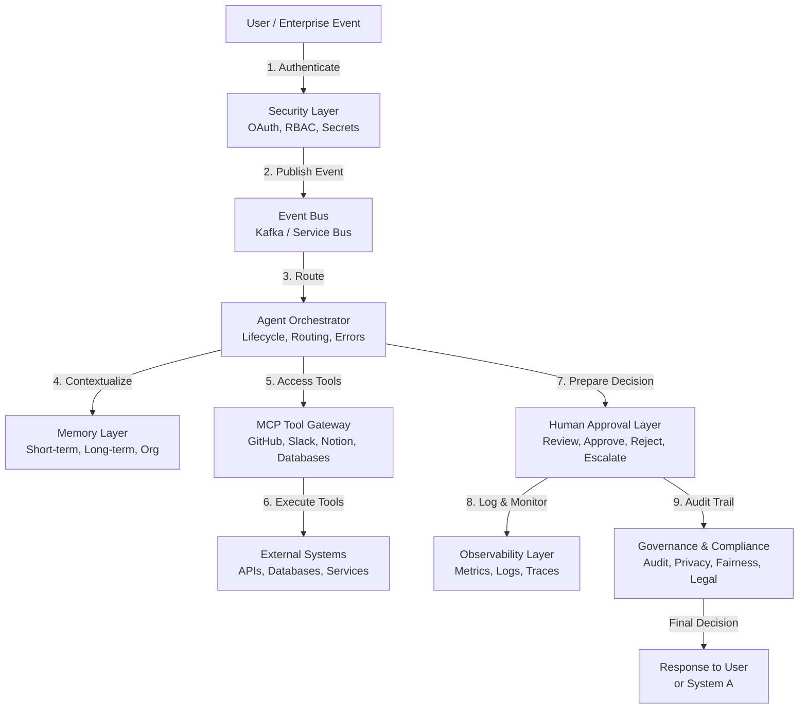
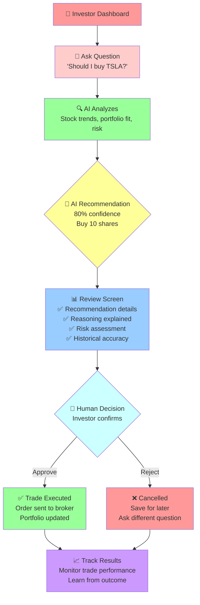
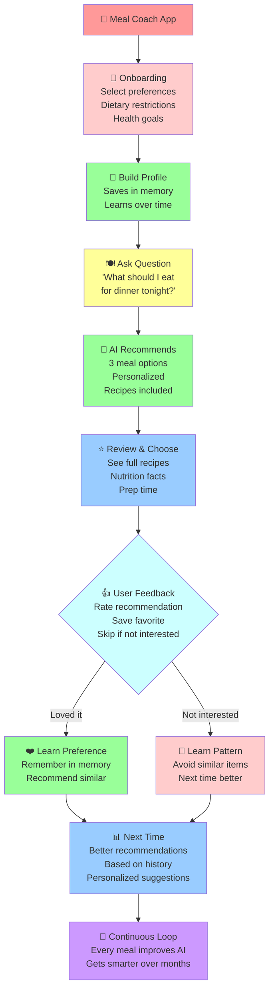

# From AI Demos to Enterprise AI Decision Systems: Why LLM + RAG + MCP Is Not Enough

Most AI architecture diagrams you see online focus on one thing: **getting a demo running as quickly as possible**.

That's fine. Those architectures work great for:

- Learning AI concepts
- Building MVPs
- Weekend projects
- Solo developers
- Proof of concepts

But enterprise AI systems need something **fundamentally different**.

This article explains why the popular "$0 AI Architecture Stack" (LLM + RAG + MCP) is insufficient for enterprise, and introduces a more mature concept: **AI Decision System Architecture**.

## The Problem: Enterprise AI Failures

We've all seen it happen.

A company gets excited about AI. They watch demos. They see a simple architecture:

```
Frontend → Agent → RAG → LLM → MCP → Database
```

It looks clean. It looks simple. It looks like it should work.

Six months later, the project is abandoned because:

- **No audit trail** — Who approved what? When? Why? Nobody knows.
- **No security layer** — API keys are hardcoded. Secrets are exposed.
- **No scaling** — When the system processes millions of requests, everything breaks.
- **No human control** — The AI makes decisions nobody can review or overturn.
- **No memory** — The system forgets context between requests.
- **No observability** — When it fails, you can't debug it.
- **No cost control** — You're spending thousands on API calls with no visibility.
- **No governance** — You can't prove compliance with regulations.

The demo worked. The enterprise system didn't.

## The Demo Stack vs. The Enterprise Stack

### The Demo Stack

```
LLM + RAG + MCP
```

**Pro:**
- Fast to build
- Simple to understand
- Good for learning

**Con:**
- Missing critical enterprise layers
- Can't handle scale
- No governance
- No safety rails

### What's Missing?

In the demo, you think about:

- ✅ Getting an answer from the LLM
- ✅ Retrieving context with RAG
- ✅ Calling tools with MCP

You **don't think about**:

- ❌ Authentication & Authorization
- ❌ Audit logging
- ❌ Secret management
- ❌ Event-driven architecture
- ❌ Long-term memory
- ❌ Human approval layers
- ❌ Monitoring & observability
- ❌ Cost tracking
- ❌ Governance & compliance
- ❌ Circuit breakers & retries
- ❌ Rate limiting
- ❌ Data retention policies

That's 11 categories of missing layers. For a demo, that's fine. For an enterprise system, **that's a disaster waiting to happen**.

## The Evolution: From Chatbot to Decision System

There's a natural evolution in AI systems maturity:

```
AI Chatbot
    ↓
RAG System
    ↓
AI Agent
    ↓
Multi-Agent System
    ↓
AI Decision System
```

Each level has different requirements:

### Level 1: AI Chatbot

**Stack:** LLM only

**Architecture:**
```
User Input → LLM → Response
```

**Use case:** Chat interface, Q&A

**Enterprise ready:** ❌ No

---

### Level 2: RAG System

**Stack:** LLM + Vector DB + Retrieval

**Architecture:**
```
User Input → Retrieval → Context → LLM → Response
```

**Use case:** Document Q&A, knowledge base search

**Enterprise ready:** ⚠️ Partially (with safety additions)

---

### Level 3: AI Agent

**Stack:** LLM + RAG + MCP + Tool Router

**Architecture:**
```
User Input
    ↓
Agent Loop
    ├→ LLM (Reasoning)
    ├→ Tool Router
    ├→ MCP (Tool Execution)
    └→ Memory
    ↓
Response
```

**Use case:** Autonomous task execution, multi-step reasoning

**Enterprise ready:** ⚠️ No (missing critical layers)

---

### Level 4: Multi-Agent System

**Stack:** Agent Orchestration + Event Bus + Multiple Agents

**Architecture:**
```
User Request
    ↓
Event Bus
    ↓
Agent 1, Agent 2, Agent 3 (parallel or sequential)
    ↓
Response Aggregation
    ↓
Response
```

**Use case:** Complex workflows, cross-functional processes

**Enterprise ready:** ⚠️ Partially (depends on implementation)

---

### Level 5: AI Decision System

**Stack:** Full enterprise architecture (see below)

**Use case:** Mission-critical decisions in production

**Enterprise ready:** ✅ Yes

This is where we focus this article.

## The Enterprise AI Decision System Architecture

An **enterprise-grade AI decision system** requires these core layers:

### 1. Security Layer

**Responsibility:** Authentication, authorization, secret management

**Components:**
- OAuth 2.0 / OIDC (authentication)
- Role-based access control (authorization)
- Secret vault (AWS Secrets Manager, HashiCorp Vault)
- API key rotation
- TLS/mTLS for service-to-service communication

**Why it matters:**
- Ensures only authorized users trigger decisions
- Prevents unauthorized access to sensitive data
- Enables compliance with regulations (SOC2, HIPAA, PCI-DSS)

---

### 2. Event Bus

**Responsibility:** Decouple systems, enable scalability, provide auditability

**Options:**
- Apache Kafka
- Azure Service Bus
- AWS SQS/SNS
- NATS
- RabbitMQ

**Why it matters:**
- **Decoupling:** System A doesn't need to know about System B
- **Scalability:** Can process millions of events
- **Replayability:** Can re-run decisions if needed
- **Audit trail:** Every event is logged
- **Integration:** Enterprise systems can subscribe to events

**Example flow:**
```
Enterprise System A
    ↓
Event Bus
    ├→ AI Decision Agent
    ├→ Audit Logger
    ├→ Cost Tracker
    └→ Compliance Monitor
```

---

### 3. Agent Orchestrator

**Responsibility:** Manage agent lifecycle, routing, error handling

**Components:**
- Agent lifecycle management
- Tool routing & validation
- Error handling & retries
- Circuit breakers
- Timeout management
- Resource pooling

**Why it matters:**
- Ensures agents don't crash the system
- Provides visibility into agent execution
- Enables graceful degradation
- Manages resource utilization

---

### 4. Memory Layer

**Responsibility:** Store and retrieve context for decision-making

**Three tiers:**

| Type | Scope | Lifespan | Example |
|------|-------|----------|---------|
| **Short-term** | Single request | Minutes | Current user input, recent context |
| **Long-term** | User lifetime | Months/Years | User preferences, historical decisions |
| **Organizational** | System-wide | Years | Domain rules, historical patterns |

**Why it matters:**

Without memory, the system forgets everything between requests. With memory, it makes **better decisions**.

**Real example from XingAI:**

- **Meal Coach:** Remembers user's dietary restrictions, preferences, past meals
  - Without memory: "What should I eat?" → Generic response
  - With memory: "What should I eat?" → Personalized based on 6 months of history

- **Invest AI:** Remembers user's risk tolerance, portfolio composition, past decisions
  - Without memory: "Should I buy this stock?" → Generic analysis
  - With memory: "Should I buy this stock?" → Personalized based on user's investment profile

---

### 5. MCP Tool Gateway

**Responsibility:** Standardize how agents access external tools

**What MCP does:**
- Provides a standard protocol for tools
- Enables agents to discover available tools
- Abstracts away tool implementation details

**What MCP does NOT do:**
- MCP is not the architecture
- MCP is not where business logic lives
- MCP is just a tool integration standard

**Correct flow:**
```
Agent
    ↓
Tool Router (where business logic lives)
    ↓
MCP Layer (standardized tool invocation)
    ↓
External Tools (GitHub, Slack, Notion, Databases, APIs)
```

**Real tools in enterprise AI:**
- GitHub API (code search, deployment)
- Slack API (notifications, approvals)
- Notion API (documentation, knowledge)
- Internal databases
- Third-party APIs
- Legacy systems

---

### 6. Human Approval Layer

**Responsibility:** Ensure AI decisions are reviewed before execution

**AI should NOT directly:**
- Approve financial transactions
- Move money
- Delete records
- Modify production systems
- Send external communications
- Create legal contracts

**AI CAN:**
- Prepare the decision for human review
- Recommend an action
- Surface relevant context
- Flag risks or exceptions
- Explain the reasoning

**Implementation:**
```
AI Decision
    ↓
Prepare for Human Review
    ├─ Decision summary
    ├─ Risk assessment
    ├─ Relevant context
    └─ Explainability
    ↓
Human Review
    ├─ Approve
    ├─ Reject
    ├─ Escalate
    └─ Request modifications
    ↓
Execution (only if approved)
```

---

### 7. Observability Layer

**Responsibility:** Understand what the system is doing

**Three pillars:**

1. **Metrics** — Numerical measurements
   - Decisions per minute
   - Success rate
   - Latency (p50, p99)
   - Cost per decision
   - User satisfaction

2. **Logs** — Detailed event records
   - Decision inputs
   - Reasoning steps
   - Tool calls
   - Outcomes

3. **Traces** — Request flow through system
   - Entry point
   - Agent routing
   - Tool invocations
   - Final decision

**Why it matters:**
- When something goes wrong, you can debug it
- You understand system behavior
- You can optimize performance
- You can track costs

---

### 8. Governance & Compliance Layer

**Responsibility:** Ensure system complies with regulations

**Components:**
- **Audit logging** — Who approved what, when, why
- **Data retention** — How long to keep data
- **Explainability** — Can you explain the decision?
- **Fairness** — Is the system biased?
- **Right to deletion** — Can users delete their data?
- **Compliance checks** — SOC2, HIPAA, PCI-DSS, GDPR, etc.

**Why it matters:**
- Regulators demand audit trails
- Users demand privacy
- You need to prove fairness
- Legal liability is enormous

---

## Visual: The Full Enterprise AI Decision System

Here's how these 8 layers work together:



## Why This Matters: The Event Bus Section

Let me go deeper on one critical component: **the Event Bus**.

### Without an Event Bus

When you don't have an event bus, systems are **tightly coupled**:

```
System A → AI Agent → Directly modifies System B
```

**Problems:**
- System A and System B must know about each other
- If System B changes, System A breaks
- Can't replay decisions
- Hard to debug what happened
- Synchronous calls = slow

---

### With an Event Bus

Systems are **decoupled**:

```
System A
    ↓
Event Bus
    ├→ AI Decision Agent (subscribes)
    ├→ Audit Logger (subscribes)
    ├→ Cost Tracker (subscribes)
    └→ Compliance Monitor (subscribes)
```

**Benefits:**

1. **Decoupling** — System A doesn't know about AI Agent
2. **Scalability** — Event Bus can handle millions of events
3. **Reliability** — If AI Agent crashes, event stays in the bus
4. **Replayability** — Can re-process events if needed
5. **Auditability** — Every event is logged
6. **Enterprise Integration** — Easy to add new subscribers
7. **Async Processing** — Faster responses to users

**Real example: Financial decision**

```
User submits investment decision
    ↓
Event: "InvestmentDecision.Submitted"
    ├→ AI Analysis Agent (analyze risk)
    ├→ Compliance Agent (check regulations)
    ├→ Risk Agent (check portfolio exposure)
    ├→ Audit Logger (log for regulators)
    └→ Notification Service (notify user)
    ↓
All agents process in parallel
All events logged
All decisions explainable
```

---

## The Role of MCP in Enterprise AI

I need to be clear on something: **MCP is not the architecture**.

This is a common misconception.

**MCP is a tool integration standard.**

It solves one problem: "How do I get the AI agent to call external tools in a standardized way?"

It does NOT solve:
- Authentication (your problem)
- Authorization (your problem)
- Memory (your problem)
- Human approval (your problem)
- Observability (your problem)
- Governance (your problem)

### Correct Architecture with MCP

```
Agent
    ↓
Tool Router (business logic, routing decisions)
    ↓
MCP Layer (standardized protocol)
    ↓
Tools
    ├─ GitHub
    ├─ Slack
    ├─ Notion
    ├─ Databases
    └─ Internal APIs
```

The **Tool Router** is where your business logic lives. MCP is just a layer below that.

### Enterprise Tools via MCP

In XingAI products:

- **GitHub MCP** — Code search, deploy systems
- **Slack MCP** — Send alerts, get approvals
- **Notion MCP** — Access knowledge base
- **Database MCP** — Query user data
- **Custom MCP servers** — Internal APIs

Each tool is accessed through the same standardized interface (MCP), but routed by business logic in the Tool Router.

---

## The Missing Layer: Memory Architectures

One of the biggest mistakes in simple AI systems: **no memory**.

Every request starts from scratch.

**That's fine for chatbots.** Not fine for enterprise.

### Three Tiers of Memory

#### 1. Short-Term Memory

**Scope:** Single request or conversation session

**Lifespan:** Minutes to hours

**Examples:**
- Current user input
- Recent messages in conversation
- Context needed for current decision

**Implementation:** In-memory cache, Redis, session storage

---

#### 2. Long-Term Memory

**Scope:** Specific user or entity

**Lifespan:** Months to years

**Examples:**
- User preferences
- Historical decisions
- Past interactions
- User profile

**Implementation:** Database, vector store

**Real example — Meal Coach:**
```
User has been using Meal Coach for 6 months.
System remembers:
- Dietary restrictions (vegetarian, nut allergy)
- Preferences (prefers Asian cuisine)
- Health goals (weight loss)
- Past meals (to avoid repetition)
- Feedback (didn't like quinoa)

Next recommendation:
→ Vegetarian Asian recipe
→ No nuts
→ 400 calories
→ Something they haven't had in 2 weeks
```

Without this memory, every meal recommendation is generic.

With this memory, every recommendation is personalized.

---

#### 3. Organizational Memory

**Scope:** System-wide, organization-level

**Lifespan:** Years

**Examples:**
- Domain rules (what loans do we approve?)
- Compliance policies (what are regulatory limits?)
- Historical patterns (what decisions led to good outcomes?)
- Risk profiles (what is our risk tolerance?)

**Implementation:** Policy database, rules engine, knowledge graph

**Real example — Invest AI:**
```
Organizational memory for investment decisions:
- Max portfolio allocation per sector: 25%
- Max position size: $100K
- Minimum margin of safety: 20%
- Minimum analyst coverage: 2+
- Geographic diversification requirement

When AI suggests a trade:
→ Check against organizational memory
→ Flag if violates any policy
→ Escalate for human review if needed
```

---

## Human Approval Layer in Practice

Let's look at how different enterprises implement human approval:

### E-commerce: Order Approval

```
AI Decision: "Approve order for $50K from new customer"
    ↓
Human Review:
    - Customer credit check ✅
    - Shipping address verification ✅
    - Risk flags: High first-time order amount ⚠️
    ↓
Options for human:
    - Approve (order processes immediately)
    - Reject (order is cancelled)
    - Request more info (AI provides additional context)
    - Escalate (send to manager)
```

---

### Finance: Investment Decision

```
AI Decision: "Recommend buying TSLA stock"
    ↓
AI provides:
    - Analysis (valuation, momentum, risk)
    - Portfolio impact (concentration, diversification)
    - Market context (sector trends, macro factors)
    - Confidence level (78%)
    ↓
Human Review:
    - Reads AI analysis ✅
    - Checks company news ✅
    - Verifies against portfolio goals ✅
    ↓
Human Decision:
    - Approve (buy recommended amount)
    - Approve with modification (buy 50% recommended amount)
    - Reject (don't buy, believe market priced in news)
    - Escalate (ask CIO for guidance)
```

---

### Healthcare: Treatment Decision

```
AI Decision: "Recommend reducing dosage for medication"
    ↓
AI provides:
    - Patient history
    - Recent vitals
    - Research on drug interactions
    - Risk assessment
    ↓
Doctor Review:
    - Evaluates AI recommendation
    - Examines latest lab work
    - Considers patient-specific factors
    ↓
Doctor Decision:
    - Approve (reduce dosage)
    - Reject (maintain current dosage)
    - Modify (reduce by smaller amount)
    - Schedule follow-up
```

---

## Observability in Enterprise AI Systems

When something goes wrong in production (and it will), you need to understand **exactly what happened**.

### Example: Bad Decision Made

```
Scenario: Investment AI recommended terrible trade

Question: Why did it recommend that?

Without observability:
→ No idea. System is a black box. Can't debug.

With observability:
→ Pull the trace for that request
→ See exact inputs, reasoning, tools called
→ Identify the bug (missing data, wrong weight, miscalculation)
→ Fix and retest
```

### Three Pillars of Observability

#### 1. Metrics

```
dashboard/
├─ Decisions per minute
├─ Success rate (approved / total)
├─ Latency (p50, p95, p99)
├─ Cost per decision
├─ Tool utilization
└─ Error rate
```

#### 2. Logs

```
Example log entry:

{
  "timestamp": "2026-06-07T14:23:45Z",
  "request_id": "req-12345",
  "user_id": "user-987",
  "decision_type": "investment_recommendation",
  "inputs": {
    "stock_symbol": "TSLA",
    "portfolio_value": "$500K",
    "risk_tolerance": "moderate"
  },
  "agent_reasoning": [
    "Analyzed valuation metrics",
    "Checked technical indicators",
    "Evaluated sector trends"
  ],
  "recommendation": "BUY",
  "confidence": 0.78,
  "approval_status": "approved_by_user_123",
  "execution_time_ms": 1247
}
```

#### 3. Traces

```
Request flow:

[User Input]
    ↓ (100ms)
[Authentication]
    ↓ (50ms)
[Load Memory]
    ├─ Short-term (30ms)
    ├─ Long-term (45ms)
    └─ Organizational (35ms)
    ↓ (110ms)
[Agent Reasoning]
    ├─ Call LLM (2000ms)
    ├─ Interpret response (50ms)
    ├─ Route to tools (25ms)
    └─ Execute tools (1500ms)
    ↓ (3575ms)
[Human Review] (waits for human decision)
    ↓ (depends on human)
[Execute Decision]
    ↓ (500ms)
[Log Results]
    ↓ (100ms)
[Total latency: 4435ms + human time]
```

---

## Governance & Compliance: The Non-Negotiable Layer

In enterprise, AI systems are not optional extras. **They're subject to regulation.**

### Compliance Requirements (by industry)

| Industry | Regulation | Key Requirement |
|----------|-----------|-----------------|
| Finance | SOC2, SEC, FINRA | Audit trail, explainability, risk limits |
| Healthcare | HIPAA, FDA | Privacy, safety monitoring, documentation |
| Insurance | State regulators | Fairness, non-discrimination |
| Government | Federal guidelines | Explainability, bias testing |
| EU | GDPR, AI Act | Right to deletion, explainability |

### What Regulators Want

1. **Audit trail** — "Who made the decision and when?"
2. **Explainability** — "Why was this decision made?"
3. **Safety bounds** — "Can the system make catastrophic decisions?"
4. **Fairness** — "Is the system biased?"
5. **Transparency** — "Tell users you're using AI"

### Building Compliance In

```
Decision Made
    ↓
Log to Audit Trail
    - Decision ID
    - Decision content
    - AI inputs
    - Human approver (if applicable)
    - Timestamp
    - Execution result
    ↓
Monitor for Anomalies
    - Unusual patterns
    - Regulatory violations
    - Fairness issues
    ↓
Generate Compliance Reports
    - For regulators
    - For internal review
    - For user requests (e.g., "why did you reject my application?")
```

---

## Real-World Case Studies

### Case Study 1: Investment AI at XingAI

**Problem:** Simple agent could recommend terrible trades

**Solution:** Enterprise AI Decision System

**Layers implemented:**

| Layer | What They Do |
|-------|-------------|
| Security | OAuth for user auth, API keys for brokers |
| Event Bus | Kafka for decision tracking, audit |
| Memory | Stores portfolio, risk profile, past decisions |
| MCP | Connects to broker APIs, market data |
| Human Approval | All trades require investor confirmation |
| Observability | Logs every recommendation and decision |
| Governance | Audit trail for regulators, SEC compliance |

**UX Flow:**



**Result:**
- Investors confident in recommendations
- SEC compliance for regulated activities
- Can explain every decision
- Can revert bad decisions
- Can analyze recommendation quality

**[→ Try the demo at invest.xingai.app](https://invest.xingai.app)**

---

### Case Study 2: Meal Coach at XingAI

**Problem:** Generic meal recommendations aren't useful

**Solution:** Memory-powered decision system

**Layers implemented:**

| Layer | What They Do |
|-------|-------------|
| Memory | Tracks dietary restrictions, preferences, feedback |
| Agent | Reasons about nutrition and user goals |
| Observability | Tracks recommendation quality |
| Governance | Privacy of food preferences, medical data |

**UX Flow:**



**Result:**
- 10x better user engagement
- Personalized recommendations
- Users follow through on suggestions
- Improved health outcomes

**[→ Try the demo at meal.xingai.app](https://meal.xingai.app)**

---

## What XingAI Builds

Most AI products focus on **generating answers**.

XingAI focuses on **helping people make better decisions**.

### Our Products

Each is a focused **AI Decision System**:

- **Meal Coach** — Health domain, help users eat better
- **Cook AI** — Cooking domain, help users cook smarter
- **Outfit AI** — Fashion domain, help users dress smarter
- **Routine AI** — Habits domain, help users live better
- **SAT AI** — Education domain, help students prep smarter
- **Travel AI** — Travel domain, help users explore better
- **Invest AI** — Finance domain, help investors decide smarter
- **Parent AI** — Parenting domain, help families thrive

### Why This Architecture Works

Each product needs:

1. **Domain-specific knowledge** (memory, rules)
2. **Safety guardrails** (human approval for critical decisions)
3. **Long-term learning** (improve recommendations over time)
4. **Trust and transparency** (users need to understand why)
5. **Compliance** (different regulations per domain)

Our enterprise architecture supports all of this.

---

## Making the Evolution: From MVP to Enterprise

You don't need to implement everything at once.

### Phase 1: MVP (Month 1-2)

```
User → Agent → RAG → LLM → Response
+ Simple error handling
```

**Sufficient for:** Learning, demos, PoC

---

### Phase 2: Early Product (Month 3-4)

Add memory and MCP:

```
User → Agent → Memory → RAG → LLM → MCP → Tools
+ Logging
```

**Sufficient for:** Beta users, lightweight production

---

### Phase 3: Growth (Month 5-6)

Add orchestration and approval:

```
User → Event Bus → Agent Orchestrator → Memory → LLM → Approval → MCP
+ Observability
```

**Sufficient for:** Production with oversight

---

### Phase 4: Enterprise (Month 7+)

Add security, governance, compliance:

```
Auth → Event Bus → Orchestrator → Memory → LLM → Approval → MCP
    ↓
Governance & Compliance
Observability & Monitoring
Cost Tracking & Limits
```

**Sufficient for:** Enterprise, regulated industries

---

## Common Mistakes to Avoid

### ❌ Mistake 1: Thinking MCP is the architecture

MCP is a tool standard. The architecture is much bigger.

### ❌ Mistake 2: Skipping the human approval layer

"The AI is smart enough." No, it's not. Always have human approval for consequential decisions.

### ❌ Mistake 3: No memory

Every request starting fresh = bad decisions. Invest in memory.

### ❌ Mistake 4: No observability

When something breaks, you can't debug it.

### ❌ Mistake 5: Ignoring governance

You'll get sued or fined. Compliance is not optional.

### ❌ Mistake 6: Event-driven architecture too late

Adding it later is painful. Plan for it from the start.

---

## Conclusion: The Path Forward

The "$0 AI Architecture Stack" (LLM + RAG + MCP) is great for learning and MVPs.

**But enterprise requires maturity.**

**8 essential layers:**

1. **Security** — Authenticate and authorize users
2. **Event Bus** — Decouple systems, enable scale
3. **Agent Orchestrator** — Manage agent lifecycle
4. **Memory Layer** — Store context for better decisions
5. **MCP Tool Gateway** — Standardize tool access
6. **Human Approval** — Ensure critical decisions are reviewed
7. **Observability** — Understand what your system is doing
8. **Governance** — Comply with regulations

Without these layers, your AI system will:
- Fail under load
- Make unexplainable decisions
- Be impossible to debug
- Create regulatory liability
- Lose user trust

With these layers, your AI system will:
- Scale to production
- Make trustworthy decisions
- Enable rapid debugging
- Satisfy regulators
- Build user confidence

The question isn't whether you need this. The question is **when you want to build it** — at the start, or after 6 months of failure.

---

**Author:** Xing Wang, AI Architect  
**Date:** June 7, 2026  
**License:** CC BY 4.0

---

## Further Reading

- [Event Bus Patterns in Enterprise Architecture](https://www.azure.microsoft.com/en-us/blog/event-driven-architecture/)
- [NIST AI Risk Management Framework](https://nvlpubs.nist.gov/nistpubs/ai/nist.ai.100-1.pdf)
- [Model Context Protocol (MCP) Specification](https://modelcontextprotocol.io)
- [XingAI Tech Blog](https://github.com/xingaiapp/xingai-tech-blog)

## Tags

`architecture` `enterprise` `ai-decision-systems` `design-patterns` `mcp` `event-bus` `human-in-the-loop` `governance` `observability` `security` `memory` `compliance` `audit-logging` `agent-orchestration`
