# 从 AI 演示到企业 AI 决策系统：为什么 LLM + RAG + MCP 还不够

## 5W 框架

### **What（是什么）**
本文讨论为什么流行的"$0 AI 架构栈"（LLM + RAG + MCP）对企业AI系统**不足够**，以及如何构建**企业级 AI 决策系统架构**。

### **Who（谁适用）**
- 企业架构师
- AI 架构师
- CTO
- 工程部经理
- 高级开发工程师

### **Why（为什么重要）**
因为简单的 LLM + RAG + MCP 缺少 11 个关键的企业层（安全、审计、治理、合规等），导致项目在生产环境中失败。

### **When（何时需要）**
当你从 **MVP/演示** 阶段进入**企业生产**阶段时。

### **Where（在哪里应用）**
在企业级 AI 系统中——金融、医疗、政府、SaaS 等受规管行业。

---

## 问题：企业 AI 系统为什么失败

你可能看过这样的情景。

一家公司对 AI 很兴奋。他们看了演示。他们看到一个简单的架构：

```
Frontend → Agent → RAG → LLM → MCP → Database
```

看起来干净。看起来简单。看起来应该能用。

六个月后，项目被放弃了，因为：

- **没有审计追踪** — 谁批准了什么？什么时候？为什么？没人知道。
- **没有安全层** — API 密钥被硬编码。密钥暴露。
- **无法扩展** — 当系统处理数百万请求时，一切都崩溃了。
- **没有人类控制** — AI 做出的决策没人能审核或推翻。
- **没有记忆** — 系统在请求间忘记所有内容。
- **不可观测** — 当它失败时，你无法调试。
- **没有成本控制** — 你在 API 调用上花费数千美元，却看不见成本。
- **没有治理** — 你无法证明符合法规。

演示成功了。企业系统失败了。

---

## 演示栈 vs. 企业栈

### 演示栈

```
LLM + RAG + MCP
```

**优点：**
- 快速构建
- 易于理解
- 适合学习

**缺点：**
- 缺少关键的企业层
- 无法处理规模
- 没有治理
- 没有安全防护

### 缺少什么？

在演示中，你考虑：

- ✅ 从 LLM 获取答案
- ✅ 用 RAG 检索上下文
- ✅ 用 MCP 调用工具

你**不考虑**：

- ❌ 身份验证和授权
- ❌ 审计日志
- ❌ 密钥管理
- ❌ 事件驱动架构
- ❌ 长期记忆
- ❌ 人工批准层
- ❌ 监控和可观测性
- ❌ 成本跟踪
- ❌ 治理和合规
- ❌ 熔断器和重试
- ❌ 限流

那是 11 个类别的缺失层。对于演示，没关系。对于企业系统，**这是一场灾难**。

---

## 演进阶段：从聊天机器人到决策系统

AI 系统成熟度有一个自然演进：

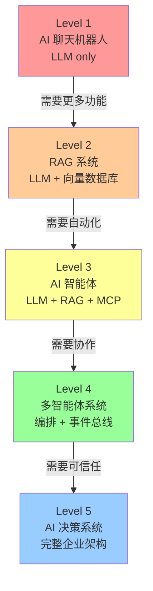

每个级别有不同的要求：

| 级别 | 栈 | 用例 | 企业就绪 |
|------|-----|------|---------|
| 1 | LLM 仅 | 聊天、Q&A | ❌ |
| 2 | LLM + 向量DB | 文档 Q&A | ⚠️ |
| 3 | LLM + RAG + MCP | 智能体任务 | ⚠️ |
| 4 | 编排 + 事件总线 | 复杂工作流 | ⚠️ |
| 5 | **完整企业架构** | **生产决策** | ✅ |

---

## 企业 AI 决策系统架构

一个**企业级 AI 决策系统**需要这 8 个核心层：

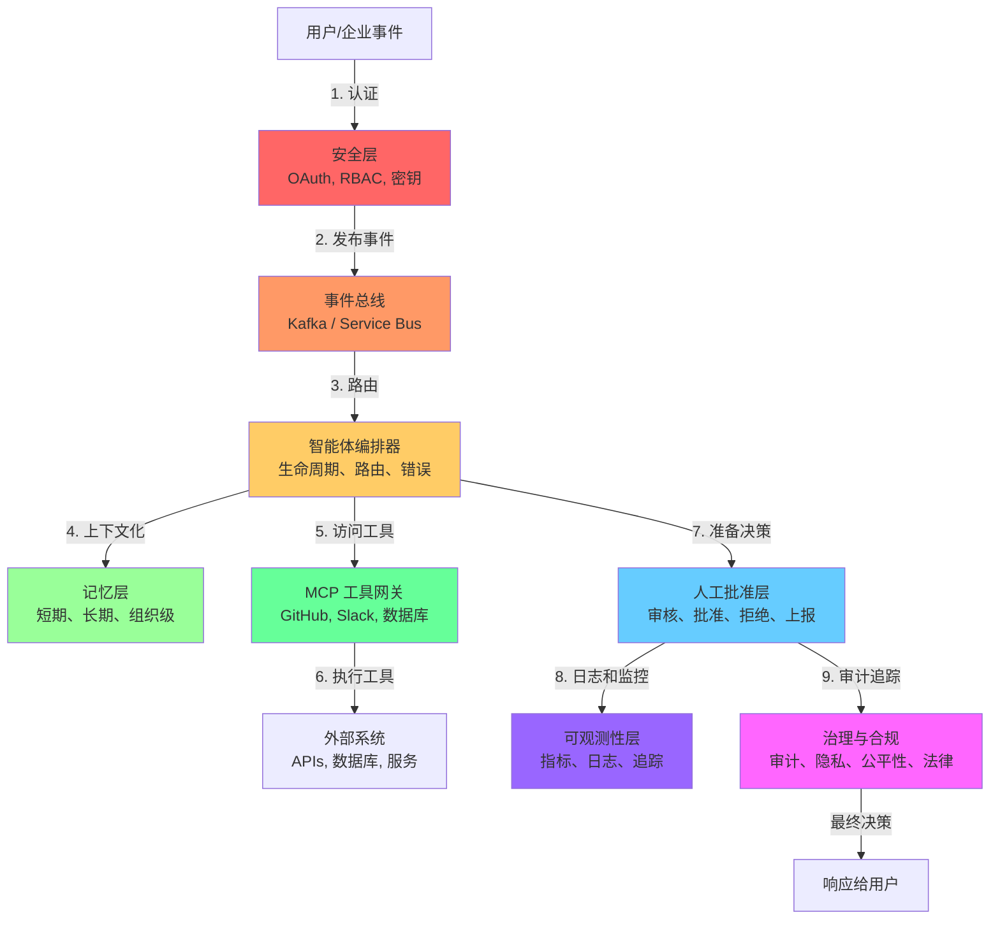

### 1. 安全层

**职责：** 身份验证、授权、密钥管理

**为什么重要：**
- 确保只有授权用户触发决策
- 防止未授权访问敏感数据
- 符合法规要求（SOC2, HIPAA, PCI-DSS）

---

### 2. 事件总线

**职责：** 解耦系统、启用可扩展性、提供可审计性

**选项：** Apache Kafka, Azure Service Bus, AWS SQS/SNS, NATS, RabbitMQ

**为什么重要：**

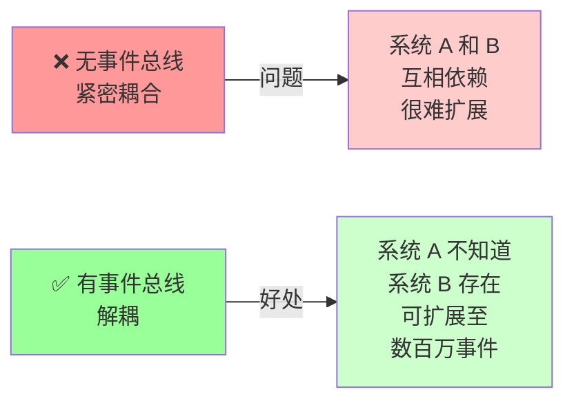

**示例流程：**

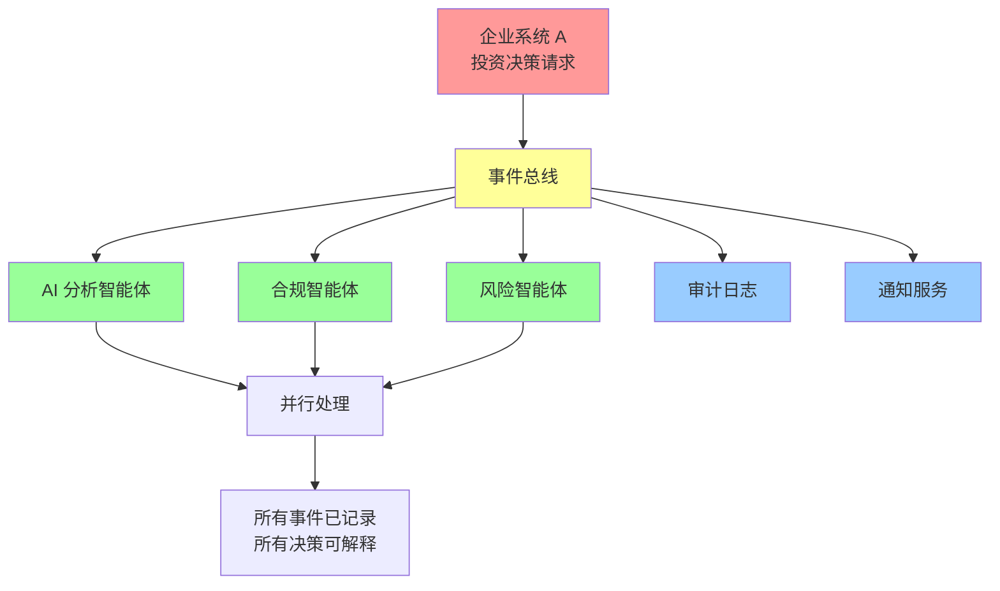

---

### 3. 记忆层

**三个层级：**

| 类型 | 范围 | 生命周期 | 示例 |
|------|------|---------|------|
| **短期** | 单个请求 | 分钟 | 当前用户输入 |
| **长期** | 用户生命周期 | 月/年 | 用户偏好 |
| **组织级** | 系统范围 | 年 | 域规则、政策 |

**为什么重要：**

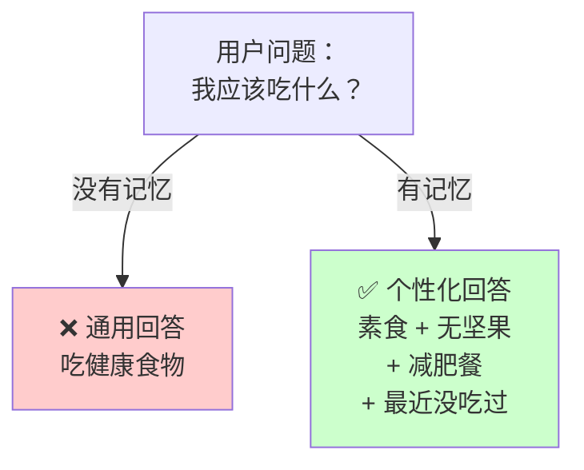

---

### 4. MCP 工具网关

**重要澄清：MCP 不是架构。MCP 是工具集成标准。**

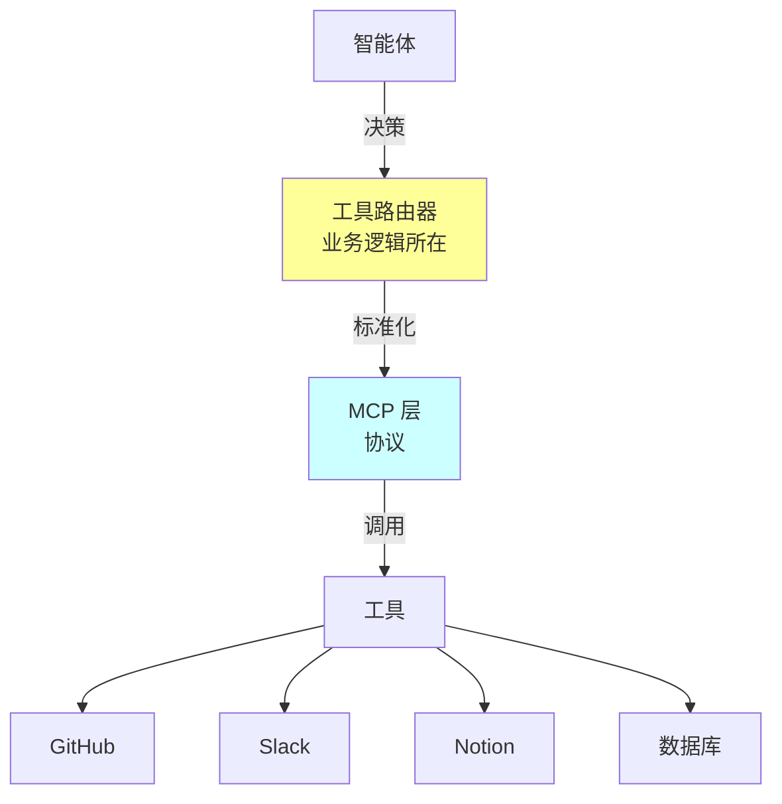

---

### 5. 人工批准层

**AI 不应该直接：**
- 批准金融交易
- 转移金钱
- 删除记录
- 修改生产系统

**AI 应该：**
- 为人工审核准备决策
- 推荐一个行动
- 提供相关上下文
- 解释推理

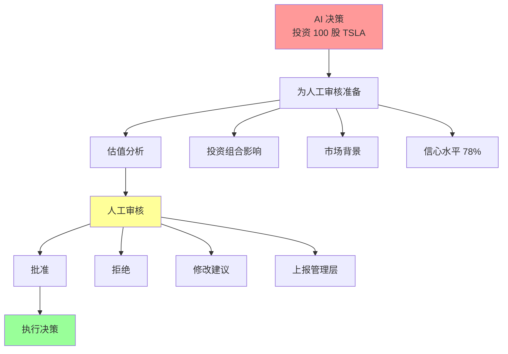

---

### 6. 可观测性层

**三大支柱：**

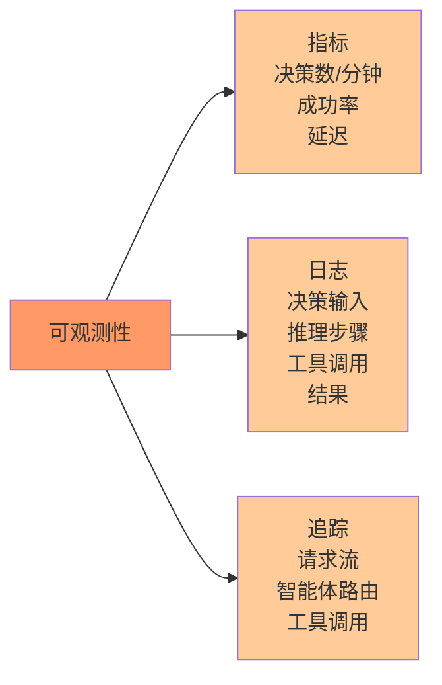

---

### 7. 治理与合规层

**法规要求：**

| 行业 | 法规 | 关键要求 |
|------|------|---------|
| 金融 | SOC2, SEC | 审计追踪、可解释性、风险限制 |
| 医疗 | HIPAA, FDA | 隐私、安全监控、文档 |
| 保险 | 州法规 | 公平性、无歧视 |
| EU | GDPR, AI 法 | 删除权、可解释性 |

---

## 真实案例

### 案例 1：XingAI Invest AI

**问题：** 简单的智能体可能推荐糟糕的交易

**解决方案：** 企业 AI 决策系统

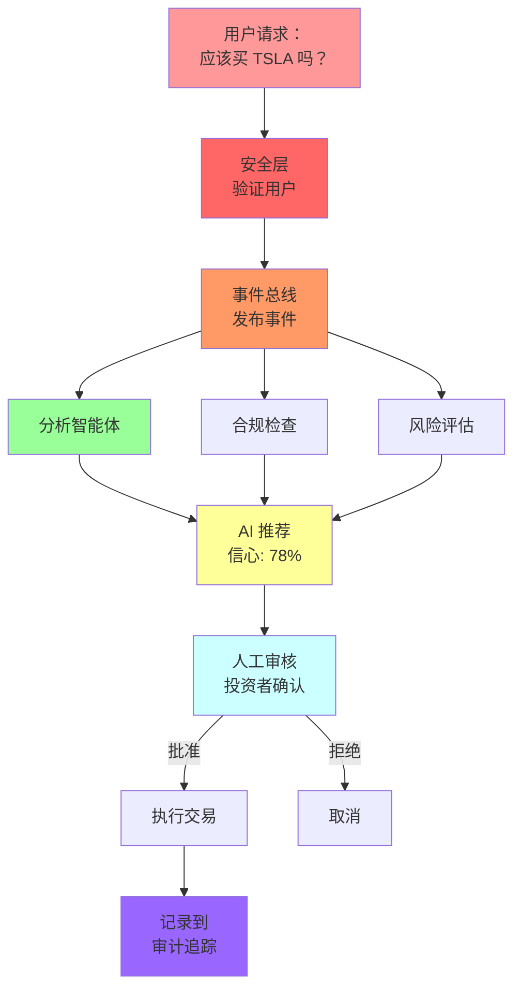

**用户体验流程：**

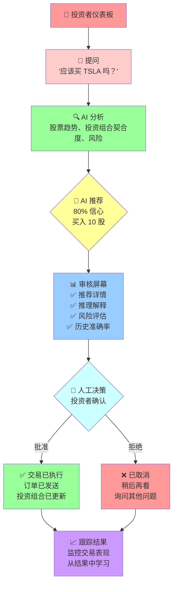

**[→ 在 invest.xingai.app 尝试演示](https://invest.xingai.app)**

---

### 案例 2：XingAI Meal Coach

**问题：** 通用的膳食建议没有用

**解决方案：** 记忆驱动的决策系统

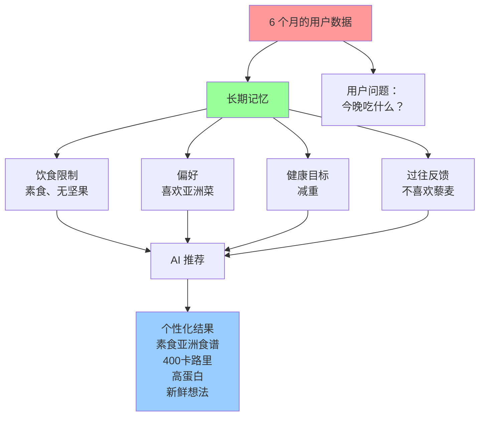

**用户体验流程：**

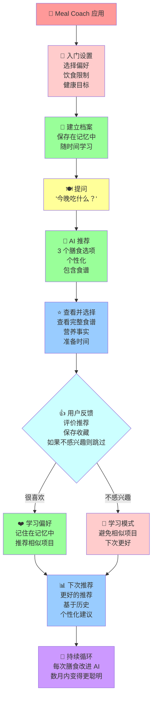

**[→ 在 meal.xingai.app 尝试演示](https://meal.xingai.app)**

---

## 常见错误

### ❌ 错误 1：认为 MCP 就是架构

MCP 是工具标准。架构大得多。

### ❌ 错误 2：跳过人工批准层

"AI 足够聪明。" 不，不够。关键决策总是需要人工审核。

### ❌ 错误 3：没有记忆

每个请求从零开始 = 糟糕的决策。投资记忆。

### ❌ 错误 4：没有可观测性

当出问题时，你无法调试它。

### ❌ 错误 5：忽视治理

你会被起诉或罚款。合规不是可选的。

### ❌ 错误 6：太晚采用事件驱动架构

事后添加很痛苦。从一开始就规划。

---

## 演进路径

你不需要一次性实现一切。

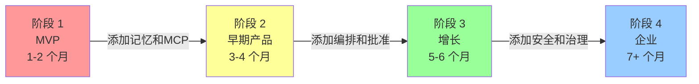

---

## 结论

"$0 AI 架构栈"（LLM + RAG + MCP）适合学习和 MVP。

**但企业需要成熟度。**

**8 个必需层：**

1. **安全** — 身份验证和授权
2. **事件总线** — 解耦系统、启用扩展
3. **智能体编排器** — 管理智能体生命周期
4. **记忆层** — 为更好的决策存储上下文
5. **MCP 工具网关** — 标准化工具访问
6. **人工批准** — 确保关键决策被审核
7. **可观测性** — 理解你的系统在做什么
8. **治理** — 符合法规

没有这些层，你的 AI 系统会：
- 负载下失败
- 做出无法解释的决策
- 无法调试
- 产生法律风险
- 失去用户信任

有了这些层，你的 AI 系统会：
- 扩展到生产
- 做出值得信任的决策
- 快速调试
- 满足法规
- 建立用户信心

问题不是你是否需要这个。问题是**什么时候构建它**——在一开始，还是在 6 个月失败后。

---

**作者：** Xing Wang, AI 架构师  
**日期：** 2026 年 6 月 7 日  
**许可证：** CC BY 4.0

## 标签

`架构` `企业` `ai决策系统` `设计模式` `mcp` `事件总线` `人机闭环` `治理` `可观测性` `安全` `记忆` `合规` `审计日志` `智能体编排`
