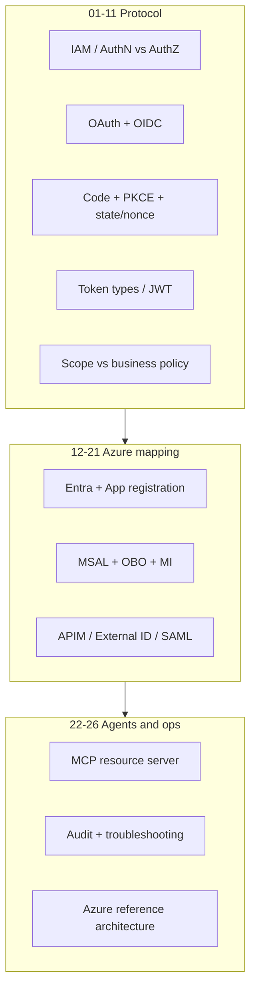

# Course 10: OAuth, OIDC, Azure Identity & API Security

Chinese: [README.zh.md](README.zh.md) | Prerequisite: [Course 04](../04-mcp-interoperability/README.md) recommended | Gate: secured OAuth/OIDC + two-wall lab

Specialization track after the Level 0–9 hiring ladder. Teaches identity from IAM vocabulary through Entra/MSAL/APIM patterns and MCP resource-server authorization. Portable OIDC/OAuth first; Azure is the reference implementation, not the only valid stack.

Companion critique wiki: [oauth-oidc-azure-identity](https://github.com/xingaiapp/xingai-ai-learning-wiki/blob/main/wiki/concepts/oauth-oidc-azure-identity/00-overview.md).

## 5W + How

- **What:** OAuth authorizes API/tool access; OIDC authenticates users; Azure Entra/MSAL/APIM/managed identity are one production mapping; MCP servers are resource servers that still need business policy.
- **Why:** agent and API products fail when login success is mistaken for permission, or when scope is treated as domain policy.
- **Who:** app and API engineers, MCP authors, IdP admins, security reviewers, auditors, and users granting consent.
- **When:** before shipping any protected product API, third-party integration, or remote MCP. Use simpler shared secrets only with rotation and contract limits.
- **Where:** clients, authorization servers, resource servers, gateways, workloads, and audit ledgers — not inside model prompts.
- **How:** learn modules 01–11 (protocol), 12–21 (Azure mapping), 22–26 (MCP, ops, architecture); complete the PKCE lab; pass the gate at 80%.



## Final Rules

```text
OAuth → API authorization
OIDC → user login
ID Token → Client
Access Token → API / MCP Server
Refresh Token → Authorization Server
Authorization Code → Token Endpoint
state → protect callback
nonce → protect ID Token
PKCE → protect Authorization Code
Scope → what you can do (capability)
Role → what role you are
Business Policy → whether this business object is allowed
Session → application login state
```

## Modules

| # | Module |
|---|---|
| 01 | [Identity and Access Management Overview](modules/01-iam-overview.md) |
| 02 | [Authentication vs Authorization](modules/02-authentication-vs-authorization.md) |
| 03 | [OAuth 2.0 Fundamentals](modules/03-oauth-2-fundamentals.md) |
| 04 | [OpenID Connect Fundamentals](modules/04-openid-connect-fundamentals.md) |
| 05 | [ID Token vs Access Token](modules/05-id-token-vs-access-token.md) |
| 06 | [Authorization Code Flow with PKCE](modules/06-authorization-code-flow-pkce.md) |
| 07 | [State, Nonce, and PKCE](modules/07-state-nonce-and-pkce.md) |
| 08 | [OAuth Token Types](modules/08-oauth-token-types.md) |
| 09 | [JWT, Bearer, Opaque, and PoP Tokens](modules/09-jwt-bearer-opaque-pop.md) |
| 10 | [Scope, Role, and Business Authorization](modules/10-scope-role-business-authorization.md) |
| 11 | [OIDC Discovery and JWKS](modules/11-oidc-discovery-and-jwks.md) |
| 12 | [Microsoft Entra ID Architecture](modules/12-microsoft-entra-id-architecture.md) |
| 13 | [Azure App Registration](modules/13-azure-app-registration.md) |
| 14 | [MSAL Integration](modules/14-msal-integration.md) |
| 15 | [Azure API Management Security](modules/15-azure-api-management-security.md) |
| 16 | [Managed Identity and Workload Identity](modules/16-managed-identity-workload-identity.md) |
| 17 | [On-Behalf-Of Flow](modules/17-on-behalf-of-flow.md) |
| 18 | [Session and Cookie Security](modules/18-session-and-cookie-security.md) |
| 19 | [API Keys and PATs](modules/19-api-keys-and-pats.md) |
| 20 | [OAuth/OIDC vs SAML](modules/20-oauth-oidc-vs-saml.md) |
| 21 | [Microsoft Entra External ID](modules/21-microsoft-entra-external-id.md) |
| 22 | [MCP Server Authentication and Authorization](modules/22-mcp-server-authn-authz.md) |
| 23 | [Logging, Monitoring, and Auditing](modules/23-logging-monitoring-and-auditing.md) |
| 24 | [Security Best Practices](modules/24-security-best-practices.md) |
| 25 | [Common Errors and Troubleshooting](modules/25-common-errors-and-troubleshooting.md) |
| 26 | [Complete Azure Reference Architecture](modules/26-complete-azure-reference-architecture.md) |

## Code: Two-Wall Check

```python
def allow_tool(scopes: set[str], action: str, policy_ok: bool, aud_ok: bool) -> bool:
    """OAuth wall + business wall + audience binding."""
    return aud_ok and action in scopes and policy_ok

assert allow_tool({"claim.read"}, "claim.read", True, True)
assert not allow_tool({"claim.read"}, "claim.read", False, True)
assert not allow_tool({"claim.read"}, "claim.write", True, True)
```

## Failure Analysis

- Using ID Tokens as API bearer credentials.
- Accepting tokens for the wrong audience (confused deputy).
- Treating scope grants as object-level business permission.
- Long-lived secrets in env files instead of managed/workload identity.
- MCP tools that skip audit or combine read and write authority casually.

## Lab And Interview Gate

1. Complete [OAuth 2.1 + PKCE MCP lab](../../guides/2026-07-12-mcp-oauth-pkce-lab.md) and [auth deep dive](../../guides/2026-07-12-mcp-oauth-auth-deep-dive.md).
2. Add negative tests: wrong `aud`, missing PKCE, ID Token as bearer, scope without business policy.
3. Draw Module 26 for your stack; mark what is Entra-specific vs portable OIDC/OAuth.
4. Interview ladder: explain AuthN vs AuthZ; debug a 401 audience failure; design MCP two-wall authz; present Entra vs portable IdP tradeoffs to a CTO.

Pass at **80/100** using the [assessment framework](../../assessments/README.md).

## Related

- [Course 04: MCP And Interoperability](../04-mcp-interoperability/README.md)
- [Deep track: Authentication and authorization](../../deep-enterprise-ai/09-authentication-authorization/README.md)
- [Third-party MCP auth decision article](../../articles/2026-07-15-third-party-mcp-auth-api-key-vs-oauth2.md)

## Disclaimer

Educational material only. Not legal, compliance, or security certification advice. Validate against current RFCs, Microsoft Learn docs, and your organization's controls before production use.
