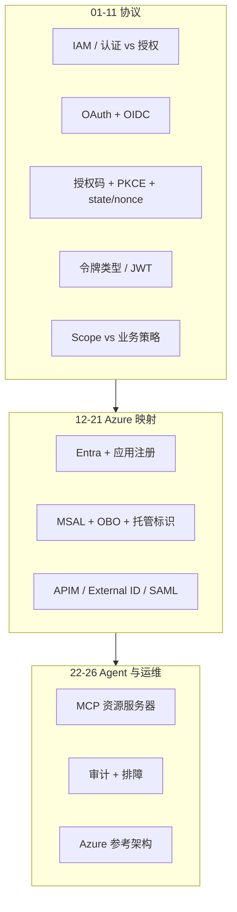

# 课程 10：OAuth、OIDC、Azure 身份与 API 安全

English: [README.md](README.md) | 建议先修：[课程 04](../04-mcp-interoperability/README.zh.md) | 门槛：受保护的 OAuth/OIDC + 双墙实验

位于 Level 0–9 岗位路径之后的**专项课程**。从 IAM 词汇讲到 Entra/MSAL/APIM 映射，再到 MCP 资源服务器授权。先讲可移植的 OIDC/OAuth；Azure 是参考实现，不是唯一合法栈。

配套 wiki 批判页：[oauth-oidc-azure-identity](https://github.com/xingaiapp/xingai-ai-learning-wiki/blob/main/wiki/concepts/oauth-oidc-azure-identity/00-overview.zh.md)。

## 5W + How

- **What（是什么）:** OAuth 授权 API/工具访问；OIDC 认证用户；Azure Entra/MSAL/APIM/托管标识是一种生产映射；MCP Server 仍是资源服务器，仍需要业务策略。
- **Why（为什么）:** 把登录成功当成权限，或把 scope 当成领域策略，是 Agent/API 产品常见翻车点。
- **Who（谁）:** 应用与 API 工程师、MCP 作者、IdP 管理员、安全评审、审计方，以及授予同意的用户。
- **When（何时）:** 上线任何受保护产品 API、第三方集成或远程 MCP 之前。共享密钥仅在可轮换与合同约束下使用。
- **Where（何处）:** 客户端、授权服务器、资源服务器、网关、工作负载与审计账本——不在模型提示词里。
- **How（怎么做）:** 学完 01–11（协议）、12–21（Azure 映射）、22–26（MCP 与运维）；完成 PKCE 实验；达到 80% 门槛。



## 最终规则

```text
OAuth → API 授权
OIDC → 用户登录
ID Token → 客户端
Access Token → API / MCP Server
Refresh Token → 授权服务器
Authorization Code → 令牌端点
state → 保护回调
nonce → 保护 ID Token
PKCE → 保护授权码
Scope → 你能做什么（能力）
Role → 你是什么角色
Business Policy → 该业务对象是否允许
Session → 应用登录状态
```

## 模块

| # | 模块 |
|---|---|
| 01 | [身份与访问管理概览](modules/01-iam-overview.zh.md) |
| 02 | [认证与授权](modules/02-authentication-vs-authorization.zh.md) |
| 03 | [OAuth 2.0 基础](modules/03-oauth-2-fundamentals.zh.md) |
| 04 | [OpenID Connect 基础](modules/04-openid-connect-fundamentals.zh.md) |
| 05 | [ID Token 与 Access Token](modules/05-id-token-vs-access-token.zh.md) |
| 06 | [授权码流 + PKCE](modules/06-authorization-code-flow-pkce.zh.md) |
| 07 | [state、nonce 与 PKCE](modules/07-state-nonce-and-pkce.zh.md) |
| 08 | [OAuth 令牌类型](modules/08-oauth-token-types.zh.md) |
| 09 | [JWT、Bearer、不透明令牌与 PoP](modules/09-jwt-bearer-opaque-pop.zh.md) |
| 10 | [Scope、角色与业务授权](modules/10-scope-role-business-authorization.zh.md) |
| 11 | [OIDC Discovery 与 JWKS](modules/11-oidc-discovery-and-jwks.zh.md) |
| 12 | [Microsoft Entra ID 架构](modules/12-microsoft-entra-id-architecture.zh.md) |
| 13 | [Azure 应用注册](modules/13-azure-app-registration.zh.md) |
| 14 | [MSAL 集成](modules/14-msal-integration.zh.md) |
| 15 | [Azure API Management 安全](modules/15-azure-api-management-security.zh.md) |
| 16 | [托管标识与工作负载标识](modules/16-managed-identity-workload-identity.zh.md) |
| 17 | [代表流（OBO）](modules/17-on-behalf-of-flow.zh.md) |
| 18 | [会话与 Cookie 安全](modules/18-session-and-cookie-security.zh.md) |
| 19 | [API Key 与 PAT](modules/19-api-keys-and-pats.zh.md) |
| 20 | [OAuth/OIDC 与 SAML](modules/20-oauth-oidc-vs-saml.zh.md) |
| 21 | [Microsoft Entra External ID](modules/21-microsoft-entra-external-id.zh.md) |
| 22 | [MCP Server 认证与授权](modules/22-mcp-server-authn-authz.zh.md) |
| 23 | [日志、监控与审计](modules/23-logging-monitoring-and-auditing.zh.md) |
| 24 | [安全最佳实践](modules/24-security-best-practices.zh.md) |
| 25 | [常见错误与排障](modules/25-common-errors-and-troubleshooting.zh.md) |
| 26 | [完整 Azure 参考架构](modules/26-complete-azure-reference-architecture.zh.md) |

## 代码：双墙校验

```python
def allow_tool(scopes: set[str], action: str, policy_ok: bool, aud_ok: bool) -> bool:
    """OAuth 墙 + 业务墙 + audience 绑定。"""
    return aud_ok and action in scopes and policy_ok

assert allow_tool({"claim.read"}, "claim.read", True, True)
assert not allow_tool({"claim.read"}, "claim.read", False, True)
assert not allow_tool({"claim.read"}, "claim.write", True, True)
```

## 故障分析

- 把 ID Token 当作 API Bearer。
- 接受错误 audience 的令牌（混淆代理）。
- 把 scope 授权当成对象级业务权限。
- 在环境变量中放长期密钥，而不是托管/工作负载标识。
- MCP 工具跳过审计，或随意合并读写权限。

## 实验与面试门槛

1. 完成 [OAuth 2.1 + PKCE MCP 实验](../../guides/2026-07-12-mcp-oauth-pkce-lab.zh.md) 与 [认证深读](../../guides/2026-07-12-mcp-oauth-auth-deep-dive.zh.md)。
2. 补充负向测试：错误 `aud`、缺少 PKCE、ID Token 当 Bearer、有 scope 无业务策略。
3. 画出模块 26 对应你的栈；标出 Entra 特有与可移植 OIDC/OAuth 部分。
4. 面试阶梯：讲清 AuthN vs AuthZ；排查 401 audience 失败；设计 MCP 双墙授权；向 CTO 陈述 Entra vs 可移植 IdP 取舍。

按 [评估框架](../../assessments/README.zh.md) 达到 **80/100** 通过。

## 相关

- [课程 04：MCP 与互操作性](../04-mcp-interoperability/README.zh.md)
- [深造：认证与授权](../../deep-enterprise-ai/09-authentication-authorization/README.zh.md)
- [第三方 MCP 认证决策文章](../../articles/2026-07-15-third-party-mcp-auth-api-key-vs-oauth2.zh.md)

## 免责声明

仅供教育参考。不构成法律、合规或安全认证建议。生产使用前请对照现行 RFC、Microsoft Learn 与组织内控进行验证。
