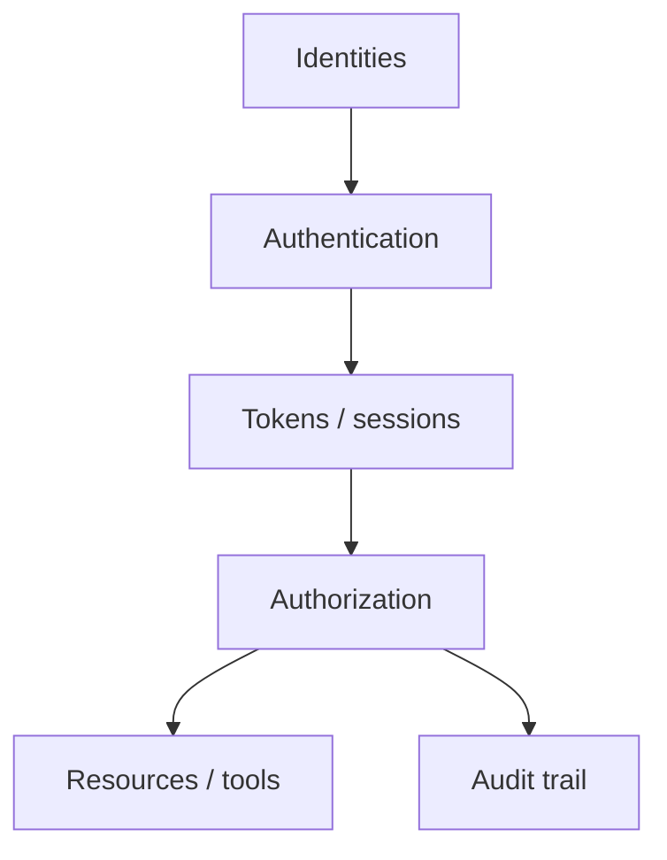

# 模块 01: 身份与访问管理概览

English: [01-iam-overview.md](01-iam-overview.md) | [课程主页](../README.zh.md) | 下一课: [02-authentication-vs-authorization](02-authentication-vs-authorization.zh.md)

## 5W + How

- **What（是什么）:** IAM 是应用、API 与 Agent 上「身份是谁、能做什么」的控制面。
- **Why（为什么）:** 错误的身份边界会导致混淆代理与静默越权。
- **Who（谁）:** 身份、凭证、策略、目录、审计方。
- **When（何时）:** 在构建受保护 API、MCP Server 或多租户产品之前。
- **Where（何处）:** 身份与策略位于客户端、IdP、API 与工具之间的信任边界。
- **How（怎么做）:** 先掌握词汇与时序，实现最小校验，不匹配则失败关闭。

## 图示



## 代码

```python
# who are you?
assert "authn" != "authz"
roles = {"reader": {"doc.read"}, "editor": {"doc.read", "doc.write"}}
def may(role: str, action: str) -> bool:
    return action in roles.get(role, set())
assert may("reader", "doc.read") and not may("reader", "doc.write")
```

## 故障模式

- 把登录成功当成授权通过。
- 把错误类型的令牌发给错误的受众。
- 跳过 PKCE、state、nonce 或精确回调校验。
- 只把业务策略写在提示词或 UI 可见性里。

## 练习

1. 分别以初学者、工程师、架构师、CTO 深度讲解本模块。
2. 为自己的技术栈补一条最可能故障的负向测试。
3. 对照 wiki 批判页，记下一条 Missing / Needs evidence。

## 来源

- Wiki: [身份与访问管理概览](https://github.com/xingaiapp/xingai-ai-learning-wiki/blob/main/wiki/concepts/oauth-oidc-azure-identity/01-iam-overview.zh.md)
- 实验: [OAuth 2.1 + PKCE MCP](https://github.com/xingaiapp/xingai-enterprise-ai-design/blob/main/guides/2026-07-12-mcp-oauth-pkce-lab.md)
- 深读: [MCP OAuth 认证](https://github.com/xingaiapp/xingai-enterprise-ai-design/blob/main/guides/2026-07-12-mcp-oauth-auth-deep-dive.md)
- 规范: [OAuth 2.1](https://datatracker.ietf.org/doc/html/draft-ietf-oauth-v2-1-13) · [OIDC Core](https://openid.net/specs/openid-connect-core-1_0.html) · [Entra ID 文档](https://learn.microsoft.com/entra/identity/)
