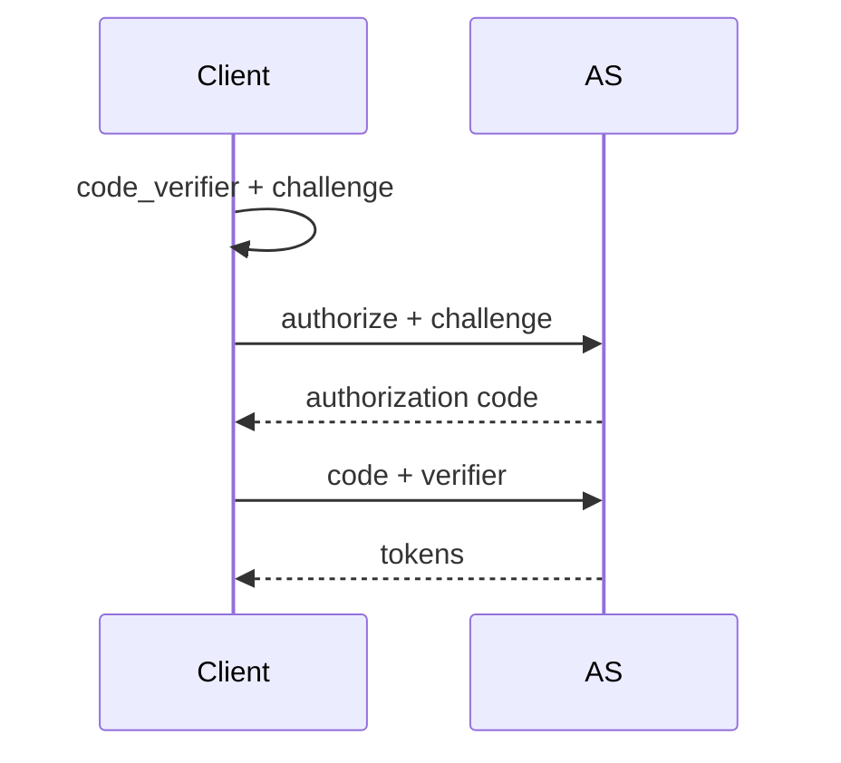

# 模块 06: 授权码流 + PKCE

English: [06-authorization-code-flow-pkce.md](06-authorization-code-flow-pkce.md) | 上一课: [05-id-token-vs-access-token](05-id-token-vs-access-token.zh.md) | [课程主页](../README.zh.md) | 下一课: [07-state-nonce-and-pkce](07-state-nonce-and-pkce.zh.md)

## 5W + How

- **What（是什么）:** 公共客户端用 PKCE 把授权码换成令牌，即使授权码被截获也无法兑换。
- **Why（为什么）:** 错误的身份边界会导致混淆代理与静默越权。
- **Who（谁）:** 浏览器/移动/SPA 客户端、授权服务器、回调 URI 所有者。
- **When（何时）:** 现代公共客户端交互登录的默认选择；避免 Implicit 流。
- **Where（何处）:** 身份与策略位于客户端、IdP、API 与工具之间的信任边界。
- **How（怎么做）:** 先掌握词汇与时序，实现最小校验，不匹配则失败关闭。

## 图示



## 代码

```python
import hashlib, base64, secrets
verifier = secrets.token_urlsafe(32)
digest = hashlib.sha256(verifier.encode()).digest()
challenge = base64.urlsafe_b64encode(digest).rstrip(b"=").decode()
assert len(verifier) >= 32 and challenge != verifier
```

## 故障模式

- 把登录成功当成授权通过。
- 把错误类型的令牌发给错误的受众。
- 跳过 PKCE、state、nonce 或精确回调校验。
- 只把业务策略写在提示词或 UI 可见性里。

## 练习

1. 分别以初学者、工程师、架构师、CTO 深度讲解本模块。
2. 为自己的技术栈补一条最可能故障的负向测试。
3. 对照 wiki 批判页，记下一条 Missing / Needs evidence。

## 来源

- Wiki: [授权码流 + PKCE](https://github.com/xingaiapp/xingai-ai-learning-wiki/blob/main/wiki/concepts/oauth-oidc-azure-identity/06-authorization-code-flow-pkce.zh.md)
- 实验: [OAuth 2.1 + PKCE MCP](https://github.com/xingaiapp/xingai-enterprise-ai-design/blob/main/guides/2026-07-12-mcp-oauth-pkce-lab.md)
- 深读: [MCP OAuth 认证](https://github.com/xingaiapp/xingai-enterprise-ai-design/blob/main/guides/2026-07-12-mcp-oauth-auth-deep-dive.md)
- 规范: [OAuth 2.1](https://datatracker.ietf.org/doc/html/draft-ietf-oauth-v2-1-13) · [OIDC Core](https://openid.net/specs/openid-connect-core-1_0.html) · [Entra ID 文档](https://learn.microsoft.com/entra/identity/)
