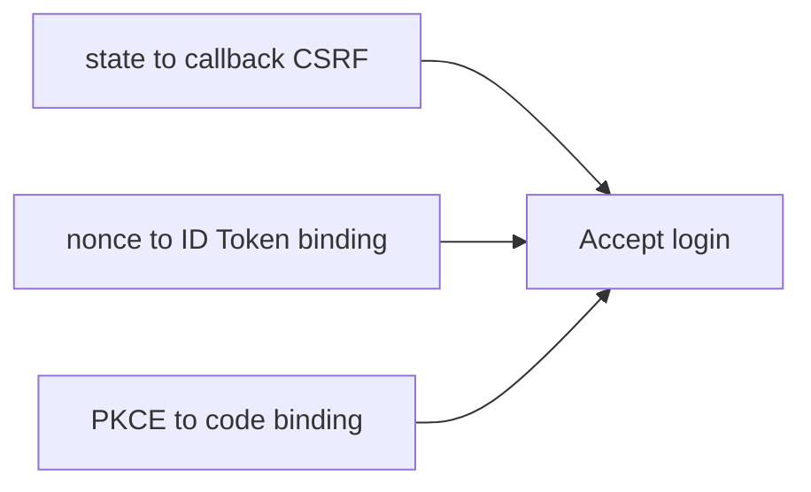

# Module 07: State, Nonce, and PKCE

Chinese: [07-state-nonce-and-pkce.zh.md](07-state-nonce-and-pkce.zh.md) | Prev: [06-authorization-code-flow-pkce](06-authorization-code-flow-pkce.md) | [Course hub](../README.md) | Next: [08-oauth-token-types](08-oauth-token-types.md)

## 5W + How

- **What:** state binds the callback to the browser session (CSRF). nonce binds the ID Token to the login request. PKCE binds the code to the client.
- **Why:** wrong identity boundaries create confused-deputy and silent over-privilege failures.
- **Who:** OIDC clients, security reviewers.
- **When:** every interactive OIDC login; fail closed if any check is missing.
- **Where:** identity and policy sit at trust boundaries between clients, IdPs, APIs, and tools.
- **How:** learn the vocabulary, draw the sequence, implement the minimal check, then fail closed on mismatch.

## Diagram



## Code

```python
checks = {"state_match": True, "nonce_match": True, "pkce_ok": True}
assert all(checks.values())
```

## Failure Modes

- Confusing login success with authorization.
- Sending the wrong token type to the wrong audience.
- Skipping PKCE, state, nonce, or exact redirect checks.
- Encoding business policy only in prompts or UI visibility.

## Practice

1. Explain this module at beginner, engineer, architect, and CTO depth.
2. Add one negative test for the failure mode most likely in your stack.
3. Cross-check the wiki critique page and note one Missing / Needs evidence item.

## Sources

- Wiki: [State, Nonce, and PKCE](https://github.com/xingaiapp/xingai-ai-learning-wiki/blob/main/wiki/concepts/oauth-oidc-azure-identity/07-state-nonce-and-pkce.md)
- Lab: [OAuth 2.1 + PKCE MCP](https://github.com/xingaiapp/xingai-enterprise-ai-design/blob/main/guides/2026-07-12-mcp-oauth-pkce-lab.md)
- Deep dive: [MCP OAuth auth](https://github.com/xingaiapp/xingai-enterprise-ai-design/blob/main/guides/2026-07-12-mcp-oauth-auth-deep-dive.md)
- Specs: [OAuth 2.1](https://datatracker.ietf.org/doc/html/draft-ietf-oauth-v2-1-13) · [OIDC Core](https://openid.net/specs/openid-connect-core-1_0.html) · [Entra ID docs](https://learn.microsoft.com/entra/identity/)
