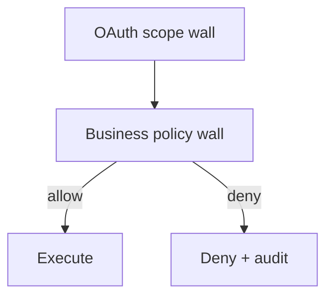

# Module 10: Scope, Role, and Business Authorization

Chinese: [10-scope-role-business-authorization.zh.md](10-scope-role-business-authorization.zh.md) | Prev: [09-jwt-bearer-opaque-pop](09-jwt-bearer-opaque-pop.md) | [Course hub](../README.md) | Next: [11-oidc-discovery-and-jwks](11-oidc-discovery-and-jwks.md)

## 5W + How

- **What:** Scopes describe OAuth capability. Roles describe job function. Business policy decides if this object may be acted on.
- **Why:** wrong identity boundaries create confused-deputy and silent over-privilege failures.
- **Who:** product owners, security, MCP tool authors.
- **When:** always separate OAuth scope from domain policy (two-wall model).
- **Where:** identity and policy sit at trust boundaries between clients, IdPs, APIs, and tools.
- **How:** learn the vocabulary, draw the sequence, implement the minimal check, then fail closed on mismatch.

## Diagram



## Code

```python
def two_wall(scopes: set[str], role: str, object_owner: str, actor: str, action: str) -> bool:
    if action not in scopes:
        return False
    if role == "support" and object_owner != actor:
        return False
    return True
assert two_wall({"claim.read"}, "owner", "u1", "u1", "claim.read")
assert not two_wall({"claim.read"}, "support", "u1", "u2", "claim.read")
```

## Failure Modes

- Confusing login success with authorization.
- Sending the wrong token type to the wrong audience.
- Skipping PKCE, state, nonce, or exact redirect checks.
- Encoding business policy only in prompts or UI visibility.

## Practice

1. Explain this module at beginner, engineer, architect, and CTO depth.
2. Add one negative test for the failure mode most likely in your stack.
3. Cross-check the wiki critique page and note one Missing / Needs evidence item.

## Sources

- Wiki: [Scope, Role, and Business Authorization](https://github.com/xingaiapp/xingai-ai-learning-wiki/blob/main/wiki/concepts/oauth-oidc-azure-identity/10-scope-role-business-authorization.md)
- Lab: [OAuth 2.1 + PKCE MCP](https://github.com/xingaiapp/xingai-enterprise-ai-design/blob/main/guides/2026-07-12-mcp-oauth-pkce-lab.md)
- Deep dive: [MCP OAuth auth](https://github.com/xingaiapp/xingai-enterprise-ai-design/blob/main/guides/2026-07-12-mcp-oauth-auth-deep-dive.md)
- Specs: [OAuth 2.1](https://datatracker.ietf.org/doc/html/draft-ietf-oauth-v2-1-13) · [OIDC Core](https://openid.net/specs/openid-connect-core-1_0.html) · [Entra ID docs](https://learn.microsoft.com/entra/identity/)
