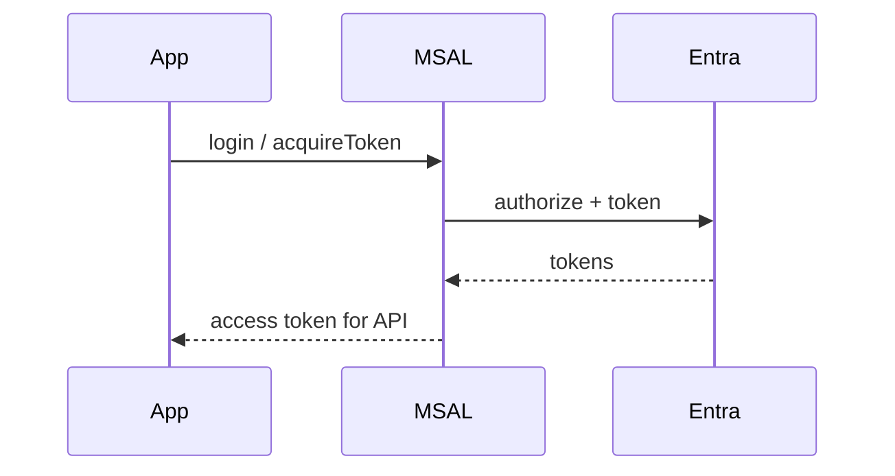

# Module 14: MSAL Integration

Chinese: [14-msal-integration.zh.md](14-msal-integration.zh.md) | Prev: [13-azure-app-registration](13-azure-app-registration.md) | [Course hub](../README.md) | Next: [15-azure-api-management-security](15-azure-api-management-security.md)

## 5W + How

- **What:** MSAL libraries implement OIDC/OAuth flows, token cache, and account selection for Microsoft identity.
- **Why:** wrong identity boundaries create confused-deputy and silent over-privilege failures.
- **Who:** frontend and backend engineers on Entra.
- **When:** prefer MSAL over hand-rolled authorize URLs for Entra apps; still understand the underlying protocol.
- **Where:** identity and policy sit at trust boundaries between clients, IdPs, APIs, and tools.
- **How:** learn the vocabulary, draw the sequence, implement the minimal check, then fail closed on mismatch.

## Diagram



## Code

```python
strategy = ["silent_cache", "interactive_if_needed"]
assert strategy[0] == "silent_cache" 
```

## Failure Modes

- Confusing login success with authorization.
- Sending the wrong token type to the wrong audience.
- Skipping PKCE, state, nonce, or exact redirect checks.
- Encoding business policy only in prompts or UI visibility.

## Practice

1. Explain this module at beginner, engineer, architect, and CTO depth.
2. Add one negative test for the failure mode most likely in your stack.
3. Cross-check the wiki critique page and note one Missing / Needs evidence item.

## Sources

- Wiki: [MSAL Integration](https://github.com/xingaiapp/xingai-ai-learning-wiki/blob/main/wiki/concepts/oauth-oidc-azure-identity/14-msal-integration.md)
- Lab: [OAuth 2.1 + PKCE MCP](https://github.com/xingaiapp/xingai-enterprise-ai-design/blob/main/guides/2026-07-12-mcp-oauth-pkce-lab.md)
- Deep dive: [MCP OAuth auth](https://github.com/xingaiapp/xingai-enterprise-ai-design/blob/main/guides/2026-07-12-mcp-oauth-auth-deep-dive.md)
- Specs: [OAuth 2.1](https://datatracker.ietf.org/doc/html/draft-ietf-oauth-v2-1-13) · [OIDC Core](https://openid.net/specs/openid-connect-core-1_0.html) · [Entra ID docs](https://learn.microsoft.com/entra/identity/)
