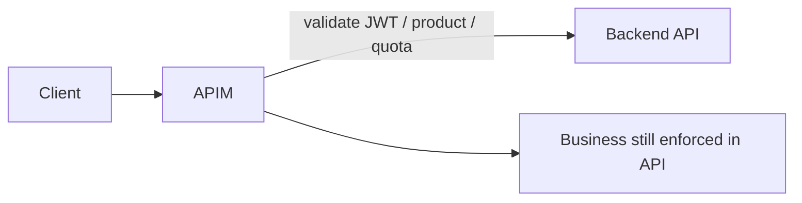

# Module 15: Azure API Management Security

Chinese: [15-azure-api-management-security.zh.md](15-azure-api-management-security.zh.md) | Prev: [14-msal-integration](14-msal-integration.md) | [Course hub](../README.md) | Next: [16-managed-identity-workload-identity](16-managed-identity-workload-identity.md)

## 5W + How

- **What:** APIM can validate JWTs, enforce subscriptions, rate limits, and policies in front of backend APIs.
- **Why:** wrong identity boundaries create confused-deputy and silent over-privilege failures.
- **Who:** API platform teams, security.
- **When:** centralize edge authz for many APIs — do not treat APIM as the only business policy engine.
- **Where:** identity and policy sit at trust boundaries between clients, IdPs, APIs, and tools.
- **How:** learn the vocabulary, draw the sequence, implement the minimal check, then fail closed on mismatch.

## Diagram



## Code

```python
def apim_and_app(jwt_ok: bool, business_ok: bool) -> bool:
    return jwt_ok and business_ok
assert not apim_and_app(True, False)
```

## Failure Modes

- Confusing login success with authorization.
- Sending the wrong token type to the wrong audience.
- Skipping PKCE, state, nonce, or exact redirect checks.
- Encoding business policy only in prompts or UI visibility.

## Practice

1. Explain this module at beginner, engineer, architect, and CTO depth.
2. Add one negative test for the failure mode most likely in your stack.
3. Cross-check the wiki critique page and note one Missing / Needs evidence item.

## Sources

- Wiki: [Azure API Management Security](https://github.com/xingaiapp/xingai-ai-learning-wiki/blob/main/wiki/concepts/oauth-oidc-azure-identity/15-azure-api-management-security.md)
- Lab: [OAuth 2.1 + PKCE MCP](https://github.com/xingaiapp/xingai-enterprise-ai-design/blob/main/guides/2026-07-12-mcp-oauth-pkce-lab.md)
- Deep dive: [MCP OAuth auth](https://github.com/xingaiapp/xingai-enterprise-ai-design/blob/main/guides/2026-07-12-mcp-oauth-auth-deep-dive.md)
- Specs: [OAuth 2.1](https://datatracker.ietf.org/doc/html/draft-ietf-oauth-v2-1-13) · [OIDC Core](https://openid.net/specs/openid-connect-core-1_0.html) · [Entra ID docs](https://learn.microsoft.com/entra/identity/)
