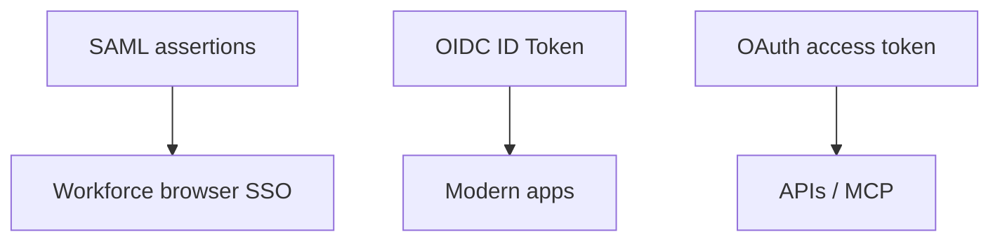

# 模块 20: OAuth/OIDC 与 SAML

English: [20-oauth-oidc-vs-saml.md](20-oauth-oidc-vs-saml.md) | 上一课: [19-api-keys-and-pats](19-api-keys-and-pats.zh.md) | [课程主页](../README.zh.md) | 下一课: [21-microsoft-entra-external-id](21-microsoft-entra-external-id.zh.md)

## 5W + How

- **What（是什么）:** SAML 是面向企业 SSO 的 XML 联邦；OIDC 面向 JSON/JWT，并自然配合 OAuth API。
- **Why（为什么）:** 错误的身份边界会导致混淆代理与静默越权。
- **Who（谁）:** 企业 IdP 架构师。
- **When（何时）:** 新建 API/SPA → OIDC/OAuth；存量人力 SSO 可继续用 SAML IdP。
- **Where（何处）:** 身份与策略位于客户端、IdP、API 与工具之间的信任边界。
- **How（怎么做）:** 先掌握词汇与时序，实现最小校验，不匹配则失败关闭。

## 图示



## 代码

```python
choice = {"browser_sso_legacy": "saml_or_oidc", "api_access": "oauth", "modern_login": "oidc"}
assert choice["api_access"] == "oauth" 
```

## 故障模式

- 把登录成功当成授权通过。
- 把错误类型的令牌发给错误的受众。
- 跳过 PKCE、state、nonce 或精确回调校验。
- 只把业务策略写在提示词或 UI 可见性里。

## 练习

1. 分别以初学者、工程师、架构师、CTO 深度讲解本模块。
2. 为自己的技术栈补一条最可能故障的负向测试。
3. 对照 wiki 批判页，记下一条 Missing / Needs evidence。

## 来源

- Wiki: [OAuth/OIDC 与 SAML](https://github.com/xingaiapp/xingai-ai-learning-wiki/blob/main/wiki/concepts/oauth-oidc-azure-identity/20-oauth-oidc-vs-saml.zh.md)
- 实验: [OAuth 2.1 + PKCE MCP](https://github.com/xingaiapp/xingai-enterprise-ai-design/blob/main/guides/2026-07-12-mcp-oauth-pkce-lab.md)
- 深读: [MCP OAuth 认证](https://github.com/xingaiapp/xingai-enterprise-ai-design/blob/main/guides/2026-07-12-mcp-oauth-auth-deep-dive.md)
- 规范: [OAuth 2.1](https://datatracker.ietf.org/doc/html/draft-ietf-oauth-v2-1-13) · [OIDC Core](https://openid.net/specs/openid-connect-core-1_0.html) · [Entra ID 文档](https://learn.microsoft.com/entra/identity/)
