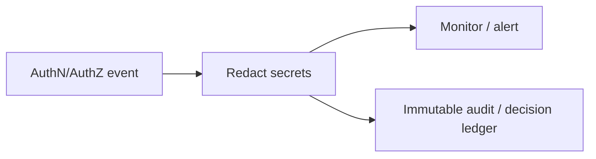

# Module 23: Logging, Monitoring, and Auditing

Chinese: [23-logging-monitoring-and-auditing.zh.md](23-logging-monitoring-and-auditing.zh.md) | Prev: [22-mcp-server-authn-authz](22-mcp-server-authn-authz.md) | [Course hub](../README.md) | Next: [24-security-best-practices](24-security-best-practices.md)

## 5W + How

- **What:** Auth logs must prove who did what, when, with which token/app, without leaking secrets or raw tokens.
- **Why:** wrong identity boundaries create confused-deputy and silent over-privilege failures.
- **Who:** SOC, platform, compliance.
- **When:** every authn/authz decision path for regulated or agent tool calls.
- **Where:** identity and policy sit at trust boundaries between clients, IdPs, APIs, and tools.
- **How:** learn the vocabulary, draw the sequence, implement the minimal check, then fail closed on mismatch.

## Diagram



## Code

```python
event = {"sub": "user-1", "action": "tool.invoke", "decision": "deny", "token": "[redacted]"}
assert event["token"] == "[redacted]"
assert event["decision"] in {"allow", "deny", "step_up"}
```

## Failure Modes

- Confusing login success with authorization.
- Sending the wrong token type to the wrong audience.
- Skipping PKCE, state, nonce, or exact redirect checks.
- Encoding business policy only in prompts or UI visibility.

## Practice

1. Explain this module at beginner, engineer, architect, and CTO depth.
2. Add one negative test for the failure mode most likely in your stack.
3. Cross-check the wiki critique page and note one Missing / Needs evidence item.

## Sources

- Wiki: [Logging, Monitoring, and Auditing](https://github.com/xingaiapp/xingai-ai-learning-wiki/blob/main/wiki/concepts/oauth-oidc-azure-identity/23-logging-monitoring-auditing.md)
- Lab: [OAuth 2.1 + PKCE MCP](https://github.com/xingaiapp/xingai-enterprise-ai-design/blob/main/guides/2026-07-12-mcp-oauth-pkce-lab.md)
- Deep dive: [MCP OAuth auth](https://github.com/xingaiapp/xingai-enterprise-ai-design/blob/main/guides/2026-07-12-mcp-oauth-auth-deep-dive.md)
- Specs: [OAuth 2.1](https://datatracker.ietf.org/doc/html/draft-ietf-oauth-v2-1-13) · [OIDC Core](https://openid.net/specs/openid-connect-core-1_0.html) · [Entra ID docs](https://learn.microsoft.com/entra/identity/)
