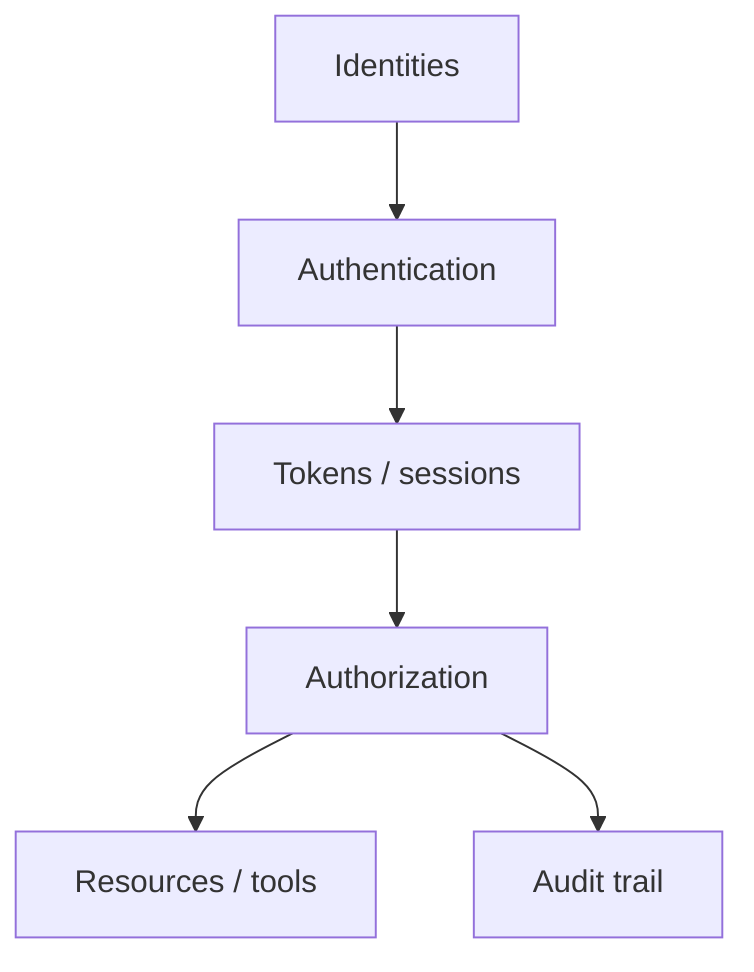

# 01. Identity and Access Management Overview

Chinese: [01-iam-overview.zh.md](01-iam-overview.zh.md)

Part of [OAuth / OIDC / Azure Identity catalog](00-overview.md).  
**Primary teaching source:** [Course 10 · Module 01](https://github.com/xingaiapp/xingai-enterprise-ai-design/blob/main/courses/10-oauth-oidc-azure-identity/modules/01-iam-overview.md) · [hub](https://github.com/xingaiapp/xingai-enterprise-ai-design/blob/main/courses/10-oauth-oidc-azure-identity/README.md)

## Teach (from Course 10)

- **What:** IAM is the control plane for who actors are and what they may do across apps, APIs, and agents.
- **Why:** wrong identity boundaries create confused-deputy and silent over-privilege failures.
- **Who:** identities, credentials, policies, directories, auditors.
- **When:** before building any protected API, MCP server, or multi-tenant product.
- **Where:** identity and policy sit at trust boundaries between clients, IdPs, APIs, and tools.
- **How:** learn the vocabulary, draw the sequence, implement the minimal check, then fail closed on mismatch.

### Diagram



### Minimal check

```python
# who are you?
assert "authn" != "authz"
roles = {"reader": {"doc.read"}, "editor": {"doc.read", "doc.write"}}
def may(role: str, action: str) -> bool:
    return action in roles.get(role, set())
assert may("reader", "doc.read") and not may("reader", "doc.write")
```

### Failure modes (course)

- Confusing login success with authorization.
- Sending the wrong token type to the wrong audience.
- Skipping PKCE, state, nonce, or exact redirect checks.
- Encoding business policy only in prompts or UI visibility.

## Known

- Course 10 Module 01 defines the vocabulary, diagram, and fail-closed checks above (`raw/xingai-enterprise-ai-design/courses/10-oauth-oidc-azure-identity/modules/01-iam-overview.md`; public: [module](https://github.com/xingaiapp/xingai-enterprise-ai-design/blob/main/courses/10-oauth-oidc-azure-identity/modules/01-iam-overview.md)).
- Hands-on OAuth/PKCE path: [PKCE MCP lab](https://github.com/xingaiapp/xingai-enterprise-ai-design/blob/main/guides/2026-07-12-mcp-oauth-pkce-lab.md) · [auth deep dive](https://github.com/xingaiapp/xingai-enterprise-ai-design/blob/main/guides/2026-07-12-mcp-oauth-auth-deep-dive.md).
- Cross-links: [agent-governance-and-mcp](../agent-governance-and-mcp.md) · [Course 04](../../courses/04-mcp-interoperability.md) · [Course 10 wiki](../../courses/10-oauth-oidc-azure-identity.md) · [claims-mcp-oauth-poc](../../products/claims-mcp-oauth-poc.md).

## Missing

- Course module stays compact — no live token traces for “Identity and Access Management Overview” in this wiki page.

## Rethink

- Protocol literacy must stay ahead of vendor SDKs; MSAL/Entra mapping comes later (modules 12–21).

## Debate

- How much OAuth 2.1 / resource-indicator depth belongs here vs Course 04 MCP labs.

## Needs evidence

- Public POC evidence that exercises this module’s negative tests end-to-end.

## Sources

- Course: [Identity and Access Management Overview](https://github.com/xingaiapp/xingai-enterprise-ai-design/blob/main/courses/10-oauth-oidc-azure-identity/modules/01-iam-overview.md) · [中文](https://github.com/xingaiapp/xingai-enterprise-ai-design/blob/main/courses/10-oauth-oidc-azure-identity/modules/01-iam-overview.zh.md)
- Snapshot: `raw/xingai-enterprise-ai-design/courses/10-oauth-oidc-azure-identity/modules/01-iam-overview.md`
- Lab: [OAuth 2.1 + PKCE MCP](https://github.com/xingaiapp/xingai-enterprise-ai-design/blob/main/guides/2026-07-12-mcp-oauth-pkce-lab.md)
