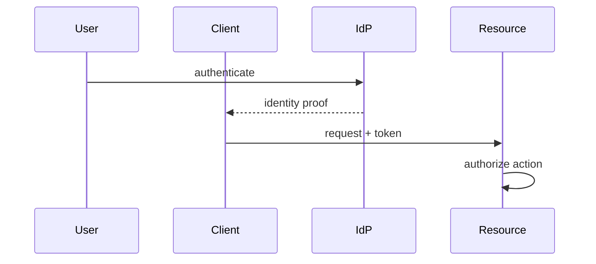

# 02. 认证与授权

English: [02-authentication-vs-authorization.md](02-authentication-vs-authorization.md)

属于 [OAuth / OIDC / Azure Identity 目录](00-overview.zh.md)。  
**主要教学来源：** [课程 10 · 模块 02](https://github.com/xingaiapp/xingai-enterprise-ai-design/blob/main/courses/10-oauth-oidc-azure-identity/modules/02-authentication-vs-authorization.zh.md) · [主页](https://github.com/xingaiapp/xingai-enterprise-ai-design/blob/main/courses/10-oauth-oidc-azure-identity/README.zh.md)

## 教学要点（来自课程 10）

- **是什么：** 
- **为什么：** 
- **谁：** 
- **何时：** 
- **何处：** 
- **怎么做：** 

### 图示



### 最小校验

```python
def authorize(authenticated: bool, scope: set[str], action: str) -> bool:
    if not authenticated:
        return False
    return action in scope
assert authorize(True, {"orders.read"}, "orders.read")
assert not authorize(True, {"orders.read"}, "orders.write")
```

### 故障模式（课程）

- 把登录成功当成授权通过。
- 把错误类型的令牌发给错误的受众。
- 跳过 PKCE、state、nonce 或精确回调校验。
- 只把业务策略写在提示词或 UI 可见性里。

## Known（已知）

- 课程 10 模块 02 给出上文词汇、图示与失败关闭校验（`raw/xingai-enterprise-ai-design/courses/10-oauth-oidc-azure-identity/modules/02-authentication-vs-authorization.zh.md`；公开：[模块](https://github.com/xingaiapp/xingai-enterprise-ai-design/blob/main/courses/10-oauth-oidc-azure-identity/modules/02-authentication-vs-authorization.zh.md)）。
- 可动手路径：[PKCE MCP 实验](https://github.com/xingaiapp/xingai-enterprise-ai-design/blob/main/guides/2026-07-12-mcp-oauth-pkce-lab.zh.md) · [认证深读](https://github.com/xingaiapp/xingai-enterprise-ai-design/blob/main/guides/2026-07-12-mcp-oauth-auth-deep-dive.md)。
- 交叉：[agent-governance-and-mcp](../agent-governance-and-mcp.zh.md) · [课程 04](../../courses/04-mcp-interoperability.zh.md) · [课程 10 wiki](../../courses/10-oauth-oidc-azure-identity.zh.md) · [claims-mcp-oauth-poc](../../products/claims-mcp-oauth-poc.md)。

## Missing（缺失）

- 课程模块保持精简——本 wiki 页无「Authentication vs Authorization」的真实令牌追踪。

## Rethink（重思）

- 协议素养须先于厂商 SDK；MSAL/Entra 映射在模块 12–21。

## Debate（争议）

- OAuth 2.1 / resource indicator 深度应落在本课，还是课程 04 MCP 实验。

## Needs evidence（待证）

- 端到端练习本模块负向测试的公开 POC 证据。

## Sources（来源）

- 课程：[认证与授权](https://github.com/xingaiapp/xingai-enterprise-ai-design/blob/main/courses/10-oauth-oidc-azure-identity/modules/02-authentication-vs-authorization.zh.md) · [EN](https://github.com/xingaiapp/xingai-enterprise-ai-design/blob/main/courses/10-oauth-oidc-azure-identity/modules/02-authentication-vs-authorization.md)
- 快照：`raw/xingai-enterprise-ai-design/courses/10-oauth-oidc-azure-identity/modules/02-authentication-vs-authorization.zh.md`
- 实验：[OAuth 2.1 + PKCE MCP](https://github.com/xingaiapp/xingai-enterprise-ai-design/blob/main/guides/2026-07-12-mcp-oauth-pkce-lab.zh.md)
