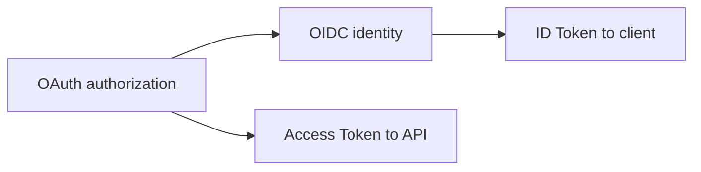

# 04. OpenID Connect Fundamentals

Chinese: [04-openid-connect-fundamentals.zh.md](04-openid-connect-fundamentals.zh.md)

Part of [OAuth / OIDC / Azure Identity catalog](00-overview.md).  
**Primary teaching source:** [Course 10 · Module 04](https://github.com/xingaiapp/xingai-enterprise-ai-design/blob/main/courses/10-oauth-oidc-azure-identity/modules/04-openid-connect-fundamentals.md) · [hub](https://github.com/xingaiapp/xingai-enterprise-ai-design/blob/main/courses/10-oauth-oidc-azure-identity/README.md)

## Teach (from Course 10)

- **What:** OIDC is an identity layer on OAuth: it authenticates the user and returns an ID Token to the client.
- **Why:** wrong identity boundaries create confused-deputy and silent over-privilege failures.
- **Who:** relying party, end user, OpenID provider.
- **When:** user sign-in and single sign-on; pair with OAuth when APIs need access tokens.
- **Where:** identity and policy sit at trust boundaries between clients, IdPs, APIs, and tools.
- **How:** learn the vocabulary, draw the sequence, implement the minimal check, then fail closed on mismatch.

### Diagram



### Minimal check

```python
oidc = {"uses_oauth": True, "adds": ["id_token", "userinfo", "discovery"]}
assert oidc["uses_oauth"] and "id_token" in oidc["adds"]
```

### Failure modes (course)

- Confusing login success with authorization.
- Sending the wrong token type to the wrong audience.
- Skipping PKCE, state, nonce, or exact redirect checks.
- Encoding business policy only in prompts or UI visibility.

## Known

- Course 10 Module 04 defines the vocabulary, diagram, and fail-closed checks above (`raw/xingai-enterprise-ai-design/courses/10-oauth-oidc-azure-identity/modules/04-openid-connect-fundamentals.md`; public: [module](https://github.com/xingaiapp/xingai-enterprise-ai-design/blob/main/courses/10-oauth-oidc-azure-identity/modules/04-openid-connect-fundamentals.md)).
- Hands-on OAuth/PKCE path: [PKCE MCP lab](https://github.com/xingaiapp/xingai-enterprise-ai-design/blob/main/guides/2026-07-12-mcp-oauth-pkce-lab.md) · [auth deep dive](https://github.com/xingaiapp/xingai-enterprise-ai-design/blob/main/guides/2026-07-12-mcp-oauth-auth-deep-dive.md).
- Cross-links: [agent-governance-and-mcp](../agent-governance-and-mcp.md) · [Course 04](../../courses/04-mcp-interoperability.md) · [Course 10 wiki](../../courses/10-oauth-oidc-azure-identity.md) · [claims-mcp-oauth-poc](../../products/claims-mcp-oauth-poc.md).

## Missing

- Course module stays compact — no live token traces for “OpenID Connect Fundamentals” in this wiki page.

## Rethink

- Protocol literacy must stay ahead of vendor SDKs; MSAL/Entra mapping comes later (modules 12–21).

## Debate

- How much OAuth 2.1 / resource-indicator depth belongs here vs Course 04 MCP labs.

## Needs evidence

- Public POC evidence that exercises this module’s negative tests end-to-end.

## Sources

- Course: [OpenID Connect Fundamentals](https://github.com/xingaiapp/xingai-enterprise-ai-design/blob/main/courses/10-oauth-oidc-azure-identity/modules/04-openid-connect-fundamentals.md) · [中文](https://github.com/xingaiapp/xingai-enterprise-ai-design/blob/main/courses/10-oauth-oidc-azure-identity/modules/04-openid-connect-fundamentals.zh.md)
- Snapshot: `raw/xingai-enterprise-ai-design/courses/10-oauth-oidc-azure-identity/modules/04-openid-connect-fundamentals.md`
- Lab: [OAuth 2.1 + PKCE MCP](https://github.com/xingaiapp/xingai-enterprise-ai-design/blob/main/guides/2026-07-12-mcp-oauth-pkce-lab.md)
