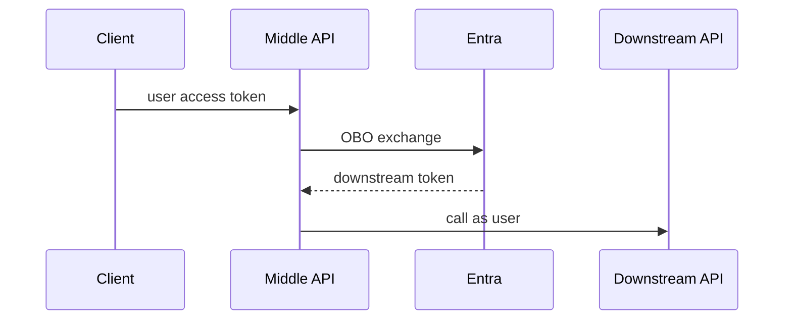

# 17. On-Behalf-Of Flow

Chinese: [17-on-behalf-of-flow.zh.md](17-on-behalf-of-flow.zh.md)

Part of [OAuth / OIDC / Azure Identity catalog](00-overview.md).  
**Primary teaching source:** [Course 10 · Module 17](https://github.com/xingaiapp/xingai-enterprise-ai-design/blob/main/courses/10-oauth-oidc-azure-identity/modules/17-on-behalf-of-flow.md) · [hub](https://github.com/xingaiapp/xingai-enterprise-ai-design/blob/main/courses/10-oauth-oidc-azure-identity/README.md)

## Teach (from Course 10)

- **What:** OBO lets a middle-tier API exchange a user token for a new token to call a downstream API as that user.
- **Why:** wrong identity boundaries create confused-deputy and silent over-privilege failures.
- **Who:** multi-API product backends, MCP gateways calling user-scoped APIs.
- **When:** when the middle tier must preserve user identity downstream — not for pure app-only calls.
- **Where:** identity and policy sit at trust boundaries between clients, IdPs, APIs, and tools.
- **How:** learn the vocabulary, draw the sequence, implement the minimal check, then fail closed on mismatch.

### Diagram



### Minimal check

```python
def needs_obo(call_as_user: bool, middle_tier: bool) -> bool:
    return call_as_user and middle_tier
assert needs_obo(True, True) and not needs_obo(False, True)
```

### Failure modes (course)

- Confusing login success with authorization.
- Sending the wrong token type to the wrong audience.
- Skipping PKCE, state, nonce, or exact redirect checks.
- Encoding business policy only in prompts or UI visibility.

## Known

- Course 10 Module 17 defines the vocabulary, diagram, and fail-closed checks above (`raw/xingai-enterprise-ai-design/courses/10-oauth-oidc-azure-identity/modules/17-on-behalf-of-flow.md`; public: [module](https://github.com/xingaiapp/xingai-enterprise-ai-design/blob/main/courses/10-oauth-oidc-azure-identity/modules/17-on-behalf-of-flow.md)).
- Hands-on OAuth/PKCE path: [PKCE MCP lab](https://github.com/xingaiapp/xingai-enterprise-ai-design/blob/main/guides/2026-07-12-mcp-oauth-pkce-lab.md) · [auth deep dive](https://github.com/xingaiapp/xingai-enterprise-ai-design/blob/main/guides/2026-07-12-mcp-oauth-auth-deep-dive.md).
- Cross-links: [agent-governance-and-mcp](../agent-governance-and-mcp.md) · [Course 04](../../courses/04-mcp-interoperability.md) · [Course 10 wiki](../../courses/10-oauth-oidc-azure-identity.md) · [claims-mcp-oauth-poc](../../products/claims-mcp-oauth-poc.md).

## Missing

- No live Entra tenant screenshots for “On-Behalf-Of Flow” — course treats Azure as a mapping, not a required cloud.

## Rethink

- Entra vocabulary must map back to portable OIDC/OAuth terms or OSS POCs drift.

## Debate

- Entra-first teaching vs IdP-portable teaching for public XingAI repos.

## Needs evidence

- Which public XingAI apps actually use this Azure control (if any).

## Sources

- Course: [On-Behalf-Of Flow](https://github.com/xingaiapp/xingai-enterprise-ai-design/blob/main/courses/10-oauth-oidc-azure-identity/modules/17-on-behalf-of-flow.md) · [中文](https://github.com/xingaiapp/xingai-enterprise-ai-design/blob/main/courses/10-oauth-oidc-azure-identity/modules/17-on-behalf-of-flow.zh.md)
- Snapshot: `raw/xingai-enterprise-ai-design/courses/10-oauth-oidc-azure-identity/modules/17-on-behalf-of-flow.md`
- Lab: [OAuth 2.1 + PKCE MCP](https://github.com/xingaiapp/xingai-enterprise-ai-design/blob/main/guides/2026-07-12-mcp-oauth-pkce-lab.md)
