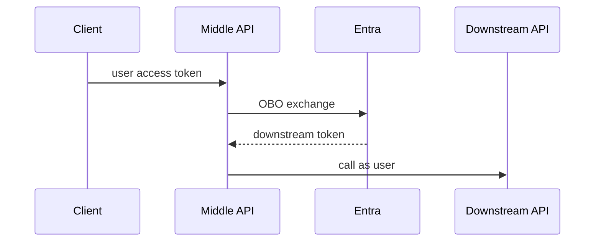

# 17. 代表流（OBO）

English: [17-on-behalf-of-flow.md](17-on-behalf-of-flow.md)

属于 [OAuth / OIDC / Azure Identity 目录](00-overview.zh.md)。  
**主要教学来源：** [课程 10 · 模块 17](https://github.com/xingaiapp/xingai-enterprise-ai-design/blob/main/courses/10-oauth-oidc-azure-identity/modules/17-on-behalf-of-flow.zh.md) · [主页](https://github.com/xingaiapp/xingai-enterprise-ai-design/blob/main/courses/10-oauth-oidc-azure-identity/README.zh.md)

## 教学要点（来自课程 10）

- **是什么：** 
- **为什么：** 
- **谁：** 
- **何时：** 
- **何处：** 
- **怎么做：** 

### 图示



### 最小校验

```python
def needs_obo(call_as_user: bool, middle_tier: bool) -> bool:
    return call_as_user and middle_tier
assert needs_obo(True, True) and not needs_obo(False, True)
```

### 故障模式（课程）

- 把登录成功当成授权通过。
- 把错误类型的令牌发给错误的受众。
- 跳过 PKCE、state、nonce 或精确回调校验。
- 只把业务策略写在提示词或 UI 可见性里。

## Known（已知）

- 课程 10 模块 17 给出上文词汇、图示与失败关闭校验（`raw/xingai-enterprise-ai-design/courses/10-oauth-oidc-azure-identity/modules/17-on-behalf-of-flow.zh.md`；公开：[模块](https://github.com/xingaiapp/xingai-enterprise-ai-design/blob/main/courses/10-oauth-oidc-azure-identity/modules/17-on-behalf-of-flow.zh.md)）。
- 可动手路径：[PKCE MCP 实验](https://github.com/xingaiapp/xingai-enterprise-ai-design/blob/main/guides/2026-07-12-mcp-oauth-pkce-lab.zh.md) · [认证深读](https://github.com/xingaiapp/xingai-enterprise-ai-design/blob/main/guides/2026-07-12-mcp-oauth-auth-deep-dive.md)。
- 交叉：[agent-governance-and-mcp](../agent-governance-and-mcp.zh.md) · [课程 04](../../courses/04-mcp-interoperability.zh.md) · [课程 10 wiki](../../courses/10-oauth-oidc-azure-identity.zh.md) · [claims-mcp-oauth-poc](../../products/claims-mcp-oauth-poc.md)。

## Missing（缺失）

- 无「On-Behalf-Of Flow」的真实 Entra 租户截图——课程把 Azure 当映射，而非必选云。

## Rethink（重思）

- Entra 词汇必须映射回可移植 OIDC/OAuth，否则开源 POC 会漂移。

## Debate（争议）

- 面向公开 XingAI 仓库：Entra 优先教学还是 IdP 可移植教学。

## Needs evidence（待证）

- 哪些公开 XingAI 应用实际使用该 Azure 控件（若有）。

## Sources（来源）

- 课程：[代表流（OBO）](https://github.com/xingaiapp/xingai-enterprise-ai-design/blob/main/courses/10-oauth-oidc-azure-identity/modules/17-on-behalf-of-flow.zh.md) · [EN](https://github.com/xingaiapp/xingai-enterprise-ai-design/blob/main/courses/10-oauth-oidc-azure-identity/modules/17-on-behalf-of-flow.md)
- 快照：`raw/xingai-enterprise-ai-design/courses/10-oauth-oidc-azure-identity/modules/17-on-behalf-of-flow.zh.md`
- 实验：[OAuth 2.1 + PKCE MCP](https://github.com/xingaiapp/xingai-enterprise-ai-design/blob/main/guides/2026-07-12-mcp-oauth-pkce-lab.zh.md)
