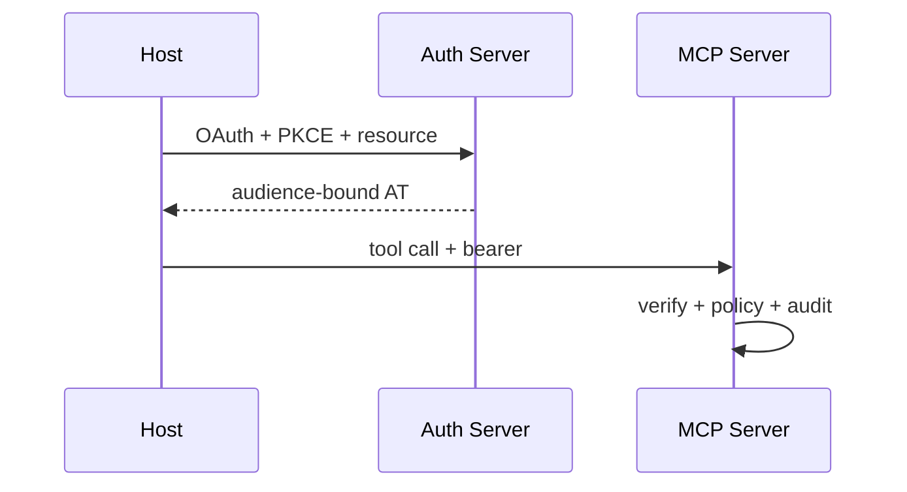

# 22. MCP Server Authentication and Authorization

Chinese: [22-mcp-server-authn-authz.zh.md](22-mcp-server-authn-authz.zh.md)

Part of [OAuth / OIDC / Azure Identity catalog](00-overview.md).  
**Primary teaching source:** [Course 10 · Module 22](https://github.com/xingaiapp/xingai-enterprise-ai-design/blob/main/courses/10-oauth-oidc-azure-identity/modules/22-mcp-server-authn-authz.md) · [hub](https://github.com/xingaiapp/xingai-enterprise-ai-design/blob/main/courses/10-oauth-oidc-azure-identity/README.md)

## Teach (from Course 10)

- **What:** An MCP server is a resource server: authenticate the caller, authorize each tool, bind audience, and audit.
- **Why:** wrong identity boundaries create confused-deputy and silent over-privilege failures.
- **Who:** MCP server authors, host/client developers, security.
- **When:** any remote MCP exposing tools; combine OAuth wall with business policy wall.
- **Where:** identity and policy sit at trust boundaries between clients, IdPs, APIs, and tools.
- **How:** learn the vocabulary, draw the sequence, implement the minimal check, then fail closed on mismatch.

### Diagram



### Minimal check

```python
def mcp_allow(aud_ok: bool, scope_ok: bool, policy_ok: bool) -> bool:
    return aud_ok and scope_ok and policy_ok
assert not mcp_allow(True, True, False)
```

### Failure modes (course)

- Confusing login success with authorization.
- Sending the wrong token type to the wrong audience.
- Skipping PKCE, state, nonce, or exact redirect checks.
- Encoding business policy only in prompts or UI visibility.

## Known

- Course 10 Module 22 defines the vocabulary, diagram, and fail-closed checks above (`raw/xingai-enterprise-ai-design/courses/10-oauth-oidc-azure-identity/modules/22-mcp-server-authn-authz.md`; public: [module](https://github.com/xingaiapp/xingai-enterprise-ai-design/blob/main/courses/10-oauth-oidc-azure-identity/modules/22-mcp-server-authn-authz.md)).
- Hands-on OAuth/PKCE path: [PKCE MCP lab](https://github.com/xingaiapp/xingai-enterprise-ai-design/blob/main/guides/2026-07-12-mcp-oauth-pkce-lab.md) · [auth deep dive](https://github.com/xingaiapp/xingai-enterprise-ai-design/blob/main/guides/2026-07-12-mcp-oauth-auth-deep-dive.md).
- Cross-links: [agent-governance-and-mcp](../agent-governance-and-mcp.md) · [Course 04](../../courses/04-mcp-interoperability.md) · [Course 10 wiki](../../courses/10-oauth-oidc-azure-identity.md) · [claims-mcp-oauth-poc](../../products/claims-mcp-oauth-poc.md).

## Missing

- Operational depth for “MCP Server Authentication and Authorization” is checklist-level; SIEM/runbook artifacts are not in Course 10.

## Rethink

- MCP two-wall + decision ledger are XingAI’s durable audit story — Azure APIM alone is not enough.

## Debate

- Azure reference architecture vs a portable Fly/Vercel twin diagram for XingAI demos.

## Needs evidence

- Public deploy diagram that matches a real XingAI status/API topology.

## Sources

- Course: [MCP Server Authentication and Authorization](https://github.com/xingaiapp/xingai-enterprise-ai-design/blob/main/courses/10-oauth-oidc-azure-identity/modules/22-mcp-server-authn-authz.md) · [中文](https://github.com/xingaiapp/xingai-enterprise-ai-design/blob/main/courses/10-oauth-oidc-azure-identity/modules/22-mcp-server-authn-authz.zh.md)
- Snapshot: `raw/xingai-enterprise-ai-design/courses/10-oauth-oidc-azure-identity/modules/22-mcp-server-authn-authz.md`
- Lab: [OAuth 2.1 + PKCE MCP](https://github.com/xingaiapp/xingai-enterprise-ai-design/blob/main/guides/2026-07-12-mcp-oauth-pkce-lab.md)
