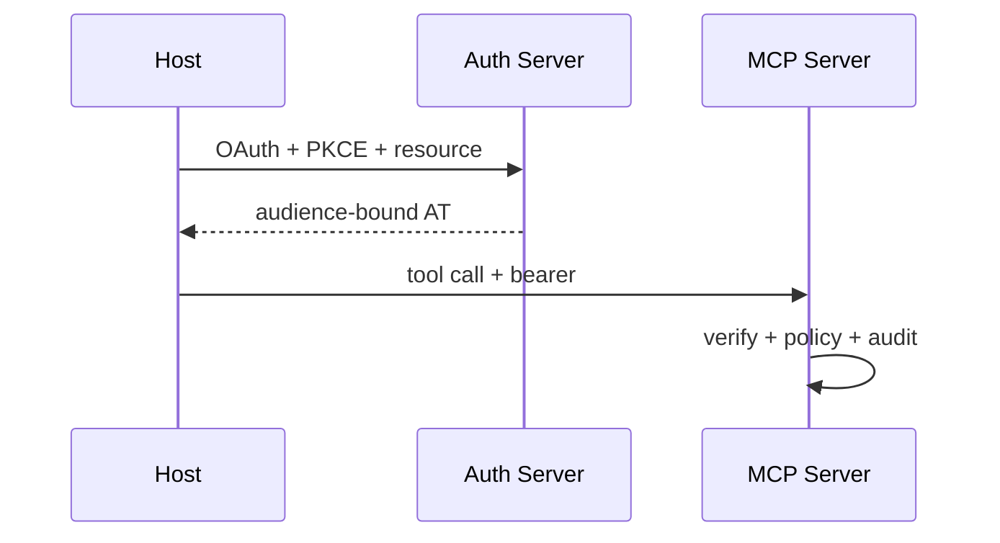

# 22. MCP Server 认证与授权

English: [22-mcp-server-authn-authz.md](22-mcp-server-authn-authz.md)

属于 [OAuth / OIDC / Azure Identity 目录](00-overview.zh.md)。  
**主要教学来源：** [课程 10 · 模块 22](https://github.com/xingaiapp/xingai-enterprise-ai-design/blob/main/courses/10-oauth-oidc-azure-identity/modules/22-mcp-server-authn-authz.zh.md) · [主页](https://github.com/xingaiapp/xingai-enterprise-ai-design/blob/main/courses/10-oauth-oidc-azure-identity/README.zh.md)

## 教学要点（来自课程 10）

- **是什么：** 
- **为什么：** 
- **谁：** 
- **何时：** 
- **何处：** 
- **怎么做：** 

### 图示



### 最小校验

```python
def mcp_allow(aud_ok: bool, scope_ok: bool, policy_ok: bool) -> bool:
    return aud_ok and scope_ok and policy_ok
assert not mcp_allow(True, True, False)
```

### 故障模式（课程）

- 把登录成功当成授权通过。
- 把错误类型的令牌发给错误的受众。
- 跳过 PKCE、state、nonce 或精确回调校验。
- 只把业务策略写在提示词或 UI 可见性里。

## Known（已知）

- 课程 10 模块 22 给出上文词汇、图示与失败关闭校验（`raw/xingai-enterprise-ai-design/courses/10-oauth-oidc-azure-identity/modules/22-mcp-server-authn-authz.zh.md`；公开：[模块](https://github.com/xingaiapp/xingai-enterprise-ai-design/blob/main/courses/10-oauth-oidc-azure-identity/modules/22-mcp-server-authn-authz.zh.md)）。
- 可动手路径：[PKCE MCP 实验](https://github.com/xingaiapp/xingai-enterprise-ai-design/blob/main/guides/2026-07-12-mcp-oauth-pkce-lab.zh.md) · [认证深读](https://github.com/xingaiapp/xingai-enterprise-ai-design/blob/main/guides/2026-07-12-mcp-oauth-auth-deep-dive.md)。
- 交叉：[agent-governance-and-mcp](../agent-governance-and-mcp.zh.md) · [课程 04](../../courses/04-mcp-interoperability.zh.md) · [课程 10 wiki](../../courses/10-oauth-oidc-azure-identity.zh.md) · [claims-mcp-oauth-poc](../../products/claims-mcp-oauth-poc.md)。

## Missing（缺失）

- 「MCP Server Authentication and Authorization」的运营深度停留在检查清单；课程 10 无 SIEM/手册工件。

## Rethink（重思）

- MCP 双墙 + 决策台账是 XingAI 的持久审计叙事——单靠 Azure APIM 不够。

## Debate（争议）

- Azure 参考架构，还是面向 XingAI demo 的可移植 Fly/Vercel 对照图。

## Needs evidence（待证）

- 与真实 XingAI 状态/API 拓扑匹配的公开部署图。

## Sources（来源）

- 课程：[MCP Server 认证与授权](https://github.com/xingaiapp/xingai-enterprise-ai-design/blob/main/courses/10-oauth-oidc-azure-identity/modules/22-mcp-server-authn-authz.zh.md) · [EN](https://github.com/xingaiapp/xingai-enterprise-ai-design/blob/main/courses/10-oauth-oidc-azure-identity/modules/22-mcp-server-authn-authz.md)
- 快照：`raw/xingai-enterprise-ai-design/courses/10-oauth-oidc-azure-identity/modules/22-mcp-server-authn-authz.zh.md`
- 实验：[OAuth 2.1 + PKCE MCP](https://github.com/xingaiapp/xingai-enterprise-ai-design/blob/main/guides/2026-07-12-mcp-oauth-pkce-lab.zh.md)
