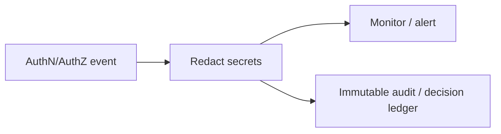

# 23. Logging, Monitoring, and Auditing

Chinese: [23-logging-monitoring-auditing.zh.md](23-logging-monitoring-auditing.zh.md)

Part of [OAuth / OIDC / Azure Identity catalog](00-overview.md).  
**Primary teaching source:** [Course 10 · Module 23](https://github.com/xingaiapp/xingai-enterprise-ai-design/blob/main/courses/10-oauth-oidc-azure-identity/modules/23-logging-monitoring-and-auditing.md) · [hub](https://github.com/xingaiapp/xingai-enterprise-ai-design/blob/main/courses/10-oauth-oidc-azure-identity/README.md)

## Teach (from Course 10)

- **What:** Auth logs must prove who did what, when, with which token/app, without leaking secrets or raw tokens.
- **Why:** wrong identity boundaries create confused-deputy and silent over-privilege failures.
- **Who:** SOC, platform, compliance.
- **When:** every authn/authz decision path for regulated or agent tool calls.
- **Where:** identity and policy sit at trust boundaries between clients, IdPs, APIs, and tools.
- **How:** learn the vocabulary, draw the sequence, implement the minimal check, then fail closed on mismatch.

### Diagram



### Minimal check

```python
event = {"sub": "user-1", "action": "tool.invoke", "decision": "deny", "token": "[redacted]"}
assert event["token"] == "[redacted]"
assert event["decision"] in {"allow", "deny", "step_up"}
```

### Failure modes (course)

- Confusing login success with authorization.
- Sending the wrong token type to the wrong audience.
- Skipping PKCE, state, nonce, or exact redirect checks.
- Encoding business policy only in prompts or UI visibility.

## Known

- Course 10 Module 23 defines the vocabulary, diagram, and fail-closed checks above (`raw/xingai-enterprise-ai-design/courses/10-oauth-oidc-azure-identity/modules/23-logging-monitoring-and-auditing.md`; public: [module](https://github.com/xingaiapp/xingai-enterprise-ai-design/blob/main/courses/10-oauth-oidc-azure-identity/modules/23-logging-monitoring-and-auditing.md)).
- Hands-on OAuth/PKCE path: [PKCE MCP lab](https://github.com/xingaiapp/xingai-enterprise-ai-design/blob/main/guides/2026-07-12-mcp-oauth-pkce-lab.md) · [auth deep dive](https://github.com/xingaiapp/xingai-enterprise-ai-design/blob/main/guides/2026-07-12-mcp-oauth-auth-deep-dive.md).
- Cross-links: [agent-governance-and-mcp](../agent-governance-and-mcp.md) · [Course 04](../../courses/04-mcp-interoperability.md) · [Course 10 wiki](../../courses/10-oauth-oidc-azure-identity.md) · [claims-mcp-oauth-poc](../../products/claims-mcp-oauth-poc.md).

## Missing

- Operational depth for “Logging, Monitoring, and Auditing” is checklist-level; SIEM/runbook artifacts are not in Course 10.

## Rethink

- MCP two-wall + decision ledger are XingAI’s durable audit story — Azure APIM alone is not enough.

## Debate

- Azure reference architecture vs a portable Fly/Vercel twin diagram for XingAI demos.

## Needs evidence

- Public deploy diagram that matches a real XingAI status/API topology.

## Sources

- Course: [Logging, Monitoring, and Auditing](https://github.com/xingaiapp/xingai-enterprise-ai-design/blob/main/courses/10-oauth-oidc-azure-identity/modules/23-logging-monitoring-and-auditing.md) · [中文](https://github.com/xingaiapp/xingai-enterprise-ai-design/blob/main/courses/10-oauth-oidc-azure-identity/modules/23-logging-monitoring-and-auditing.zh.md)
- Snapshot: `raw/xingai-enterprise-ai-design/courses/10-oauth-oidc-azure-identity/modules/23-logging-monitoring-and-auditing.md`
- Lab: [OAuth 2.1 + PKCE MCP](https://github.com/xingaiapp/xingai-enterprise-ai-design/blob/main/guides/2026-07-12-mcp-oauth-pkce-lab.md)
