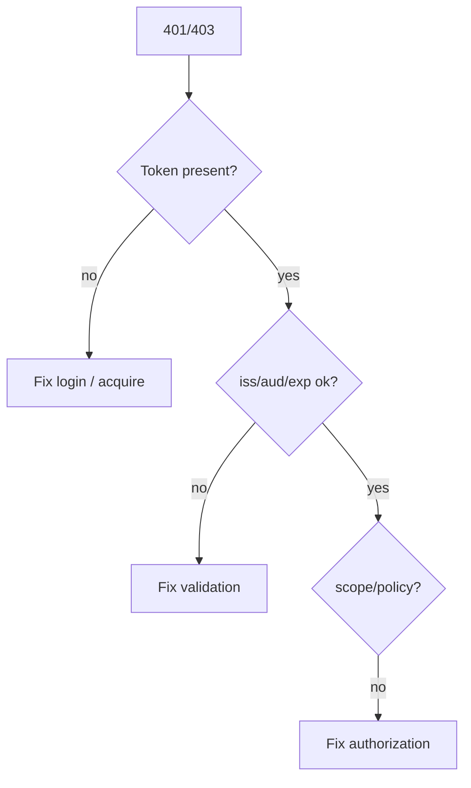

# 25. Common Errors and Troubleshooting

Chinese: [25-common-errors-troubleshooting.zh.md](25-common-errors-troubleshooting.zh.md)

Part of [OAuth / OIDC / Azure Identity catalog](00-overview.md).  
**Primary teaching source:** [Course 10 · Module 25](https://github.com/xingaiapp/xingai-enterprise-ai-design/blob/main/courses/10-oauth-oidc-azure-identity/modules/25-common-errors-and-troubleshooting.md) · [hub](https://github.com/xingaiapp/xingai-enterprise-ai-design/blob/main/courses/10-oauth-oidc-azure-identity/README.md)

## Teach (from Course 10)

- **What:** Most auth bugs are redirect mismatch, wrong audience, expired tokens, clock skew, missing PKCE, or confusing ID vs access tokens.
- **Why:** wrong identity boundaries create confused-deputy and silent over-privilege failures.
- **Who:** on-call engineers, integrators.
- **When:** when login or API 401/403 appears — debug claims before rewriting the app.
- **Where:** identity and policy sit at trust boundaries between clients, IdPs, APIs, and tools.
- **How:** learn the vocabulary, draw the sequence, implement the minimal check, then fail closed on mismatch.

### Diagram



### Minimal check

```python
def classify(status: int, aud_ok: bool) -> str:
    if status == 401 and not aud_ok:
        return "audience_or_issuer"
    if status == 403:
        return "authorization"
    return "other"
assert classify(401, False) == "audience_or_issuer"
```

### Failure modes (course)

- Confusing login success with authorization.
- Sending the wrong token type to the wrong audience.
- Skipping PKCE, state, nonce, or exact redirect checks.
- Encoding business policy only in prompts or UI visibility.

## Known

- Course 10 Module 25 defines the vocabulary, diagram, and fail-closed checks above (`raw/xingai-enterprise-ai-design/courses/10-oauth-oidc-azure-identity/modules/25-common-errors-and-troubleshooting.md`; public: [module](https://github.com/xingaiapp/xingai-enterprise-ai-design/blob/main/courses/10-oauth-oidc-azure-identity/modules/25-common-errors-and-troubleshooting.md)).
- Hands-on OAuth/PKCE path: [PKCE MCP lab](https://github.com/xingaiapp/xingai-enterprise-ai-design/blob/main/guides/2026-07-12-mcp-oauth-pkce-lab.md) · [auth deep dive](https://github.com/xingaiapp/xingai-enterprise-ai-design/blob/main/guides/2026-07-12-mcp-oauth-auth-deep-dive.md).
- Cross-links: [agent-governance-and-mcp](../agent-governance-and-mcp.md) · [Course 04](../../courses/04-mcp-interoperability.md) · [Course 10 wiki](../../courses/10-oauth-oidc-azure-identity.md) · [claims-mcp-oauth-poc](../../products/claims-mcp-oauth-poc.md).

## Missing

- Operational depth for “Common Errors and Troubleshooting” is checklist-level; SIEM/runbook artifacts are not in Course 10.

## Rethink

- MCP two-wall + decision ledger are XingAI’s durable audit story — Azure APIM alone is not enough.

## Debate

- Azure reference architecture vs a portable Fly/Vercel twin diagram for XingAI demos.

## Needs evidence

- Public deploy diagram that matches a real XingAI status/API topology.

## Sources

- Course: [Common Errors and Troubleshooting](https://github.com/xingaiapp/xingai-enterprise-ai-design/blob/main/courses/10-oauth-oidc-azure-identity/modules/25-common-errors-and-troubleshooting.md) · [中文](https://github.com/xingaiapp/xingai-enterprise-ai-design/blob/main/courses/10-oauth-oidc-azure-identity/modules/25-common-errors-and-troubleshooting.zh.md)
- Snapshot: `raw/xingai-enterprise-ai-design/courses/10-oauth-oidc-azure-identity/modules/25-common-errors-and-troubleshooting.md`
- Lab: [OAuth 2.1 + PKCE MCP](https://github.com/xingaiapp/xingai-enterprise-ai-design/blob/main/guides/2026-07-12-mcp-oauth-pkce-lab.md)
