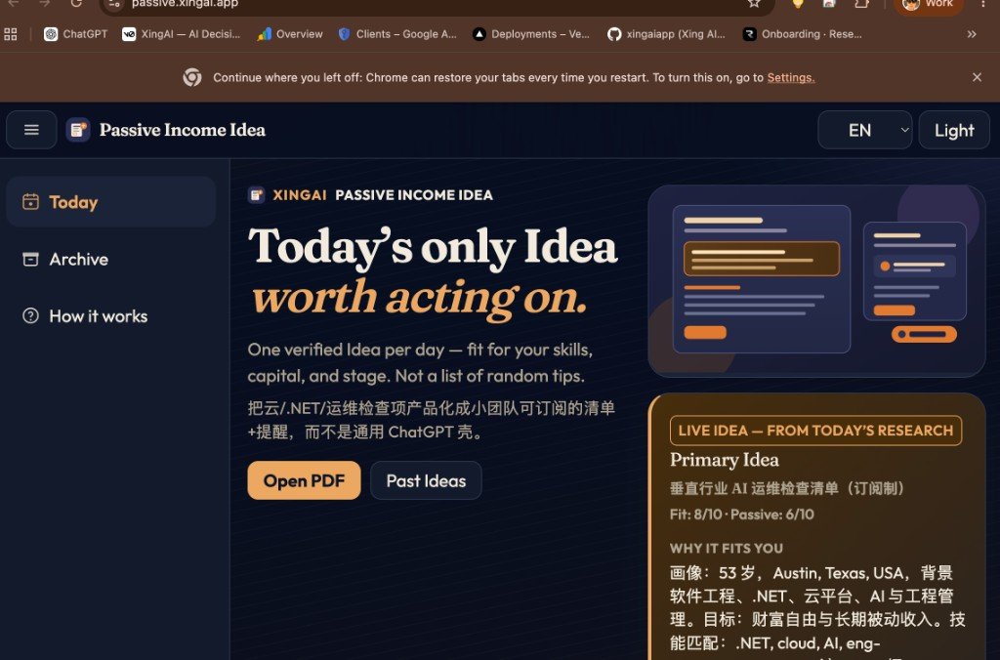
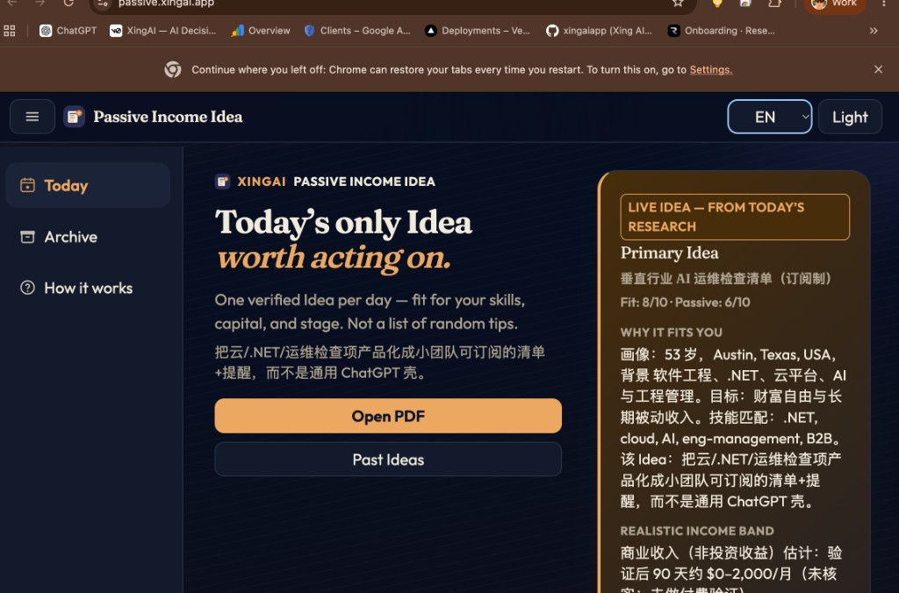

# Product: XingAI Passive Income Idea (`passive.xingai.app`)

Chinese: [passive-income-idea.zh.md](passive-income-idea.zh.md)

Public decision-style daily Idea surface — **one** personal passive-income / cash-flow Idea for a defined operator profile, with FAQ/disclaimer framing. This wiki page is grounded in the **live public site** and user-owned desktop screenshots, not private repo dumps.

**Canonical:** [https://passive.xingai.app/](https://passive.xingai.app/)  
**AEO:** [https://passive.xingai.app/llms.txt](https://passive.xingai.app/llms.txt)

## What it is arguing (public)

1. **Decision card, not tip feed** — homepage and FAQ insist on a single Idea worth acting on, not a list of random tips (`llms.txt` + FAQ).
2. **Fail-closed honesty** — FAQ: no income guarantees; unknowns stay `未核实`; investment returns vs business revenue are separated.
3. **Not Opportunity Radar** — Radar picks XingAI *product* bets; this report picks a *personal* wealth-building Idea for a defined operator profile (FAQ).
4. **Languages en / zh / ko** — claimed in `llms.txt`; published JSON includes `locales.en|zh|ko` packs (snapshot 2026-09-07).
5. **Delivery craft** — FAQ + `llms.txt`: email Summary + A4 PDF; site also exposes `pdf_url` and archive-oriented data paths.

## UX (desktop)

Dark Today chrome (top bar + sidebar + Idea panel). Screenshots from 2026-09-06 show the product before later layout/locale polish:

**What the shots prove:** XingAI mobile/desktop chrome pattern is present; Idea panel is the decision surface.  
**What they do not prove:** worker scheduling, email send success, or that every locale pack was wired that evening (chrome EN + Chinese body is visible in-shot).

## Known

- Live homepage FAQ and `llms.txt` match the educational / non-advice framing (`raw/external/2026-09-07-passive-income-idea/`).
- Published `latest-idea.json` on 2026-09-07 had `is_mock: false`, `locales` for `en`/`zh`/`ko`, public source URLs, and a `/reports/...pdf` path (same raw package).
- Desktop UX screenshots are user-owned and snapshotted under `raw/external/2026-09-07-passive-income-idea/assets/ux/`.

## Missing

- Confirmed **public** GitHub mirror of implementation (repo privacy not verified this session) — so no CQRS/worker ADR citations here.
- Mobile (~375px) screenshots, light-theme pair, Archive / How pages as images.
- Proof that Resend live email is actually sending (site only claims the craft).
- Auth story (none claimed on public FAQ).

## Rethink

- Calling a catalog-backed Idea “research” without open-web fact extraction can overclaim vs Course 06/07 evidence standards — the public JSON’s probe notes are reachability-shaped, not market-size proof.
- EN chrome + Chinese body (visible in screenshots) breaks the “languages: en, zh, ko” promise until locale packs are actually selected in UI — treat AEO language claims as **intent**, verify in UI.

## Debate

- Should the **PDF/email (Chinese)** stay the primary decision artifact while the site is a mirror, or should the multilingual web panel become primary? Public FAQ still centers email+PDF; the site now shows a full Idea card.
- How hard should “one Idea / day” continuity be when the operator is also a XingAI builder — personal wealth Idea vs Opportunity Radar product bets (FAQ draws the line; product overlap risk remains).

## Needs evidence

- Is `xingai-passive-income-ideas` public on GitHub? (blocked check this session.)
- After 0.2.5-class deploys, does switching EN/zh/ko on the live site change Idea body (not only chrome)? Re-check with a fresh screenshot pair.
- Are income bands ever marked verified, or always estimate/`未核实` by policy?

## Deliberately skipped

Private ADRs, operator YAML, worker code, Resend keys, and any unpublished roadmap.

## Sources

- `raw/external/2026-09-07-passive-income-idea/` (`SOURCE.md`, `content.md`, `llms.txt`, `latest-idea.json`, UX assets)
- Live: [passive.xingai.app](https://passive.xingai.app/), [llms.txt](https://passive.xingai.app/llms.txt)
- Related wiki concepts (pattern rhyme only): [decision-ledger-pattern](../concepts/decision-ledger-pattern.md), [cache-first-llm-architecture](../concepts/cache-first-llm-architecture.md) — **do not** treat this product page as proof those schemas are implemented here.
