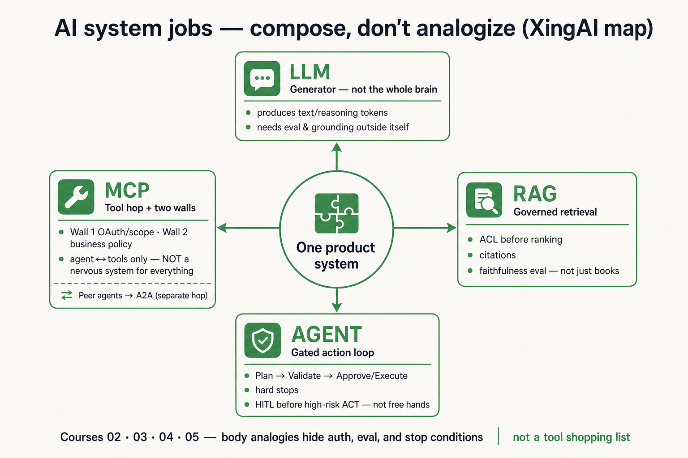

# Synthesis: “AI Systems: A Human Analogy” vs XingAI jobs map

Chinese: [ai-systems-human-analogy-vs-xingai.zh.md](ai-systems-human-analogy-vs-xingai.zh.md)

Aiswarya Venkitesh poster: **Think of AI like a human body** — LLM=Brain, RAG=Brain+books, AI Agent=Brain+hands, MCP=Nervous system / “foundation connecting layer.” Frame image credits the author. Third-party art stays **reference-only**. Wiki embeds the **XingAI-corrected** map only:

Asset: `raw/external/2026-07-19-ai-systems-human-analogy/` (`verified: partial`).

## Known

- **Poster rows (visual):** four metaphors as above; MCP “Connects everything / Foundation connecting layer.” Cite `assets/aiswarya-venkitesh-human-analogy-reference.png` + frame credit `assets/aiswarya-venkitesh-frame-reference.png` + `notes.md`.
- **Directional overlap:** LLM generates; RAG adds external knowledge; agents act with tools/memory; MCP is about connecting to capabilities — beginner-friendly labels. Cite Courses [02](../courses/02-rag-knowledge-systems.md)–[04](../courses/04-mcp-interoperability.md).
- **XingAI already rejects peer “vs” columns** for MCP/RAG/Skills: [mcp-vs-rag-vs-skills](mcp-vs-rag-vs-skills.md). MCP≠A2A: [mcp-vs-a2a-vs-acp](mcp-vs-a2a-vs-acp.md).

## Missing (on the poster — on XingAI map)

- RAG: ACL before ranking, citations, faithfulness eval.
- Agent: Validate → Approve/Execute, hard stops, HITL — not free hands.
- MCP: two walls; **not** foundation of LLM/RAG; peer hops → A2A.
- LLM: eval/grounding outside the model — not “core intelligence” of the product.
- Ledger / untrusted tool&RAG text as attack surface (still thin — open).

## Rethink

- **Body analogy hides the control plane.** Organs don’t need OAuth audiences; tool hops do.
- **MCP as “nervous system” over-claims.** Public A2A docs and Course 04 treat MCP as agent↔tool; calling it the foundation connecting *everything* collapses peer agents, RAG pipelines, and auth into one sticker.
- **“Brain” for LLM flatters the model.** Product decisions need retrieval policy + gated action + ledger — the map’s generator card.

## Debate (leave open)

| Question | Poster lean | XingAI public lean | Status |
|---|---|---|---|
| Are body metaphors OK for teaching? | Central framing | Optional for intuition; unsafe as architecture | Prefer jobs + gates for ADRs |
| Is MCP “foundational”? | Yes | Foundational for **tool access**, not for RAG/LLM existence | Prefer scoped claim |
| Agent = hands? | Yes | Hands without Validate→Execute is the failure mode Course 03 names | Prefer gated loop |

## Needs evidence

- Canonical post URL for this graphic.
- Whether a longer thread softens “nervous system / foundation” (screenshot only).

## How to use

- Interview probe: “Redraw without body parts; put walls on MCP and stops on the agent.”
- Do not embed the Aiswarya PNG on wiki teaching surfaces.

## Sources

`raw/external/2026-07-19-ai-systems-human-analogy/`; Courses 02–05; [agent-governance](../concepts/agent-governance-and-mcp.md); sibling syntheses mcp-vs-rag-vs-skills / mcp-vs-a2a-vs-acp. `verified: partial`.
