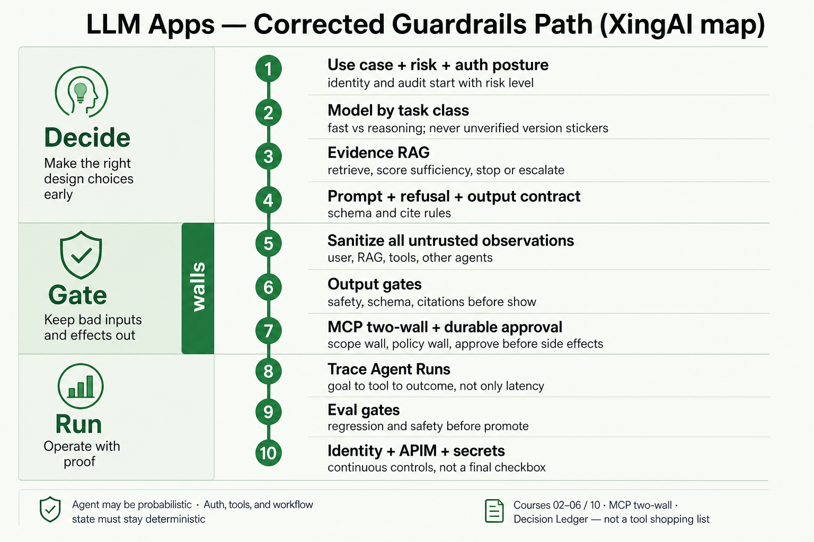

# 综合：LLM 护栏与监控阶梯 vs XingAI

English: [llm-guardrails-monitoring-vs-xingai.md](llm-guardrails-monitoring-vs-xingai.md)

两份用户附带的教学图共用标题 **How to Build LLM Apps with Guardrails and Monitoring**：

| 变体 | 形态 | Raw 文件 |
|---|---|---|
| A | 10 步蛇形（Alok Sharan 署名） | `raw/.../alok-sharan-reference.png` |
| B | 12 步 **Plan / Build / Validate / Operate** 网格 | `raw/.../12-step-plan-build-validate-operate-reference.png` |

二者都是带 **Tools** 行的检查清单，都不是企业控制平面。Wiki **只嵌入** XingAI 纠正后的地图（评估 → 修正 → 补充 → 绘制）：

## 已知

- **A 与 B** 都强调：用例、RAG、Prompt、输入/输出检查、工具限制、监控、评测、安全部署（`raw/external/2026-07-17-llm-guardrails-monitoring-poster/`）。
- **B 相对 A 的改进：** 第 2 步在选模型前做 **风险与策略**；第 12 步 **Iterate & Govern**；多处 Checks（ grounding、评测失败阻断发布）；未见 “GPT-5.5”；页脚四阶段比蛇形更清晰。
- 方向上对齐第 03 课先校验再行动，以及 [agent-governance-and-mcp](../concepts/agent-governance-and-mcp.zh.md)。
- XingAI 地图页脚：Agent 可以是概率性的；认证、工具与工作流状态必须保持确定性（[ai-architecture-digest-2026-07-17](ai-architecture-digest-2026-07-17.zh.md)）。

## 缺失（B 仍缺 — XingAI 地图已有）

- **MCP 双墙**（[第 04 课](../courses/04-mcp-interoperability.zh.md)）。
- **用户文本之外的不可信观测**。
- **证据 RAG** 与充分性停止（[第 02 课](../courses/02-rag-knowledge-systems.zh.md)）。
- **Agent Run 追踪 + Decision Ledger**（[第 06 课](../courses/06-production-ai-engineering.zh.md)）。
- **身份持续控制**（[第 10 课](../courses/10-oauth-oidc-azure-identity.zh.md)），不只靠晚期 “Deploy Securely”。
- **副作用前的持久化审批**。

## 需重新思考

- **B 是比 A 更好的阶梯，不是已修好的架构。** Tools 栏仍在教贴纸驱动设计。
- **A 的 GPT-5.5** — 未核实；XingAI 表面不得重复。
- **B 的输入护栏** 仍偏注入/PII — 低估检索/工具返回上的 Agent Traps。
- **Deploy（11）+ Iterate（12）** 有助于 Operate，但认证姿态必须从 Plan/Decide 开始。
- **B 卡片颜色 ≠ 页脚阶段** — 视觉债；XingAI 地图用 Decide / Gate / Run 分区。

## 争议

- 护栏产品嵌在 Agent 循环内，还是 MCP 工具前的独立策略服务？
- Plan/Build/Validate/Operate 是否够用，还是必须在 Operate 前显式画出 Gate（墙）？

## 待证

- A/B 均无规范 URL。
- B 是 A 的社区改写还是独立图——**未知**（B 图无署名）。
- XingAI 公开 POC 是否已跑通 Gate→Run 生产环——**仅凭本次无法判定**。

## 关联

- [agent-governance-and-mcp](../concepts/agent-governance-and-mcp.zh.md)
- [第 02 课](../courses/02-rag-knowledge-systems.zh.md)、[03](../courses/03-tool-use-ai-agents.zh.md)、[04](../courses/04-mcp-interoperability.zh.md)、[05](../courses/05-agent-runtime-multi-agent.zh.md)、[06](../courses/06-production-ai-engineering.zh.md)、[10](../courses/10-oauth-oidc-azure-identity.zh.md)
- [ai-architecture-digest-2026-07-17](ai-architecture-digest-2026-07-17.zh.md)

## 来源

- Raw：`raw/external/2026-07-17-llm-guardrails-monitoring-poster/`（A + B 参考 + `notes.md`）
- UX（仅 wiki 嵌入）：`wiki/assets/ux/llm-app-guardrails-monitoring/xingai-map.png`
