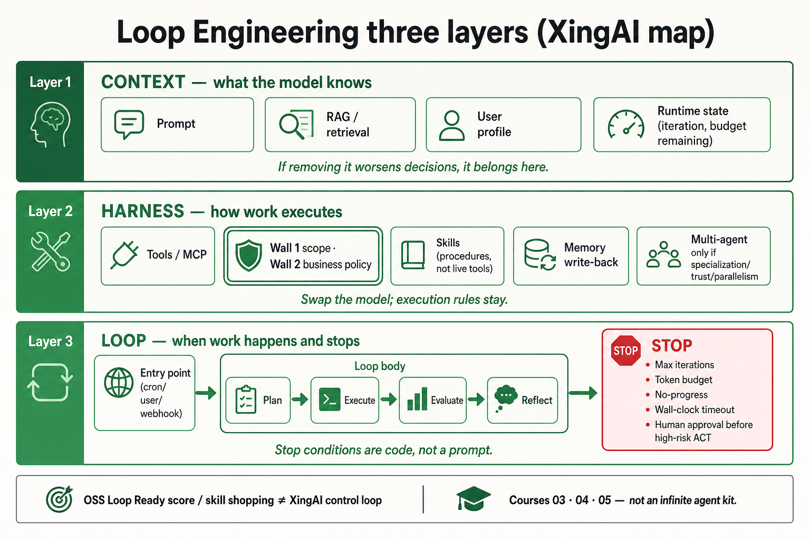

# 综合:Cobus「Loop Engineering」工具包 vs XingAI 三层 loop

English: [loop-engineering-toolkit-vs-xingai.md](loop-engineering-toolkit-vs-xingai.md)

**Cobus Greyling Loop Engineering** README 截图(星标、包徽章、发光 ∞ 图、`npx @cobusgreyling/loop-init`、「Loop Ready」分数)。第三方原图仅作 **raw 参考**,wiki **只嵌入 XingAI 纠正后地图**:

素材:`raw/external/2026-07-19-loop-engineering-toolkit-poster/`(`verified: partial`)。

## 已知

- **海报(视觉):** 标语「Stop prompting. Design the loop. Get a score.»;∞ 节点含 scheduling / sub-agents / worktrees / skills / persistent memory;脚手架 skills + state + budget;`--tool` claude|codex|opencode。引用 `assets/cobusgreyling-loop-engineering-reference.png` 与 `notes.md`。
- **方向一致:** 用工程化 loop 替代开放聊天——与 XingAI「beyond prompt engineering」同族口号。引用 [概念:Loop 工程](../concepts/loop-engineering.zh.md)。
- **XingAI 公开模式:** 分开 **Context | Harness | Loop**;Loop 要有入口、循环体、**可编程停止**;护栏含最大迭代、token 预算、无进展、超时、高风险人工批准。引用 `raw/xingai-engineering-system/patterns/loop-engineering-three-layer.md`。
- **Harness ≠ prompt:** 工具/MCP 要墙([Agent 治理](../concepts/agent-governance-and-mcp.zh.md));多智能体要第 05 课专业化规则([第 05 课](../courses/05-agent-runtime-multi-agent.zh.md))。

## 缺失(海报没有 — XingAI 地图有)

- 分层(Context / Harness / Loop)。
- 硬 **STOP** 面板(迭代、预算、无进展、超时、高风险 ACT 前 HITL)。
- MCP **双墙**(scope + 业务策略)。
- Skills vs 实时工具区分。
- Decision ledger / 跑后评测(地图仍偏薄——开放)。
- 星标 / 包版本当架构(故意丢掉)。

## 需重新思考

- **∞ 图教错了停止故事。** XingAI 测试:去掉停止条件智能体就永远跑 → loop 层缺失。发光 ∞ 在视觉上通不过。
- **「Loop Ready」分数 ≠ 生产 loop。** 脚手架就绪对工具包有用;它不是 Auth、Ledger 或 Stop。
- **同一英文词,不同对象。** XingAI「Loop Engineering」是**控制环架构**;海报是 **OSS 智能体脚手架品牌**。面试/ADR 不要无引用合并。
- **Worktrees / scheduling 是 harness 选项**,不是 loop 的定义。

## 争议(保持开放)

| 问题 | 海报倾向 | XingAI 公开倾向 | 状态 |
|---|---|---|---|
| 就绪分数够不够当闸门? | 居中(「get a score」) | 分数可选;停止 + HITL 必需 | 倾向硬停止 |
| Worktrees 算不算「loop」? | 画在 ∞ 上 | Harness/运行时细节 | 命名开放 |
| XingAI 该不该采用这套 npm? | 截图暗示 | 未知——此处未做依赖评估 | 待证 |

## 待证

- 该 README 的规范 GitHub URL(仅有截图)。
- `@cobusgreyling/loop-*` 是否实现与 XingAI 表对齐的可编程停止(不能仅凭图断定)。
- 是否有 XingAI 公开 ADR 点名背书该工具包(摄入时 wiki 未找到)。

## 怎么用

- 有人贴这张 README:先让他重画 **三层 + STOP**,再谈模块。
- XingAI 含义看 [loop-engineering](../concepts/loop-engineering.zh.md);本综合页做品牌消歧。

## 来源

`raw/external/2026-07-19-loop-engineering-toolkit-poster/`;`raw/xingai-engineering-system/patterns/loop-engineering-three-layer.md`;概念 + 第 03–05 课。`verified: partial`。
