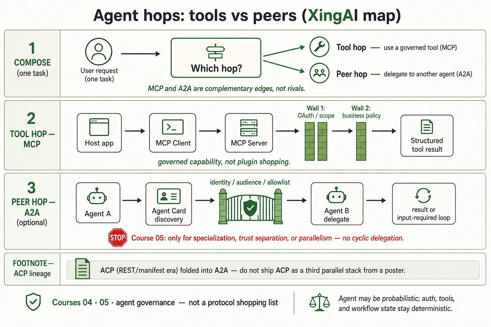

# Synthesis: MCP vs A2A vs ACP (agent talk protocols)

Chinese: [mcp-vs-a2a-vs-acp.zh.md](mcp-vs-a2a-vs-acp.zh.md)

ByteByteGo three-column poster **MCP | A2A | ACP** (user-attached 2026-07-19) plus earlier paste. Third-party art stays **reference-only** under `raw/`. Wiki embeds the **XingAI-corrected** map only (evaluate → fix → correct → draw):

Asset: `raw/external/2026-07-19-mcp-vs-a2a-vs-acp/` (`verified: partial`).

## Known

- **Poster (visual, reference-only):** three equal towers — MCP host→client→server→DB/API/file stickers; A2A registry→Agent Card→Agent B + “more information needed”; ACP REST/manifest→sync/async. Footer: ByteByteGo. Cite `raw/.../assets/bytebytego-mcp-a2a-acp-reference.png` + `notes.md` evaluation.
- **Paste split:** same high-level hop types; claims ACP merged into A2A; production complementarity. Cite `content.md`.
- **Public A2A site:** MCP for tools, A2A for peers — complementary, not competitors. Cite [a2a-protocol.org](https://a2a-protocol.org/dev/).
- **XingAI Course 04 / 05:** MCP as governed capability boundary; multi-agent only for specialization / trust separation / parallelism. Cite [Course 04](../courses/04-mcp-interoperability.md), [Course 05](../courses/05-agent-runtime-multi-agent.md).
- **Two-wall MCP** in public POCs: scope + independent business policy. Cite [agent governance](../concepts/agent-governance-and-mcp.md), [claims-mcp-oauth-poc](../products/claims-mcp-oauth-poc.md).
- Adjacent “vs” fail: [mcp-vs-rag-vs-skills](mcp-vs-rag-vs-skills.md).

## Missing (on the poster — present on XingAI map)

- **MCP two walls** before tool result (OAuth/scope + business policy).
- **Peer trust gate** (identity / audience / allowlist) before Agent B.
- **Course 05 STOP** — when *not* to add a peer; no cyclic delegation.
- **ACP demoted** to lineage footnote (not a third equal column).
- **Ledger / HITL** for high-impact side effects (still thin on both poster and map — open).
- **Primary ACP→A2A merge artifact** not yet in `raw/`.

## Rethink

- **“vs” + three towers is the wrong frame.** One task chooses *which hop*; often both. XingAI map uses Compose → Tool hop → Peer hop bands.
- **Vendor stickers ≠ architecture.** PostgreSQL / GitHub / Drive / IDE logos teach shopping, not governance.
- **Agent Card discovery ≠ authorized action.** Same confused-deputy class Course 04 names for MCP tokens.
- **Shipping ACP beside A2A from the poster** freezes a transition the paste itself says already merged.

## Debate (leave open)

| Question | Poster lean | XingAI public lean | Status |
|---|---|---|---|
| MCP vs A2A alternatives? | Three columns imply pick-one | Complementary hops + walls | Prefer composition |
| Implement ACP today? | Equal green column | Footnote / merge lineage | Open until primary docs in `raw/` |
| A2A on the wire vs in-process + MCP? | Implies registry/card always | Public POCs emphasize MCP + durable workflow | Open |
| Does Agent Card replace gateway allowlists? | Registry discovery | Enterprise still needs identity + allowlists | Open |

## Needs evidence

- Canonical ByteByteGo post URL for this graphic.
- Primary LF/IBM ACP→A2A announcement + migration guide in `raw/`.
- Any public XingAI repo exposing an A2A Agent Card (not found in this wiki at draw time).
- Spec alignment of poster “Agent Registry” vs well-known Agent Card URL wording.

## How to use

- Course 04↔05 probe: walk the XingAI map left-to-right; ask where walls sit if someone only memorized the ByteByteGo towers.
- Do not embed the ByteByteGo PNG on product or wiki teaching surfaces.

## Sources

`raw/external/2026-07-19-mcp-vs-a2a-vs-acp/` (paste + ByteByteGo reference + `notes.md`); UX embed only: `wiki/assets/ux/mcp-vs-a2a-vs-acp/xingai-map.png`; [a2a-protocol.org/dev](https://a2a-protocol.org/dev/); Courses 04/05; agent-governance + claims MCP pages. `verified: partial`.
